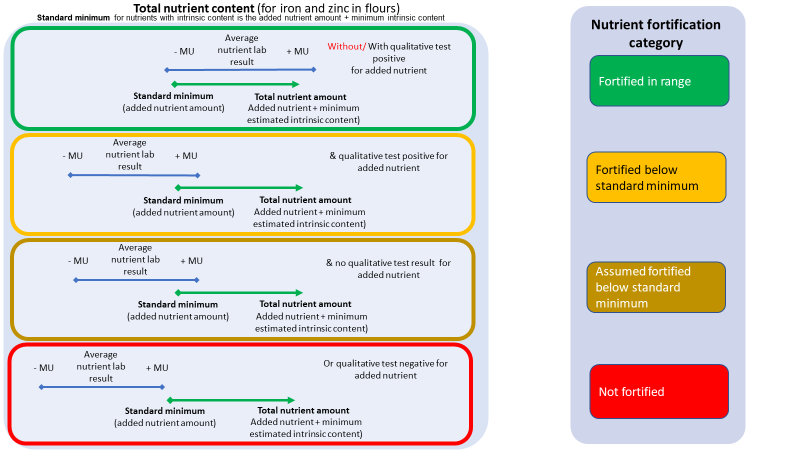

```{r setup, include=FALSE, message=FALSE, cache=FALSE}
  
  options(warn=-1)
  knitr::opts_chunk$set(echo = FALSE, dpi = 300)
  packages <- c("tidyverse", "readxl", "ggpattern", "highcharter", "flextable", "htmlwidgets", "webshot", "officedown")
  installed_packages <- packages %in% rownames(installed.packages())
  if (any(installed_packages == FALSE)) {
    install.packages(packages[!installed_packages])
   }
  invisible(lapply(packages, library, character.only = TRUE))
  #path = "/home/developer/projects/Uganda/Uganda/"
  path = "/Users/sjungjohann/OneDrive - Global Alliance for Improved Nutrition/Data for analysis/R syntax/GAIN-R-dev/"
  
   increment_table_number <- function() {
     if (!exists("table_number")) {
       table_number <<- 1
     } else {
       table_number <<- table_number + 1
     }
   }
 
   increment_figure_number <- function() {
     if (!exists("figure_number")) {
       figure_number <<- 1
     } else {
       figure_number <<- figure_number + 1
     }
   }
   
   roman_numbers <- as.roman(1 : 25)
   
   data <- read_excel(paste0(path, 'FortiMAppFilter_cleantype.xlsx'), na = "-")
   country <- data$country[1]
 
   regions <- data$region
   states_count <- n_distinct(regions)
   
   cities <- data$city
   cities_count <- n_distinct(cities)
 
   foods <- data$food
   foods <- unique(foods)
   foods_count <- n_distinct(foods)
   food_list <- noquote(paste(shQuote(foods, type="sh"), collapse=", "))
   food_list <- lapply(food_list, function(word) gsub("'", "", word))
   
   store_typies <- data$store_type
   store_typies_count <- n_distinct(store_typies)
   
   
## food origin calculation
   foodOriginData <- read_excel(paste0(path, 'ReportsumProdVol_FoodOrigin.xlsx'), na = "-")
   foodOriginData <- foodOriginData[,c("food", "origin", "ProductPercentOrigin", "ProdVolPercentOrigin")]
   food_index <- grep("food", colnames(foodOriginData))
   prodper_index <- grep("ProductPercentOrigin", colnames(foodOriginData))
   volper_index <- grep("ProdVolPercentOrigin", colnames(foodOriginData))
   foodLocalOriginData <- foodOriginData %>% dplyr::filter(origin=="Local")
   foodImportedOriginData <- foodOriginData %>% dplyr::filter(origin=="Imported")
   
   prodper_local_origin_line <- "For origin"
   for(i in 1:nrow(foodLocalOriginData)) {
     value = (foodLocalOriginData[i,food_index])
     per = (foodLocalOriginData[i,prodper_index])
     value_string = paste0(", ",per,"% of ",value)
     prodper_local_origin_line <- paste0(prodper_local_origin_line, value_string)
    }
   prodper_local_origin_line <- paste0(prodper_local_origin_line, " products are locally produced")
   
   prodper_imported_origin_line <- " and"
   for(i in 1:nrow(foodImportedOriginData)) {
     value = (foodImportedOriginData[i,food_index])
     per = (foodImportedOriginData[i,prodper_index])
     value_string = paste0(", ",per,"% of ",value)
     prodper_imported_origin_line <- paste0(prodper_imported_origin_line, value_string)
    }
   prodper_imported_origin_line <- paste0(prodper_imported_origin_line, " products are imported.")
   prodper_origin_line <- paste0(prodper_local_origin_line, prodper_imported_origin_line)
   
   
   volper_local_origin_line <- "For product volume by origin"
   for(i in 1:nrow(foodLocalOriginData)) {
     value = (foodLocalOriginData[i,food_index])
     per = (foodLocalOriginData[i,volper_index])
     value_string = paste0(", ",per,"% of ",value)
     volper_local_origin_line <- paste0(volper_local_origin_line, value_string)
    }
   volper_local_origin_line <- paste0(volper_local_origin_line, " product volume is locally produced")
   
   volper_imported_origin_line <- " and"
   for(i in 1:nrow(foodImportedOriginData)) {
     value = (foodImportedOriginData[i,food_index])
     per = (foodImportedOriginData[i,volper_index])
     value_string = paste0(", ",per,"% of ",value)
     volper_imported_origin_line <- paste0(volper_imported_origin_line, value_string)
    }
   volper_imported_origin_line <- paste0(volper_imported_origin_line, " product volume is imported.")
   volper_origin_line <- paste0(volper_local_origin_line, volper_imported_origin_line)
   
   ## food fortification labelling calculation
   foodLabellingData <- read_excel(paste0(path, 'ReportsumProdVol_FoodLabelnutrient.xlsx'), na = "-")
   foodLabellingData <- foodLabellingData[,c("food", "product_fortification_labelnutrient", "ProductPercentLabelnutrient", 
                                             "ProdVolPercentLabelnutrient")]
   food_index <- grep("food", colnames(foodLabellingData))
   prodper_index <- grep("ProductPercentLabelnutrient", colnames(foodLabellingData))
   volper_index <- grep("ProdVolPercentLabelnutrient", colnames(foodLabellingData))
   foodAsLabelledData <- foodLabellingData %>% dplyr::filter(product_fortification_labelnutrient=="Fortification logo, statement or nutrient label")
   foodAsNoLabelledData <- foodLabellingData %>% dplyr::filter(product_fortification_labelnutrient=="No fortification labelling")
   
   prodper_as_labelled_line <- "For product fortification labelling"
   for(i in 1:nrow(foodAsLabelledData)) {
     value = (foodAsLabelledData[i,food_index])
     per = (foodAsLabelledData[i,prodper_index])
     value_string = paste0(", ",per,"% of ",value)
     prodper_as_labelled_line <- paste0(prodper_as_labelled_line, value_string)
    }
   prodper_as_labelled_line <- paste0(prodper_as_labelled_line, " products are labelled as fortified")
   
   prodper_as_notlabelled_line <- " and"
   for(i in 1:nrow(foodAsNoLabelledData)) {
     value = (foodAsNoLabelledData[i,food_index])
     per = (foodAsNoLabelledData[i,prodper_index])
     value_string = paste0(", ",per,"% of ",value)
     prodper_as_notlabelled_line <- paste0(prodper_as_notlabelled_line, value_string)
    }
   prodper_as_notlabelled_line <- paste0(prodper_as_notlabelled_line, " products are not labelled as fortified")
   prodper_labelled_line <- paste0(prodper_as_labelled_line, prodper_as_notlabelled_line)
   
   
   volper_as_labelled_line <- "For product volume by product fortification labelling"
   for(i in 1:nrow(foodAsLabelledData)) {
     value = (foodAsLabelledData[i,food_index])
     per = (foodAsLabelledData[i,volper_index])
     value_string = paste0(", ",per,"% of ",value)
     volper_as_labelled_line <- paste0(volper_as_labelled_line, value_string)
    }
   volper_as_labelled_line <- paste0(volper_as_labelled_line, " product volume is labelled as fortified")
   
   volper_as_notlabelled_line <- " and"
   for(i in 1:nrow(foodAsNoLabelledData)) {
     value = (foodAsNoLabelledData[i,food_index])
     per = (foodAsNoLabelledData[i,volper_index])
     value_string = paste0(", ",per,"% of ",value)
     volper_as_notlabelled_line <- paste0(volper_as_notlabelled_line, value_string)
    }
   volper_as_notlabelled_line <- paste0(volper_as_notlabelled_line, " product volume is not labelled as fortified")
   volper_labelled_line <- paste0(volper_as_labelled_line, volper_as_notlabelled_line)
   
   ## food fortification labelling calculation
   
   foodFort2Data <- read_excel(paste0(path, 'ReportsumProdVol_FoodFort2.xlsx'), na = "-")
   foodFort2Data <- foodFort2Data[,c("food", "product_fortification_status2", "ProductPercentFort2", 
                                     "ProdVolPercentFort2")]
   food_index <- grep("food", colnames(foodFort2Data))
   status_index <- grep("product_fortification_status2", colnames(foodFort2Data))
   prodper_index <- grep("ProductPercentFort2", colnames(foodFort2Data))
   volper_index <- grep("ProdVolPercentFort2", colnames(foodFort2Data))
   foods <- foodFort2Data$food
   food_vector <- unique(foods)
   prodper_vector <- c()
   
   for (food_item in food_vector) {
     foodItemFilterData <- foodFort2Data %>% dplyr::filter(food==food_item)
     food_item_line <- paste0("Of the available ",food_item," products")
     for(i in 1:nrow(foodItemFilterData)) {
       value = (foodItemFilterData[i,status_index])
       per = (foodItemFilterData[i,prodper_index])
       value_string = paste0(", ",per,"% were ",value)
       food_item_line <- paste0(food_item_line, value_string)
     }
    prodper_vector <- append(prodper_vector, food_item_line)
   }
   
   
   prodvol_vector <- c()
   for (food_item in food_vector) {
     foodItemFilterData <- foodFort2Data %>% dplyr::filter(food==food_item)
     food_item_line <- paste0("For the ",food_item," product volume by fortification status")
     for(i in 1:nrow(foodItemFilterData)) {
       value = (foodItemFilterData[i,status_index])
       per = (foodItemFilterData[i,volper_index])
       value_string = paste0(", ",per,"% was ",value)
       food_item_line <- paste0(food_item_line, value_string)
     }
    prodvol_vector <- append(prodvol_vector, food_item_line)
   }
```

# Assessment Team
<!--
  Please enter the name and organization name in the square bracket below
-->
1. [Name]				Global Alliance for Improved Nutrition, Geneva
2. [Name]				[Organization/Affiliation]
3. [Name]				[Organization/Affiliation]
```{r}

```
# Acknowledgments
<!--
  Please enter the acknowledgments in the square bracket below
-->
[INSERT ACKNOWLEDGMENT TO ANY FUNDER OF THE MARKET ASSESSMENT, AS WELL AS ANY TECHNICAL SUPPORT/ADVISORY SERVICES PROVIDED THAT ARE NOT ALREADY LISTED IN THE ASSESSMENT TEAM SECTION]
```{r}

```
<!--
  Adapt as needed to acronyms used in report
-->
# Acronyms\
```{r}
  X <- c("AAS", "FACT", "FCT", "Fe", "FIIRO", "FSAN", "GAIN", "HPLC-MS", "HQ", "IITA", "LSFFQA", "MU", "NAFDAC", "NIS", "QA", 
         "SAPFF", "SON", "Zn")
  Y <- c("Atomic Absorption Spectroscopy", "Fortification Assessment Coverage Toolkit", "Federal Capital Territory", "Iron", 
         "Federal Institute of Industrial Research, Oshodi", "Food Safety and Applied Nutrition", "Global Alliance for Improved 
         Nutrition", "High Performance Liquid Chromatography-Mass Spectrophotometry", "Headquarter", "International Institute of
         Tropical Agriculture", "Large Scale Food Fortification Quality Assessment", "Measurement Uncertainty", "National Agency
         for Food and Drug Administration and Control", "National Industrial Requirements", "Quality Assurance", "Strengthening 
         African Processors of Fortified Foods", "Standard Organization of Uganda", "Zinc")
  data <- data.frame(X, Y)
  ft <- flextable(data) %>% theme_box()
  ft <- delete_part(x = ft, part = "header")
  ft <- align(ft, align = "center", part = "header")
  ft <- align(ft, i = NULL, j = 1, align = "center", part = "body")
  ft <- set_table_properties(ft, width = 1, layout = "autofit")
  ft
```
# Executive Summary
  This report presents the findings of the Market level assessment of the fortification status and compliance of mandatory food vehicles conducted by [implementing agency/ies] in [year]. [Implementing agencies] assessed the availability and spread of brands in selected market hubs of `r states_count` states across `r country`, in order to:\
  
  1. Document available brands of `r foods_count` mandatory food vehicles (eg. `r food_list`) and their full description across market hubs and outlets,\
  
  2. Assess the fortification level and determine the compliance status of mandatory food vehicles brands, and\
  
  3. Estimate the market share of fortified food vehicles in `r country` by combining the quality assessment with the market share data.\
  
  The assessment protocol was developed and reviewed with relevant stakeholders, detailing the procedures for data and sample collection, logistics pre- and post-data collection, with defined roles and responsibilities of partners. [Number] groups of [#] data and sample collectors were trained. A [#]- day training was held in [location] with [implementing agencies and any partners]. The training was followed with the actual electronic data and physical food sample collection in each of the `r states_count` regions, consecutively. All the samples collected were analysed by earlier trained selected local laboratories experts from both public and private sectors, while a lab in [location] was used for reference.\
  
  A complementary market study of the `r foods_count` mandatory food vehicles was conducted in `r states_count` selected states across the `r country` to assess brand availability, volume, and market share of available brands in three defined tiers of the market. The brand market share was used to weigh the fortification status of brand products and estimate the proportion of the food vehicle that is fortified, which was an additional indicator of the potential impact of fortification programs. Face to Face interviews were conducted with the retailers while the left-hand rule was used for the random selection of the outlets.\
  
  Data on the [#] food vehicles were collected from [#] market outlets across [#] cities of the [#] surveyed states. The highest percentage of outlets were recorded in [name(s)] cities (X% and X%, respectively) where food industries are concentrated. Data collected made up of X% from supermarkets and X% each from groceries/retail stores and market stalls. Across the food vehicles, [food vehicle, eg. oil] had the highest availability in most of the outlets visited (X%) followed by [food vehicle, eg. wheat flour] (X%). Regulatory monitoring focus would need to prioritize visits to supermarkets as most of the available brands of food vehicles are found there, and products could be easily traced for fortification monitoring.\
  
  Overall, [#] brands of products from all the food vehicles were found across the country, out of which [food vehicle, eg. oil]  again had the highest number of different brands (X), thus posing an extra task on regulatory monitoring of fortification compliance, followed by [food vehicle, eg. wheat flour] and [food vehicle, eg. margarine], [#] each. [food vehicle, eg. sugar]  had the least of all the brand products (#). Food vehicles have different food vehicle types. Some types are more dominant in markets than others, which should take priority in monitoring. `r prodper_origin_line`. In product fortification labelling, [X%] of all the brands, irrespective of vehicles and sources of origin, were labelled fortified. Within the food vehicles, fortification labelling compliance was found highest (X%) in [food vehicle, eg. wheat flour], followed by [food vehicle, eg. margarine] (X%) and [food vehicle, eg. sugar (X%)\
  
  On the other hand, [food vehicles, list all that apply] were less than 50%. Overall, more of the imported brands were not labelled as fortified, while local products were labelled. Wheat flour, which is mainly produced locally had 98% of its brand products labelled fortified. The leading brand products of each of the food vehicles were sampled and analysed for content fortification and compliance status. `r prodper_labelled_line`.`r prodper_vector[3]`. Fortification of products below the mandated national standard has implications for inadequate intake of micronutrients by consumers and ultimately, the low nutrition status of the populace. Fortification of imported [list all applicable food vehicles, eg. margarine, salt, and oil] shows that fortification monitoring at `r country` borders must be improved to ensure all imported products comply with the national fortification standards.\
  
  Fortification compliance status by market share of salt shows good compliance. All the [#] main brand products produced locally have over X% of the market share and are adequately fortified with iodine. The leading [#] oil brands that dominate the market were confirmed fortified. For wheat flour products, all the top brands that drive the market share were locally produced and compliant in labelling.  However, more efforts need to be put into this sector as none of the leading brands was adequately fortified at the market level.\
  
  Market share competition between regionally available brands of maize flour and the unbranded ones exists and remains a challenge in the maize flour business and regulatory monitoring. Regulatory monitoring within the large-scale food fortification (LSFF) mandate does not favour the highly consumed unbranded products, which is a concern. Unfortunately, all the 4 top brands of the market share were not fortified but wrongly labelled as fortified. Regulatory monitoring of the maize flour sector is a priority and an emergency, considering the reported high level of use in the North, to address the micronutrient deficiency situation of the region.\
  
  In the margarine industry, most of the leading brands available in `r country` are imported, accounting for over X% of the market share. The top imported brands are fortified below standard. However, one local brand which also had the highest market share (X%) is labelled as fortified and was confirmed adequate. This brand should be promoted at all levels, and regulatory agencies should support its continuous compliance and consumption.\
  
  All the top brands with adequate fortification should be recognized, publicly acknowledged, and rewarded for continued compliance while the non-complying industries should be sanctioned.\
  
  Overall, there seems to be no difference in the fortification compliance between imported and locally produced brands of food vehicles in `r country`. All brands of the food vehicles, irrespective of origin default in adequate fortification. Routine regulatory monitoring to ensure adequate fortification should be conducted for all food vehicle brands in `r country` irrespective of origin and locations and prioritize products with higher market share being consumed/used by a large population of the country.\
  
  Regulatory monitoring message and strategy should shift more towards promoting adequate fortification in line with the standard and not just fortification labelling, especially in the flour sector. Also, greater attention should be paid to the monitoring of imported foods, border tightening towards strengthening regulations on imported foods. Additional monitoring activities are required at the factory and importation entry) to ascertain points of fortification default and trigger corrective action. Finally, a monitoring system for verifying compliance at different levels should be strengthened by the regulatory agencies for timely decisions and corrective action.
```{r}

```
# Introduction
Large Scale Food Fortification (LSFF) is a proven sustainable and cost-effective food-based approach to improving the health and wellbeing of large numbers of vulnerable people, especially where existing food supplies and limited access fail to provide adequate levels of the respective nutrients in the diet.<!--
  Please enter the country background information in the square bracket below
-->
[Insert country background information, as it relates to food fortification history, experience and legislation. Include references to surveys and publications where relevant, and standards for fortification. Eg. Uganda began its national fortification of salt with iodine in 1993 while fortification of flours with multiple micronutrients, sugar and edible oil with vitamin A has been mandated by law since 2002. Uganda once attained about 97% coverage of adequately iodized salt as a result of strong commitment and joint effort with industry and received the universal salt iodization certificate award in 2007. Between 1995 and 2005, government inspection records consistently showed that more than 90% of edible salt being imported through the country’s four major ports was fortified to the required standard. Vitamin A compliance increased between 2012- 2013 from 24.2% to 54.2% for edible oil; from 26.2% to 63.2% for sugar; and from 10.2% to 55.9% for cereal flour.\

However, at some point, there was a confirmed drop in fortification of the vehicles from the various national and regional surveys conducted (FACT 2015 & 2017, Ogunmoyela, 2013). Therefore, the prevalence of micronutrient deficiencies in Uganda has remained alarmingly high.\

Assessment of the dropping fortification compliance and coverage revealed an underlying cause of little or no reliable and consistently comprehensive national monitoring data available for decisions and interventions. The 2013 nationwide survey of some mandatory food vehicle samples from factories and markets found that for vitamin A; only 15-20% oil, 12-17% sugar and 12-33% flour were fortified at or above the minimum national standard while that of iron in flour samples was just 1-21%. In addition, the Fortification Assessment Coverage Toolkit (FACT) 2015 survey conducted in Kano and Lagos states found inconsistent and generally low compliance with fortification standards in household food samples. In Kano, fortification at or above the minimum national standard reported 28% salt, 1% sugar, 47% oil, 27% wheat flour, 0% maize flour, and 26% semolina flour samples were while that of Lagos found 12% salt, 2% sugar, 31% oil, 73% wheat flour, 0% maize flour, and 24% of semolina flour. The more recent 2017 FACT survey conducted in Ebonyi and Sokoto states found similar trend of inconsistent and low compliance in market samples collected by brand across both states.]\

<!--
  Please enter the justification for conducting market assessment in the square bracket below
-->
[Insert justification for conducting market assessment – what problem exists, why do a market assessment now, what problem are you hoping to solve? Eg. Overall, these data suggest substantial challenges in quality and compliance of large-scale fortification of staple food vehicles over time.  They also reveal differences across time and space that are hard to interpret given the different methodologies.  Uganda has recent information on four states but no nationally representative data on the status of the program.  Specifically, the FACT surveys have illustrated the wide disparities in fortification coverage between the north and south of the country.  This suggests a complexity of the market and the existence of at least 2 sub-markets, which needs to be established more definitively.\

There is also growing concern about the role of imports with regards to what ends up in markets, yet the customs services have been ineffective and do not have specific roles in the compliance architecture when it should be part of a more comprehensive multi-stakeholder mechanism.There is a strategic investment in the Strengthening African Processors of Fortified Foods (SAPFF) program of Technoserve and GAIN, working with the government agencies and industry leaders to strengthen the enabling environment component and engage key industry players on their internal QA and compliance processes.\

Part of this investment is the large-scale food fortification quality assessment, which aims at strengthening regulatory monitoring capacities, and generating reliable and consistent monitoring data at both factory and market level for decision and strategic interventions.]
```{r}

```
# Objectives

The goal of this study was to determine the presence of brands of food vehicles which are mandatorily fortified (`r food_list`) in `r country`, and collect samples of brand products to assess their level of fortification in order to compare them with fortification standards.\

The specific objectives are threefold:\

 1. To assess the **availability and spread of brand products** of mandatorily fortified food vehicles (`r food_list`) in selected market hubs of each of selected [# states/regions/districts] across [# of zones] in `r country`\
  
     a. To determine the brand products of mandatorily fortified food vehicles and their respective producers or suppliers; their origin, price, packaging and labelling that are present in the country, regions and outlet types;\
  
 2. To assess the **fortification content of available brand products** and establish compliance status by comparing the content to national standards (compliance):\
 
   * by food vehicle
   * by brand product
   * by origin (locally produced or imported)
   * by region
   * by retail type\
      
 3. To estimate the **market share of fortified food:**\

The market assessment results can help ascertain the potential for impact of the fortification program in `r country` as well as inform technical and programmatic decisions to target general, localized, or targeted course corrective actions.\

<!--
  objective, question and key indicators are presented are in separate columns in a table, to change the table content you can modify the below red text.
  '\n' is used for the new line
-->
```{r}
  objective <- c("Assess the availability of brand products for mandated food vehicles in the market", "Assess the nutrient content and fortification quality of brand products available in the market", "Market share
  To estimate fortification status of market share by weighting the brand product results by market share")
  
  question <- c("What brand products of food vehicles are present in the market across regions, market hubs and outlets and their characteristics?", "To what extent are the food vehicle brand products that are available in the market fortified? How do they compare to national fortification standards? Are they labelled appropriately, e.g., with fortification logo?", "What proportion of fortified foods are available in the market?
  What is the share of specified brands?")
  
  keys <- c("● Total number of brand products per food vehicle\n  \n● Proportion of food vehicle brands that are locally produced or imported (other characteristics", "● Proportion of food vehicle brand products that are appropriately labelled\n  \n● Nutrient contents of brand products of each food vehicle\n \n● Proportion of food vehicle brand products that are fortified (to any extent)\n \n● Proportion of food vehicle brand products that are fortified to the extent that qualifies as compliant with standard.", "● Food vehicle supply volume\n \n● Proportion of food vehicle volume that are fortified (to any extent)\n \n● Proportion of food vehicle volume fortified to the extent that qualifies as compliant with standard")

  data <- data.frame(objective, question, keys)
  increment_table_number()
  ft <- flextable(data) %>% theme_box()
  ft <- align(ft, align = "center", part = "header")
  ft <- align(ft, i = NULL, j = 1, align = "center", part = "body")
  ft <- set_header_labels(ft,
    objective = "Objective",
    question ="Research question",
    keys = "Key indicators"
    )
  ft <- merge_v(ft, j = c("objective", "question", "keys"))
  caption <- paste0("Table ", table_number, ": Market-level monitoring objectives and indicators")
  ft <- set_caption(ft, caption)
  ft <- set_table_properties(ft, width = 1, layout = "autofit")
  ft
```


# Methodology
To realize the above objectives, the following activities were carried out:
```{r}

```

## Protocol Development
The protocol for the assessment was developed jointly by [insert responsible party(ies), eg. GAIN LSFF team, both in `r country` and the headquarter with inputs from other experts within GAIN].  The protocol clearly stated the aim and objectives of the study, outlined procedures for data/sample collection, data and food samples to be collected with details on quantities, handling, packaging, transportation. All necessary stakeholders and experts involved were clearly spelt out in the protocol. The protocol defined the following:\

  * Terms and selection of market hubs and marketplaces
  * Selection of retail outlets
  * Roles & responsibilities of team members
  * Data collection tools and equipment needed
  * Food sample registration
  * Food sampling and sample size
  * Food sampling materials
  * Food sample collection protocol
  * Labelling of food sample
  * Storing and transporting food samples
  * Quality assurance and control
  * Data storage
  * Training of the sample collectors
  * Laboratory analyses and protocol
  * Laboratory personnel training
```{r}

```
## Protocol Review & Methodology (Inception) Workshop
[Insert how the protocol was shared and revised, if applicable. Eg. To obtain other stakeholders’ inputs in `r country`, especially the regulatory agencies, a protocol review and methodology workshop, which was taken for the project inception workshop was organized and held in [date]. In attendance were [list participants, or summarize organizations represented and refer to full participant list in annex]. The project was shared with the participants, highlighting the aim and objectives while the protocol presented for review and inputs, as well as the proposed methodology. The participants’ multi-sectoral and multi-disciplinary contribution enriched the protocol as there was holistic view of the process and approaches were harmonized. The protocol was later finalized and shared with partners for use in the training and the actual assessment.]
```{r}

```
## Definitions
`r roman_numbers[1]`. **Market hubs** are agglomerations (places of higher population density, e.g., cities, towns, and villages) where larger volumes of food products are sold or pass through and are dispatched to other places. Market hubs will be located on the nodes of the main supply routes for the food vehicles, and we expect to find a wider variety of products in these hubs than in the places they supply. Places supplied from these hubs are expected to have the same or a selection of the variety of brands available in the market hub from which they are supplied.\

`r roman_numbers[2]`. **Marketplaces** are defined as a large concentration of all types of retail outlets in a large geographic area within the market hub that allows buyers and sellers of the food vehicle to interact. As marketplaces with clientele with different income levels and demographics exist within different market hubs (i.e., multistore shopping centre vs traditional street market), the selection of marketplaces should capture potential differences in the product variety offered to different clientele between them.\

`r roman_numbers[3]`. **Retail outlet** is a general term used here to refer to different vendors or businesses that sell the edible oil, milk, rice, wheat flour, and salt. These retail outlets include kiosks, supermarkets, grocery stores, etc.). A wide variety of retail outlets present within each selected marketplace should be visited.
```{r}

```
## Selection of market hubs
**Market hub selection**\

[State how districts or states are defined in country, and how districts and markethubs were selected for the market assessment. Eg. For India, districts can be categorized into rural, urban, and tribal, based on the characteristics of the population belonging to these groups (census of India, 2011). Brand availability in markets catering to rural, tribal, and urban groups is expected to be different and hence all three types of districts were included during selection of districts. Ensuring representation of rural, urban and tribal districts, ten districts were chosen in each state and two market hubs were chosen from each district. One market hub was selected from the largest city of the district and other was selected based on the proximity to the mill, or distance from other sampled market hubs.]
```{r}

```

## Selection of marketplaces
[Insert how marketplaces were selected for the market assessment, as per Protocol.]
```{r}

```

## Selection of retail outlets
A wide variety of retail outlets which were present within each selected marketplace were visited, ensuring an equally sized representative sample in each marketplace.
```{r}

```
## Training on data and food sample collection
[Insert details of training conducted on data and food sample collection. Include # of people, where training was conducted, length of training, training approach and content. Eg. The state level monitoring officers of NAFDAC were selected and trained for the assessment. For effectiveness, the training was done regionally; Northern and Southern. The Southern team, which comprised two officers from each of the 10 selected states in the South were trained in Lagos while those from the 10 selected states of the North trained in Kano. The 3-day training worked the team through the protocol and all about sample and data collection, using the earlier developed applications. Role plays and demonstrations were done intermittently during the training to ensure shared understanding and common approach to the assessment. GAIN project manager from the HQ, Svenja Jungjohann was also at the two trainings to technically back stop. The training was rounded off with a market visit to pre-test the App and all that was thought during the training. All foreseen challenges of market entry, security, sampling, etc.  by the collectors were addressed satisfactorily.]
```{r}

```

## Data and food sample collection
[Insert information about the who, what, when and how of data and food sample collection. Eg. Actual food vehicle sample collection using NAFDAC state level monitoring staff in 20 selected states was conducted. The exercise was done immediately after the training in each region. The Southern assessment was done first after the training with all the participants within their respective states while GAIN team monitored actively. To complement the monitoring, a WhatsApp group of each regional team was formed and daily followed up with to monitor field activities and provide immediate response to issues where and when necessary, thus ensuring smooth running of data collection. After the sample collection, all the samples were sent through the designated courier to IITA, Ibadan for storage prior to distribution to labs and analyses. Immediately after the assessment in the South, GAIN team moved to the North for the same exercise and all samples again, sent to IITA.]\

**Data Collection Tools/Materials**\

 * A copy of the finalized protocol
 * Mobile phone with the installed data collection app
 
**Food Sampling Materials**\

 * Stickers for labeling with sample code
 * Permanent markers for labelling
 * Ziploc bags
 * Masking tapes
 * Larger plastic bag to fit samples Boxes for storage and transport
 * Brand registration forms for each food vehicle recorded in each store\
 
 The following information was recorded for each food vehicle and retail outlet visited:\
 
 a. Information on the retail outlet:\
 
   * Market hub
   * Market place
   * Retail outlet type
   * Retail outlet name
  
In each retail outlet visited, the information on available batches and brands of a food vehicle in the market that claimed to be fortified (both produced in country and imported) was recorded in the Brand Registration in FortiMApp. One report was expected in the application per food vehicle in each outlet and required the following information:\
 
 b. Information on the brand product:\
 
   * Food vehicle (wheat flour, maize flour, semolina, oil, sugar, salt).
   * Food vehicle type (eg. for oil: soybean oil, sunflower oil, etc.)
   * Brand name and product description (Eg. brand name: Fortune; product description: Kachii Ghani Mustard oil)\
  
 c. Information on the packaging:\
  
   * Packaging type
   * Packaging size and unit
   * Supplier type (producer/manufacturer, re-packer, distributor/wholesaler, trader (exporter/importer))
   * Manufacturer/Supplier company name
   * Manufacturer site /Supplier location (country, town)
   * Recommended price per unit 
   * Labelled as being fortified (Fortification logo, statement, and/or micronutrient mentioned in nutrition facts)
   * Type of micronutrient compound, if indicated
   * Micronutrient content\
  
**Food Sample Registration**\

A food sample of an available brand and packaging size was taken and registered for each food vehicle ([flours & flour products, sugar, oil, salt]). [5-10] samples of each brand and packaging size were taken from different batches. If different batches of a brand were available in the same retail outlet, then more than one sample was taken and recorded in a shop.\

 d. Information on the brand product sample:\
 
   * How the sample was taken (original packaging, sealed, but opened, or open)
   * Price paid for sample
   * Quantity of product sampled
   * Production date (if indicated)
   * Best before date (if indicated)
   * Batch number (if indicated)
   * A unique code is automatically generated, and acknowledgement is required that sample code was attached to the food sample.\
  
**Food Sample Collection**\

* Investigators were required to collect [#] samples of each brand across marketplaces from different outlets. After all the samples’ details were recorded in FortiMApp, the data collection team purchased those samples from market vendors and collected it for testing.

<!--
  Adjust table to reflect only the food vehicles included in the market assessment. Adjust sample quantity to align with Protocol.
-->
```{r}
  increment_table_number()
  food_vehicles <- c("Oil", "Salt", "Wheat Flour", "Rice", "Milk")

  quantity <- c("350ml", "100gms", "300gms", "300gms", "350ml")
  
  data <- data.frame(food_vehicles, quantity)
  ft <- flextable(data) %>% theme_box()
  ft <- align(ft, align = "center", part = "header")
  ft <- align(ft, i = NULL, j = 1, align = "center", part = "body")
  ft <- set_header_labels(ft,
    food_vehicles = "Food Vehicle",
    quantity ="Minimum quantity"
    )
  caption <- paste0("Table ", table_number, ": Minimum sample quantity collected across food vehicle")
  ft <- set_caption(ft, caption)
  ft <- set_table_properties(ft, width = 1, layout = "autofit")
  ft
```

## Food sample transportation & storage prior to analyses
All samples, upon collection in the assessed states, were sent to [insert location, eg. IITA] for storage prior to distribution to the lab and analyses conducted. The transportation of samples was managed by [insert implementing agency]. For storage, all food samples were kept in closed cardboard boxes at ambient temperature (25+5 degree Celsius) and away from sunlight.
```{r}

```

## Food sample sorting and distribution for analyses
[Insert information about how samples were sorted, who was responsible, how they were packaged. Eg. After sample collection from the two regions was completed, GAIN team worked with IITA Analytical Services laboratory to sort the samples, generated four-digit codes for all the samples and re-packaged in smaller quantities, ready for analyses. All samples were divided into either three parts (if it was going to the primary lab and reference lab) or two parts (if it was only going to the primary lab) and one part of each sample was kept in the storeroom for future use (if required). All the samples were transferred into opaque plastic sample bottles, sealed, and labelled with the lab codes. Once lab wise segregation of samples was done, they were dispatched to the respective labs for testing via. courier service. All the samples were systematically shared among the five participating laboratories based on available facilities and capacities.]\

[Insert information about how labs were selected for the sample analyses. Eg. A proficiency test (PT) exercise was completed for 15 NABL accredited labs in 2019 to understand the quality and capacity of these labs to test the micronutrients present in the fortified foods. Subsequent to this PT exercise, the two top performing labs were chosen to serve as primary lab and reference lab for analysis of food samples collected at the market or production sites. All the samples were sent to primary lab for testing and at least one sample per brand product was sent to both primary and reference labs for testing, for quality control purpose.]
```{r}

```
## Laboratory analysis quality control
[Insert information about how lab quality control was ensured. Eg. Intra laboratory check samples were included for every laboratory sample for each vehicle.\
 
 20% of all the samples were prepared and packaged for confirmatory tests by GAIN partner laboratory, [Name of reference lab].]

```{r}

```
## Food sample analyses
All food vehicles collected were analyzed for mandatory micronutrient parameters with agreed methods as shown in the table below:

<!--
  Adjust methodologies in table, as per protocol and lab selection. Add any additional food vehicles
-->
```{r}

  food_vehicles <- c("Oil", "Oil", "Sugar", "Salt", "Salt", "Wheat Flour", "Wheat Flour", "Wheat Flour")

  micronutrients <- c("Vitamin A (Retinol)", "Vitamin D", "Vitamin A (Retinol)", "Iodine", "Iron", "Vitamin B12", "Vitamin B9", 
                      "Iron")
  
  primary_lab <- c("Eg. AOAC 2001.13 (HPCL)", "Eg. EL/SOP/F/032", "", "Eg. Titration", "Eg. EL/SOP/534", "Eg. AOAC 2011.10", 
                   "Eg. EL/SOP/560", "Eg. AAS")
  
  reference_lab <- c("", "Eg. LCMSMS", "", "", "Eg. AAS", "", "", "")

  data <- data.frame(food_vehicles, micronutrients, primary_lab, reference_lab)
  increment_table_number()
  ft <- flextable(data) %>% theme_box()
  ft <- align(ft, align = "center", part = "header")
  ft <- align(ft, i = NULL, j = 1, align = "center", part = "body")
  ft <- set_header_labels(ft,
    food_vehicles = "Food Vehicle",
    micronutrients ="Micronutrient Parameters",
    primary_lab = "Primary Lab",
    reference_lab = "Reference Lab"
    )
  ft <- add_header_row(ft, values = c("", "", "Quantitative test"), colwidths = c(1,1,2), top = TRUE)
  ft <- merge_v(ft, j = c("food_vehicles"))
  caption <- paste0("Table ", table_number, ": Quantitative micronutrient testing methodology by food vehicle")
  ft <- set_caption(ft, caption)
  ft <- set_table_properties(ft, width = 1, layout = "autofit")
  ft
```
The average nutrient content was compared to the national fortification standards, which are reflected in below Table
<!--
  Edit title to reflect national fortification standards name.Edit table to reflect all food vehicles for which fortification is legislated, and quantities of each micronutrient.
-->

```{r}
  
  s_no <- c(1, 2, 3, 4, 5, 6, 7, 8, 9)

  food_vehicles <- c("Wheat flour", "Semolina Wheat flour", "Maize flour", "Whole maize meal", "Composite flour 
                     (Wheat-Cassava)", "Oil", "Sugar", "Margarine", "Salt")
  
  vitamin_a <- c(2.0, 2.0, 2.0, 2.0, 2.0, 6.0, 7.5, 7.8, '')
  
  iron <- c(40.0, 40.0, 40.0, 40.0, 40.0, '', '', '', '')
  
  zinc <- c(50.0, 50.0, 50.0, 50.0, 50.0, '', '', '', '')
  
  iodine <- c('', '', '', '', '', '', '', '', 30)

  data <- data.frame(s_no, food_vehicles, vitamin_a, iron, zinc, iodine )
  increment_table_number()
  ft <- flextable(data) %>% theme_box()
  ft <- align(ft, align = "center", part = "header")
  ft <- align(ft, i = NULL, j = 1, align = "center", part = "body")
  ft <- set_header_labels(ft,
    s_no = "S/N",
    food_vehicles = "Food Vehicles",
    vitamin_a ="Vitamin A (mg/kg)",
    iron = "Iron (mg/kg)",
    zinc = "Zinc (mg/kg)",
    iodine = "Iodine (mg/Kg)"
    )
  caption <- paste0("Table ", table_number, ": Minimum National Industrial Requirements (NIS)-Expected Value in the Mandatory Vehicles at Market Level")
  ft <- set_caption(ft, caption)
  ft <- set_table_properties(ft, width = 1, layout = "autofit")
  ft
```


## Assessment of market share of brand products across food vehicle
[If applicable, insert information about how market share was assessed. Eg. Complementary to this study, GAIN commissioned IMARC (a leading market research company) in 2019 to conduct a survey in 19 states to assess availability and market share of available brand products in India. The initial database has been created by the agency by using updated FSSAI (2017) license data along with other data sources such as information available on industry’s websites and other published sources. This data was further confirmed with industries through telephonic interviews.]\

The market share was used to estimate the proportion of the food vehicle market volume that is fortified, which is an additional indicator for potential impact of fortified foods in the population. The findings from the assessment have been discussed in the ‘market share’ section in detail.
```{r}

```

# Results by indicators

## Retail outlets by food

```{r}
  increment_table_number()
  data <- read_excel(paste0(path, 'ReportsumProdVol_Food.xlsx'), na = "-")
  data <- data[,c("food","ReportCount")]
  ft <- flextable(data) %>% theme_box()
  ft <- bold(ft, bold = TRUE, part = "header")
  ft <- bg(ft, bg = "gray95", part = "header")
  ft <- set_header_labels(ft,
    food = "Food",
    ReportCount ="#"
    )
  ft <- align(ft, align = "center", part = "header")
  ft <- align(ft, i = NULL, j = 1, align = "center", part = "body")
  ft <- colformat_double(x = ft, big.mark = ",", digits = 0, na_str = "N/A")
  ft <- set_table_properties(ft, width = 1, layout = "autofit")
  caption <- paste0("Table ", table_number, ": Retail outlets by food")
  ft <- set_caption(ft, caption)
  ft
```
```{r}
  increment_figure_number()
  caption <- paste0("Figure ", figure_number, ": Number of retail outlets by food")
  data <- read_excel(paste0(path, 'ReportsumProdVol_Food.xlsx'), na = "-")
  p <- ggplot(data, aes(x = food, y = ReportCount))+
  geom_bar(stat = "identity", fill = "lightgreen")+
  geom_text(aes(label =round(ReportCount), vjust = -0.5),
            position = position_stack(vjust = 1.0), color = "black", size = 4, fontface = "bold") +
  labs(x = "Food", y = "# of retail outlets", caption = caption) +
  theme(plot.title = element_text(size = 18, face = "bold"),
  text = element_text(family = "Arial"),
  axis.text.x = element_text(angle = 45, hjust = 1, vjust = 1),
  axis.text.x.bottom = element_text(size = 16, face = "plain"),
  axis.title.x = element_text(size = 16, face = "plain"),
  axis.title = element_text(size = 14, face = "plain"),
  axis.text = element_text(size = 12, face = "plain"),
  axis.text.y = element_text(size = 16, face = "plain"),
  axis.title.y = element_text(size = 16, face = "plain"),
  legend.title = element_text(size = 16, face = "plain"),
  legend.text = element_text(size = 10, face = "plain"),
  legend.position = "right",
  panel.grid = element_blank(),
  panel.background = element_blank(),
  panel.border = element_blank(),
  plot.margin = unit(c(1, 1, 1, 1), "cm"),
  #plot.background = element_rect(fill = "white", color = "#518307", size=1),
  plot.caption = element_text(size=20, hjust = 0.5, vjust = 130, color = "black"))
  ggsave("Bar_Shopcount_Food.png", width = 8, height = 8, dpi = 300)
  knitr::include_graphics("Bar_Shopcount_Food.png")
```


## Retail outlets by food and retail outlet type
```{r}
  increment_table_number()
  data <- read_excel(paste0(path, 'ReportsumProdVol_FoodStoretype.xlsx'), na = "-")
  data <- data[,c("food","store_type","ReportCount","ShopPercentFoodStoretype")]
  data <- mutate(data, value = paste0(ReportCount," (",round(ShopPercentFoodStoretype, digits = 1),")"))
  data <- data[,c("food","store_type","value")]
  data <- pivot_wider(data, names_from = store_type, values_from = value)
  ft <- flextable(data) %>% theme_box()
  ft <- bold(ft, bold = TRUE, part = "header")
  ft <- bg(ft, bg = "gray95", part = "header")
  ft <- set_header_labels(ft,
    food = "Food",
    store_type = "Retail outlet type"
    )
  ft <- align(ft, align = "center", part = "header")
  ft <- align(ft, i = NULL, j = 1, align = "center", part = "body")
  ft <- merge_v(ft, j = "food")
  ft <- colformat_double( x = ft, big.mark = ",", digits = 0, na_str = "N/A")
  ft <- set_table_properties(ft, width = 1, layout = "autofit")
  caption <- paste0("Table ", table_number, ": # (%) of retail outlets by food and retail outlet type")
  ft <- set_caption(ft, caption)
  ft
```

```{r}
  increment_figure_number()
  caption <- paste0("Figure ", figure_number, ": Number of retail outlets by food and outlet type")
  data <- read_excel(paste0(path, 'ReportsumProdVol_FoodStoretype.xlsx'), na = "-")
  #colrs = c ('#b19cd9', 'coral','lightgreen','orange', 'cadetblue3')
  p <- ggplot(data, aes(x = food, y = ReportCount, fill = store_type))+
  geom_bar(stat = "identity", position = "fill")+
  geom_col(aes(fill = store_type))+
  scale_fill_manual(values = c(
        "Wholesaler" = "cadetblue3",
        "Supermarket" = "orange",
        "Market Stall" = "lightgreen",
        "Grocery Store / Retail Shop" = "coral",
        "Bakery" = "#b19cd9",
        "Government Store" = "chartreuse",
        "Kiosk" = "yellow"), guide = guide_legend(override.aes = list(size = 14)))+
  labs(x = "Food", y = "# of retail outlets",
       fill = "Retail outlet type", caption = caption) +
  geom_text(aes(label =round(ReportCount)),
            position = position_stack(vjust = 0.5), color = "black", size = 5, fontface = "bold") +
    theme(plot.title = element_text(size = 18, face = "bold"),
  text = element_text(family = "Arial"),
  axis.text.x = element_text(angle = 45, hjust = 1, vjust = 1),
  axis.text.x.bottom = element_text(size = 14, face = "plain"),
  axis.title.x = element_text(size = 14, face = "plain"),
  axis.title = element_text(size = 14, face = "plain"),
  axis.text = element_text(size = 14, face = "plain"),
  axis.text.y = element_text(size = 14, face = "plain"),
  axis.title.y = element_text(size = 16, face = "plain"),
  legend.title = element_text(size = 14, face = "plain"),
  legend.text = element_text(size = 14, face = "plain"),
  legend.position = "right",
  panel.grid = element_blank(),
  panel.background = element_blank(),
  panel.border = element_blank(),
  plot.margin = unit(c(1, 1, 1, 1), "cm"),
  #plot.background = element_rect(fill = "white", color = "#518307", size=1),
  plot.caption = element_text(size=18, hjust = 0.1, vjust = 137, color = "black"))
  ggsave("Bar_Shpocount_FoodStoretype.png", width = 8, height = 8, dpi = 300)
  knitr::include_graphics("Bar_Shpocount_FoodStoretype.png")
```

```{r}
  increment_figure_number()
  caption <- paste0("Figure ", figure_number, ": Percentage of retail outlets by food and outlet type")
  data <- read_excel(paste0(path, 'ReportsumProdVol_FoodStoretype.xlsx'), na = "-")
  #colrs = c ('#b19cd9', 'coral','lightgreen','orange', 'cadetblue3')
  p <- ggplot(data, aes(x = food, y = round(ShopPercentFoodStoretype), fill = store_type))+
  geom_bar(stat = "identity", position = "fill")+
  geom_col(aes(fill = store_type))+
  scale_fill_manual(values = c(
        "Wholesaler" = "cadetblue3",
        "Supermarket" = "orange",
        "Market Stall" = "lightgreen",
        "Grocery Store / Retail Shop" = "coral",
        "Bakery" = "#b19cd9",
        "Government Store" = "chartreuse",
        "Kiosk" = "yellow"), guide = guide_legend(override.aes = list(size = 14)))+
  labs(x = "Food", y = "% of retail outlets",
       fill = "Retail outlet type", caption = caption) +
  geom_text(aes(label =round(ShopPercentFoodStoretype)),
            position = position_stack(vjust = 0.5), color = "black", size = 5, fontface = "bold") +
      theme(plot.title = element_text(size = 18, face = "bold"),
  text = element_text(family = "Arial"),
  axis.text.x = element_text(angle = 45, hjust = 1, vjust = 1),
  axis.text.x.bottom = element_text(size = 14, face = "plain"),
  axis.title.x = element_text(size = 14, face = "plain"),
  axis.title = element_text(size = 14, face = "plain"),
  axis.text = element_text(size = 14, face = "plain"),
  axis.text.y = element_text(size = 14, face = "plain"),
  axis.title.y = element_text(size = 16, face = "plain"),
  legend.title = element_text(size = 14, face = "plain"),
  legend.text = element_text(size = 14, face = "plain"),
  legend.position = "right",
  panel.grid = element_blank(),
  panel.background = element_blank(),
  panel.border = element_blank(),
  plot.margin = unit(c(1, 1, 1, 1), "cm"),
  #plot.background = element_rect(fill = "white", color = "#518307", size=1),
  plot.caption = element_text(size=18, hjust = 0.1, vjust = 137, color = "black"))
  ggsave("Stackbar_ShopPerc_FoodStoretype.png", width = 8, height = 8, dpi = 300)
  knitr::include_graphics("Stackbar_ShopPerc_FoodStoretype.png")
```

## Products by food
```{r}
  increment_table_number()
  data <- read_excel(paste0(path, 'ReportsumProdVol_Food.xlsx'), na = "-")
  data <- data[,c("food","ProductCount2")]
  ft <- flextable(data) %>% theme_box()
  ft <- bold(ft, bold = TRUE, part = "header")
  ft <- bg(ft, bg = "gray95", part = "header")
  ft <- set_header_labels(ft,
    food = "Food",
    ProductCount2 ="#"
    )
  ft <- align(ft, align = "center", part = "header")
  ft <- align(ft, i = NULL, j = 1, align = "center", part = "body")
  ft <- colformat_double( x = ft, big.mark = ",", digits = 0, na_str = "N/A")
  ft <- set_table_properties(ft, width = 1, layout = "autofit")
  caption <- paste0("Table ", table_number, ": Products by food")
  ft <- set_caption(ft, caption)
  ft
```
```{r}
  increment_figure_number()
  caption <- paste0("Figure ", figure_number, ": Number of products by food")
  data <- read_excel(paste0(path, 'ReportsumProdVol_Food.xlsx'), na = "-")
  p <- ggplot(data, aes(x = food, y = ProductCount2))+
  geom_bar(stat = "identity", fill = "lightgreen")+
  geom_text(aes(label =round(ProductCount2), vjust = -0.5),
            position = position_stack(vjust = 1.0), color = "black", size = 4, fontface = "bold") +
  labs(x = "Food", y = "# of products", caption = caption) +
  theme(plot.title = element_text(size = 18, face = "bold"),
  text = element_text(family = "Arial"),
  axis.text.x = element_text(angle = 45, hjust = 1, vjust = 1),
  axis.text.x.bottom = element_text(size = 16, face = "plain"),
  axis.title.x = element_text(size = 16, face = "plain"),
  axis.title = element_text(size = 14, face = "plain"),
  axis.text = element_text(size = 12, face = "plain"),
  axis.text.y = element_text(size = 16, face = "plain"),
  axis.title.y = element_text(size = 16, face = "plain"),
  legend.title = element_text(size = 16, face = "plain"),
  legend.text = element_text(size = 10, face = "plain"),
  legend.position = "right",
  panel.grid = element_blank(),
  panel.background = element_blank(),
  panel.border = element_blank(),
  plot.margin = unit(c(1, 1, 1, 1), "cm"),
  #plot.background = element_rect(fill = "white", color = "#518307", size=1),
  plot.caption = element_text(size=20, hjust = 0.5, vjust = 130, color = "black"))
  ggsave("Bar_Prodcount_Food.png", width = 8, height = 8, dpi = 300)
  knitr::include_graphics("Bar_Prodcount_Food.png")
```

## Products by food and retail outlet type
```{r}
  increment_table_number()
  data <- read_excel(paste0(path, 'ReportsumProdVol_FoodStoretype.xlsx'), na = "-")
  data <- data[,c("food","store_type","ProductCount2","ProductPercentStoretype")]
  data <- mutate(data, value = paste0(ProductCount2," (",round(ProductPercentStoretype, digits = 1),")"))
  data <- data[,c("food","store_type","value")]
  data <- pivot_wider(data, names_from = store_type, values_from = value)
  ft <- flextable(data) %>% theme_box()
  ft <- bold(ft, bold = TRUE, part = "header")
  ft <- bg(ft, bg = "gray95", part = "header")
  ft <- set_header_labels(ft,
    food = "Food",
    store_type = "Retail outlet type"
    )
  ft <- align(ft, align = "center", part = "header")
  ft <- align(ft, i = NULL, j = 1, align = "center", part = "body")
  ft <- merge_v(ft, j = "food")
  ft <- colformat_double( x = ft, big.mark = ",", digits = 0, na_str = "N/A")
  ft <- set_table_properties(ft, width = 1, layout = "autofit")
  caption <- paste0("Table ", table_number, ": # (%) of products by food and retail outlet type")
  ft <- set_caption(ft, caption)
  ft
```

```{r}
  increment_figure_number()
  caption <- paste0("Figure ", figure_number, ": Number of products by food and outlet type")
  data <- read_excel(paste0(path, 'ReportsumProdVol_FoodStoretype.xlsx'), na = "-")
  #colrs = c ('#b19cd9', 'coral','lightgreen','orange', 'cadetblue3')
  p <- ggplot(data, aes(x = food, y = ProductCount2, fill = store_type))+
  geom_bar(stat = "identity", position = "fill")+
  geom_col(aes(fill = store_type))+
  scale_fill_manual(values = c(
        "Wholesaler" = "cadetblue3",
        "Supermarket" = "orange",
        "Market Stall" = "lightgreen",
        "Grocery Store / Retail Shop" = "coral",
        "Bakery" = "#b19cd9",
        "Government Store" = "chartreuse",
        "Kiosk" = "yellow"), guide = guide_legend(override.aes = list(size = 14)))+
  labs(x = "Food", y = "# of products",
       fill = "Retail outlet type", caption = caption) +
  geom_text(aes(label =round(ProductCount2)),
            position = position_stack(vjust = 0.5), color = "black", size = 5, fontface = "bold") +
  theme(plot.title = element_text(size = 18, face = "bold"),
  text = element_text(family = "Arial"),
  axis.text.x = element_text(angle = 45, hjust = 1, vjust = 1),
  axis.text.x.bottom = element_text(size = 14, face = "plain"),
  axis.title.x = element_text(size = 14, face = "plain"),
  axis.title = element_text(size = 14, face = "plain"),
  axis.text = element_text(size = 14, face = "plain"),
  axis.text.y = element_text(size = 14, face = "plain"),
  axis.title.y = element_text(size = 16, face = "plain"),
  legend.title = element_text(size = 14, face = "plain"),
  legend.text = element_text(size = 14, face = "plain"),
  legend.position = "right",
  panel.grid = element_blank(),
  panel.background = element_blank(),
  panel.border = element_blank(),
  plot.margin = unit(c(1, 1, 1, 1), "cm"),
  #plot.background = element_rect(fill = "white", color = "#518307", size=1),
  plot.caption = element_text(size=18, hjust = 0.1, vjust = 137, color = "black"))
  ggsave("Bar_Prodcount_FoodStoretype.png", width = 8, height = 8, dpi = 300)
  knitr::include_graphics("Bar_Prodcount_FoodStoretype.png")
```

```{r}
  increment_figure_number()
  caption <- paste0("Figure ", figure_number, ": Percentage of products by food and outlet type")
  data <- read_excel(paste0(path, 'ReportsumProdVol_FoodStoretype.xlsx'), na = "-")
  #colrs = c ('#b19cd9', 'coral','lightgreen','orange', 'cadetblue3')
  p <- ggplot(data, aes(x = food, y = round(ProductPercentStoretype), fill = store_type))+
  geom_bar(stat = "identity", position = "fill")+
  geom_col(aes(fill = store_type))+
  scale_fill_manual(values = c(
        "Wholesaler" = "cadetblue3",
        "Supermarket" = "orange",
        "Market Stall" = "lightgreen",
        "Grocery Store / Retail Shop" = "coral",
        "Bakery" = "#b19cd9",
        "Government Store" = "chartreuse",
        "Kiosk" = "yellow"), guide = guide_legend(override.aes = list(size = 14)))+
  labs(x = "Food", y = "% of products",
       fill = "Retail outlet type", caption = caption) +
  geom_text(aes(label =round(ProductPercentStoretype)),
            position = position_stack(vjust = 0.5), color = "black", size = 5, fontface = "bold") +
  theme(plot.title = element_text(size = 18, face = "bold"),
  text = element_text(family = "Arial"),
  axis.text.x = element_text(angle = 45, hjust = 1, vjust = 1),
  axis.text.x.bottom = element_text(size = 14, face = "plain"),
  axis.title.x = element_text(size = 14, face = "plain"),
  axis.title = element_text(size = 14, face = "plain"),
  axis.text = element_text(size = 14, face = "plain"),
  axis.text.y = element_text(size = 14, face = "plain"),
  axis.title.y = element_text(size = 16, face = "plain"),
  legend.title = element_text(size = 14, face = "plain"),
  legend.text = element_text(size = 14, face = "plain"),
  legend.position = "right",
  panel.grid = element_blank(),
  panel.background = element_blank(),
  panel.border = element_blank(),
  plot.margin = unit(c(1, 1, 1, 1), "cm"),
  #plot.background = element_rect(fill = "white", color = "#518307", size=1),
  plot.caption = element_text(size=18, hjust = 0.1, vjust = 137, color = "black"))
  ggsave("Stackbar_ProdPerc_FoodStoretype.png", width = 8, height = 8, dpi = 300)
  knitr::include_graphics("Stackbar_ProdPerc_FoodStoretype.png")
```

## Products by food and food type
```{r}
  increment_table_number()
  data <- read_excel(paste0(path, 'ReportsumProdVol_FoodType.xlsx'), na = "-")
  data <- data[,c("food","food_type","ProductCount2","ProductPercentType")]
  ft <- flextable(data) %>% theme_box()
  ft <- bold(ft, bold = TRUE, part = "header")
  ft <- bg(ft, bg = "gray95", part = "header")
  ft <- set_header_labels(ft,
    food = "Food",
    food_type = "Food type",
    ProductCount2 ="#",
    ProductPercentType = "%"
    )
  ft <- align(ft, align = "center", part = "header")
  ft <- align(ft, i = NULL, j = 1, align = "center", part = "body")
  ft <- merge_v(ft, j = "food")
  ft <- colformat_double( x = ft, big.mark = ",", digits = 0, na_str = "N/A")
  ft <- set_table_properties(ft, width = 1, layout = "autofit")
  caption <- paste0("Table ", table_number, ": Number and Percentage of products by food and food type")
  ft <- set_caption(ft, caption)
  ft
```

```{r}
  increment_figure_number()
  caption <- paste0("Figure ", figure_number, ": Number of products by food and food type")
  data <- read_excel(paste0(path, 'ReportsumProdVol_FoodType.xlsx'), na = "-")
  colrs = c ('orange', 'cadetblue3','coral1', 'green', 'orange', 'cadetblue3', 'green', 'orange', 'cadetblue3','coral1', 'green', 'orange', 'cadetblue3')
  p <- ggplot(data, aes(x = food, y = ProductCount2, fill = interaction(food,food_type,lex.order = T)))+
  geom_bar(stat = "identity", position = "dodge")+
  geom_col(aes(fill = interaction(food,food_type,lex.order = T)))+
  scale_fill_manual(values = colrs, guide = guide_legend(override.aes = list(size = 8)))+
  labs(x = "Food", y = "# of products",
       fill = "Food type",
       caption = caption) +
  geom_text(aes(label =round(ProductCount2)),
           position = position_stack(vjust = 0.5), color = "black", size = 4, fontface = "bold") +
  theme(plot.title = element_text(size = 18, face = "bold"),
  text = element_text(family = "Arial"),
  axis.text.x = element_text(angle = 45, hjust = 1, vjust = 1),
  axis.text.x.bottom = element_text(size = 18),
  axis.title.x = element_text(size = 20),
  axis.title = element_text(size = 14),
  axis.text = element_text(size = 12),
  axis.text.y = element_text(size = 18),
  axis.title.y = element_text(size = 20),
  legend.title = element_text(size = 12),
  legend.text = element_text(size = 12),
  legend.position = "right",
  panel.grid = element_blank(),
  panel.background = element_blank(),
  panel.border = element_blank(),
  plot.margin = unit(c(1, 1, 1, 1), "cm"),
  #plot.background = element_rect(fill = "white", color = "#518307", size=1),
  plot.caption = element_text(size=16, hjust = 0.2, vjust = 158))
  ggsave("Bar_ProdCount_FoodType.png", width = 14, height = 8, dpi = 300)
  knitr::include_graphics("Bar_ProdCount_FoodType.png")
```

```{r}
  increment_figure_number()
  caption <- paste0("Figure ", figure_number, ": Percentage of products by food and food type")
  data <- read_excel(paste0(path, 'ReportsumProdVol_FoodType.xlsx'), na = "-")
  colrs = c ('orange', 'cadetblue3','coral1', 'green', 'orange', 'cadetblue3', 'green', 'orange', 'cadetblue3','coral1', 'green', 'orange', 'cadetblue3')
  p <- ggplot(data, aes(x = food, y = ProductPercentType, fill = interaction(food,food_type,lex.order = T)))+
  geom_bar(stat = "identity", position = "dodge")+
  geom_col(aes(fill = interaction(food,food_type,lex.order = T)))+
  scale_fill_manual(values = colrs, guide = guide_legend(override.aes = list(size = 7)))+
  labs(x = "Food", y = "% of products",
       fill = "Food type",
       caption = caption) +
  geom_text(aes(label =round(ProductPercentType)),
           position = position_stack(vjust = 0.5), color = "black", size = 4, fontface = "bold") +
  theme(plot.title = element_text(size = 18, face = "bold"),
  text = element_text(family = "Arial"),
  axis.text.x = element_text(angle = 45, hjust = 1, vjust = 1),
  axis.text.x.bottom = element_text(size = 18),
  axis.title.x = element_text(size = 20),
  axis.title = element_text(size = 14),
  axis.text = element_text(size = 12),
  axis.text.y = element_text(size = 18),
  axis.title.y = element_text(size = 20),
  legend.title = element_text(size = 10),
  legend.text = element_text(size = 10),
  legend.position = "right",
  panel.grid = element_blank(),
  panel.background = element_blank(),
  panel.border = element_blank(),
  plot.margin = unit(c(1, 1, 1, 1), "cm"),
  #plot.background = element_rect(fill = "white", color = "#518307", size=1),
  plot.caption = element_text(size=16, hjust = 0.1, vjust = 158))
  ggsave("Stackbar_ProdPerc_FoodType.png", width = 12, height = 8, dpi = 300)
  knitr::include_graphics("Stackbar_ProdPerc_FoodType.png")
```

## Products by food and origin
```{r}
  increment_table_number()
  data <- read_excel(paste0(path, 'ReportsumProdVol_FoodOrigin.xlsx'), na = "-")
  data <- data[,c("food","origin","ProductCount2","ProductPercentOrigin")]
  data <- mutate(data, value = paste0(ProductCount2," (",round(ProductPercentOrigin, digits = 1),")"))
  data <- data[,c("food","origin","value")]
  data <- pivot_wider(data, names_from = origin, values_from = value)
  ft <- flextable(data) %>% theme_box()
  ft <- bold(ft, bold = TRUE, part = "header")
  ft <- bg(ft, bg = "gray95", part = "header")
  ft <- set_header_labels(ft,
    food = "Food",
    origin = "Origin"
    )
  ft <- align(ft, align = "center", part = "header")
  ft <- align(ft, i = NULL, j = 1, align = "center", part = "body")
  ft <- merge_v(ft, j = "food")
  ft <- colformat_double( x = ft, big.mark = ",", digits = 0, na_str = "N/A")
  ft <- set_table_properties(ft, width = 1, layout = "autofit")
  caption <- paste0("Table ", table_number, ": # (%) of products by food and origin")
  ft <- set_caption(ft, caption)
  ft
```

```{r}
  increment_figure_number()
  caption <- paste0("Figure ", figure_number, ": Number of products by food and origin")
  data <- read_excel(paste0(path, 'ReportsumProdVol_FoodOrigin.xlsx'), na = "-")
  data$origin <- factor(data$origin, levels = c("Local", "Imported"))
  colrs = c ('orange', 'cadetblue3')
  p <- ggplot(data, aes(x = food, y = ProductCount2, fill = origin))+
  geom_bar(stat = "identity", position = "dodge")+
  geom_col(aes(fill = origin))+
  scale_fill_manual(values = colrs, guide = guide_legend(override.aes = list(size = 14)))+
  labs(x = "Food", y = "# of products",
       fill = "Origin",
       caption = caption) +
  geom_text(aes(label =round(ProductCount2)),
             position = position_stack(vjust = 0.5), color = "black", size = 5, fontface = "bold") +
  theme(plot.title = element_text(size = 18, face = "bold"),
  text = element_text(family = "Arial"),
  axis.text.x = element_text(angle = 45, hjust = 1, vjust = 1),
  axis.text.x.bottom = element_text(size = 14, face = "plain"),
  axis.title.x = element_text(size = 14, face = "plain"),
  axis.title = element_text(size = 14, face = "plain"),
  axis.text = element_text(size = 14, face = "plain"),
  axis.text.y = element_text(size = 14, face = "plain"),
  axis.title.y = element_text(size = 16, face = "plain"),
  legend.title = element_text(size = 14, face = "plain"),
  legend.text = element_text(size = 14, face = "plain"),
  legend.position = "right",
  panel.grid = element_blank(),
  panel.background = element_blank(),
  panel.border = element_blank(),
  plot.margin = unit(c(1, 1, 1, 1), "cm"),
  #plot.background = element_rect(fill = "white", color = "#518307", size=1),
  plot.caption = element_text(size=18, hjust = 0.3, vjust = 138, color = "black"))
  ggsave("Bar_ProdCount_Origin.png", width = 8, height = 8, dpi = 300)
  knitr::include_graphics("Bar_ProdCount_Origin.png")
```

```{r}
  increment_figure_number()
  caption <- paste0("Figure ", figure_number, ": Percentage of products by food and origin")
  data <- read_excel(paste0(path, 'ReportsumProdVol_FoodOrigin.xlsx'), na = "-")
  data$origin <- factor(data$origin, levels = c("Local", "Imported"))
  colrs = c ('orange', 'cadetblue3')
  p <- ggplot(data, aes(x = food, y = ProductPercentOrigin, fill = origin))+
  geom_bar(stat = "identity", position = "dodge")+
  geom_col(aes(fill = origin))+
  scale_fill_manual(values = colrs, guide = guide_legend(override.aes = list(size = 14)))+ 
  labs(x = "Food", y = "% of products",
       fill = "Origin",
       caption = caption) +
  geom_text(aes(label =round(ProductPercentOrigin)),
             position = position_stack(vjust = 0.5), color = "black", size = 5, fontface = "bold") +
  theme(plot.title = element_text(size = 18, face = "bold"),
  text = element_text(family = "Arial"),
  axis.text.x = element_text(angle = 45, hjust = 1, vjust = 1),
  axis.text.x.bottom = element_text(size = 14, face = "plain"),
  axis.title.x = element_text(size = 14, face = "plain"),
  axis.title = element_text(size = 14, face = "plain"),
  axis.text = element_text(size = 14, face = "plain"),
  axis.text.y = element_text(size = 14, face = "plain"),
  axis.title.y = element_text(size = 16, face = "plain"),
  legend.title = element_text(size = 14, face = "plain"),
  legend.text = element_text(size = 14, face = "plain"),
  legend.position = "right",
  panel.grid = element_blank(),
  panel.background = element_blank(),
  panel.border = element_blank(),
  plot.margin = unit(c(1, 1, 1, 1), "cm"),
  #plot.background = element_rect(fill = "white", color = "#518307", size=1),
  plot.caption = element_text(size=18, hjust = 0.3, vjust = 138, color = "black"))
  ggsave("Stackbar_Prodper_Origin.png", width = 8, height = 8, dpi = 300)
  knitr::include_graphics("Stackbar_Prodper_Origin.png")
```
 
## Products by food and product fortification labelling status
```{r}
  increment_table_number()
  data <- read_excel(paste0(path, 'ReportsumProdVol_FoodLabelnutrient.xlsx'), na = "-")
  data <- data[,c("food","product_fortification_labelnutrient",
                  "ProductCount2","ProductPercentLabelnutrient")]
  data <- mutate(data, value = paste0(ProductCount2," (",round(ProductPercentLabelnutrient, digits = 1),")"))
  data <- data[,c("food","product_fortification_labelnutrient","value")]
  data <- pivot_wider(data, names_from = product_fortification_labelnutrient, values_from = value)
  ft <- flextable(data) %>% theme_box()
  ft <- bold(ft, bold = TRUE, part = "header")
  ft <- bg(ft, bg = "gray95", part = "header")
  ft <- set_header_labels(ft,
    food = "Food",
    product_fortification_labelnutrient = "fortification label")
  ft <- align(ft, align = "center", part = "header")
  ft <- align(ft, i = NULL, j = 1, align = "center", part = "body")
  ft <- merge_v(ft, j = "food")
  ft <- colformat_double( x = ft, big.mark = ",", digits = 0, na_str = "N/A")
  ft <- set_table_properties(ft, width = 1, layout = "autofit")
  caption <- paste0("Table ", table_number, ": # (%) of products by food and product labelling status")
  ft <- set_caption(ft, caption)
  ft
```

```{r}
 increment_figure_number()
 caption <- paste0("Figure: ", figure_number, ": Number of products by food and labelling status")
 data <- read_excel(paste0(path, 'ReportsumProdVol_FoodLabelnutrient.xlsx'), na = "-")
 data$product_fortification_labelnutrient <- factor(data$product_fortification_labelnutrient, levels = c("No fortification labelling", "Fortification logo, statement or nutrient label"))
 colrs = c ('orange', 'cadetblue3')
 p <- ggplot(data, aes(x = food, y = ProductCount2, fill = product_fortification_labelnutrient))+
  geom_bar(stat = "identity", position = "fill")+
  geom_col(aes(fill = product_fortification_labelnutrient))+
  scale_fill_manual(values = c(
        "No fortification labelling" = "orange",
        "Fortification logo, statement or nutrient label" = "cadetblue3"), guide = guide_legend(override.aes = list(size = 14)))+
  labs(x = "Food", y = "# of products",
       fill = "Fortification labelling",
       caption = caption) +
  geom_text(aes(label =round(ProductCount2)),
            position = position_stack(vjust = 0.5), color = "black", size = 5, fontface = "bold") +
  theme(plot.title = element_text(size = 18, face = "bold"),
  text = element_text(family = "Arial"),
  axis.text.x = element_text(angle = 45, hjust = 1, vjust = 1),
  axis.text.x.bottom = element_text(size = 14, face = "plain"),
  axis.title.x = element_text(size = 14, face = "plain"),
  axis.title = element_text(size = 14, face = "plain"),
  axis.text = element_text(size = 14, face = "plain"),
  axis.text.y = element_text(size = 14, face = "plain"),
  axis.title.y = element_text(size = 16, face = "plain"),
  legend.title = element_text(size = 14, face = "plain"),
  legend.text = element_text(size = 14, face = "plain"),
  legend.position = "right",
  panel.grid = element_blank(),
  panel.background = element_blank(),
  panel.border = element_blank(),
  plot.margin = unit(c(1, 1, 1, 1), "cm"),
  #plot.background = element_rect(fill = "white", color = "#518307", size=1),
  plot.caption = element_text(size=18, hjust = 0.1, vjust = 139, color = "black"))
  ggsave("Bar_ProdCount_Labelnutr.png", width = 8, height = 8, dpi = 300)
  knitr::include_graphics("Bar_ProdCount_Labelnutr.png")
```

```{r}
  increment_figure_number()
  caption <- paste0("Figure: ", figure_number, ": Percentage of products by food and labelling status")
  data <- read_excel(paste0(path, 'ReportsumProdVol_FoodLabelnutrient.xlsx'), na = "-")
  data$product_fortification_labelnutrient <- factor(data$product_fortification_labelnutrient, levels = c("No fortification labelling", "Fortification logo, statement or nutrient label"))
 colrs = c ('orange', 'cadetblue3')
 p <- ggplot(data, aes(x = food, y = ProductPercentLabelnutrient, fill = product_fortification_labelnutrient))+
  geom_bar(stat = "identity", position = "fill")+
  geom_col(aes(fill = product_fortification_labelnutrient))+
  scale_fill_manual(values = c(
        "No fortification labelling" = "orange",
        "Fortification logo, statement or nutrient label" = "cadetblue3"), guide = guide_legend(override.aes = list(size = 14)))+
  labs(x = "Food", y = "% of products",
       fill = "Fortification labelling",
       caption = caption) +
  geom_text(aes(label =round(ProductPercentLabelnutrient)),
            position = position_stack(vjust = 0.5), color = "black", size = 5, fontface = "bold") + 
    theme(plot.title = element_text(size = 18, face = "bold"),
  text = element_text(family = "Arial"),
  axis.text.x = element_text(angle = 45, hjust = 1, vjust = 1),
  axis.text.x.bottom = element_text(size = 14, face = "plain"),
  axis.title.x = element_text(size = 14, face = "plain"),
  axis.title = element_text(size = 14, face = "plain"),
  axis.text = element_text(size = 14, face = "plain"),
  axis.text.y = element_text(size = 14, face = "plain"),
  axis.title.y = element_text(size = 16, face = "plain"),
  legend.title = element_text(size = 14, face = "plain"),
  legend.text = element_text(size = 14, face = "plain"),
  legend.position = "right",
  panel.grid = element_blank(),
  panel.background = element_blank(),
  panel.border = element_blank(),
  plot.margin = unit(c(1, 1, 1, 1), "cm"),
  #plot.background = element_rect(fill = "white", color = "#518307", size=1),
  plot.caption = element_text(size=18, hjust = 0.1, vjust = 139, color = "black"))
  ggsave("Stackbar_ProdPerc_Labelnutr.png", width = 8, height = 8, dpi = 300)
  knitr::include_graphics("Stackbar_ProdPerc_Labelnutr.png")
```

## Products by food and product fortification status
### Number and Percentage of products by food and product fortification status
```{r}
  increment_table_number()
  data <- read_excel(paste0(path, 'ReportsumProdVol_FoodFort.xlsx'), na = "-")
  data <- data[,c("food","product_fortification_status","ProductCount2","ProductPercentFort")]
  desired_order <- c(
  "Partially fortified",
  "Fortified below standard min",
  "Fortified above standard max",
  "Fortified above standard min",
  "Fortified to any extent",
  "Fortified within standard range",
  "Not fortified",
  "Not analyzed"
  )
  data$product_fortification_status <- factor(data$product_fortification_status, levels = desired_order)
  data <- mutate(data, value = paste0(ProductCount2," (",round(ProductPercentFort, digits = 1),")"))
  data <- data[,c("food","product_fortification_status","value")]
  data <- pivot_wider(data, names_from = product_fortification_status, values_from = value, names_sort = TRUE)
  ft <- flextable(data) %>% theme_box()
  ft <- bold(ft, bold = TRUE, part = "header")
  ft <- bg(ft, bg = "gray95", part = "header")
  ft <- set_header_labels(ft,
    food = "Food",
    product_fortification_status = "Product fortification status")
  ft <- align(ft, align = "center", part = "header")
  ft <- align(ft, i = NULL, j = 1, align = "center", part = "body")
  ft <- merge_v(ft, j = "food")
  ft <- colformat_double( x = ft, big.mark = ",", digits = 0, na_str = "N/A")
  ft <- set_table_properties(ft, width = 1, layout = "autofit")
  caption <- paste0("Table ", table_number, ": # (%) of products by food and product fortification status")
  ft <- set_caption(ft, caption)
  ft
```

```{r}
  increment_figure_number()
  caption <- paste0("Figure: ", figure_number, ": Number of products by food and fortification status")
  data <- read_excel(paste0(path,'ReportsumProdVol_FoodFort.xlsx'), na = "-")
  data <- data[ , c("food","product_fortification_status",'ProductCount2')]
  data$product_fortification_status <- factor(data$product_fortification_status, levels = c("Not analyzed", "Not fortified", "Partially fortified", "Fortified below standard min","Fortified above standard max","Fortified above standard min","Fortified to any extent","Fortified within standard range"))
  p <- ggplot(data, aes(x = food, y = ProductCount2, fill = product_fortification_status))+
  geom_bar(stat = "identity", position = "dodge")+
  geom_col(aes(fill = product_fortification_status))+
  scale_fill_manual (values = c(
        "Not analyzed" = "grey",
        "Not fortified" = "red",
        "Partially fortified" = "orange",
        "Fortified below standard min" = "yellow",
        "Fortified above standard max" = "cadetblue3",
        "Fortified above standard min" = "chartreuse4",
        "Fortified to any extent" = "chartreuse3",
        "Fortified within standard range" = "chartreuse4"), guide = guide_legend(override.aes = list(size = 14)))+ 
  labs(x = "Food", y = "# of products",
       fill = "Product Fortification Status",
       caption = caption) +
  geom_text(aes(label =round(ProductCount2)),
           position = position_stack(vjust = 0.5), color = "black", size = 5, fontface = "bold") +
  theme(plot.title = element_text(size = 18, face = "bold"),
  text = element_text(family = "Arial"),
  axis.text.x = element_text(angle = 45, hjust = 1, vjust = 1),
  axis.text.x.bottom = element_text(size = 14, face = "plain"),
  axis.title.x = element_text(size = 14, face = "plain"),
  axis.title = element_text(size = 14, face = "plain"),
  axis.text = element_text(size = 14, face = "plain"),
  axis.text.y = element_text(size = 14, face = "plain"),
  axis.title.y = element_text(size = 16, face = "plain"),
  legend.title = element_text(size = 14, face = "plain"),
  legend.text = element_text(size = 14, face = "plain"),
  legend.position = "right",
  panel.grid = element_blank(),
  panel.background = element_blank(),
  panel.border = element_blank(),
  plot.margin = unit(c(1, 1, 1, 1), "cm"),
  #plot.background = element_rect(fill = "white", color = "#518307", size=1),
  plot.caption = element_text(size=18, hjust = 0.1, vjust = 139, color = "black"))
  ggsave("Bar_ProdCount_FoodFort.png", width = 8, height = 8, dpi = 300)
  knitr::include_graphics("Bar_ProdCount_FoodFort.png")
```

```{r}
  increment_figure_number()
  caption <- paste0("Figure: ", figure_number, ": Percentage of products by food and fortification status")
  data <- read_excel(paste0(path, 'ReportsumProdVol_FoodFort.xlsx'), na = "-")
  data$product_fortification_status <- factor(data$product_fortification_status, levels = c("Not analyzed", "Not fortified", "Partially fortified", "Fortified below standard min","Fortified above standard max","Fortified above standard min","Fortified to any extent","Fortified within standard range"))
  colrs = c ('grey', 'red','orange','yellow','cadetblue3','chartreuse4','chartreuse3')
  p <- ggplot(data, aes(x = food, y = ProductPercentFort, fill = product_fortification_status))+
  geom_bar(stat = "identity", position = "fill")+
  geom_col(aes(fill = product_fortification_status))+
  scale_fill_manual (values = c(
        "Not analyzed" = "grey",
        "Not fortified" = "red",
        "Partially fortified" = "orange",
        "Fortified below standard min" = "yellow",
        "Fortified above standard max" = "cadetblue3",
        "Fortified above standard min" = "chartreuse4",
        "Fortified to any extent" = "chartreuse3",
        "Fortified within standard range" = "chartreuse4"), guide = guide_legend(override.aes = list(size = 14)))+
  labs(x = "Food", y = "% of products",
       fill = "Fortification status",
       caption = caption) +
  geom_text(aes(label = round(ProductPercentFort)),
             position = position_stack(vjust = 0.5), color = "black", size = 5, fontface = "bold") +
   theme(plot.title = element_text(size = 18, face = "bold"),
  text = element_text(family = "Arial"),
  axis.text.x = element_text(angle = 45, hjust = 1, vjust = 1),
  axis.text.x.bottom = element_text(size = 14, face = "plain"),
  axis.title.x = element_text(size = 14, face = "plain"),
  axis.title = element_text(size = 14, face = "plain"),
  axis.text = element_text(size = 14, face = "plain"),
  axis.text.y = element_text(size = 14, face = "plain"),
  axis.title.y = element_text(size = 16, face = "plain"),
  legend.title = element_text(size = 14, face = "plain"),
  legend.text = element_text(size = 14, face = "plain"),
  legend.position = "right",
  panel.grid = element_blank(),
  panel.background = element_blank(),
  panel.border = element_blank(),
  plot.margin = unit(c(1, 1, 1, 1), "cm"),
  #plot.background = element_rect(fill = "white", color = "#518307", size=1),
  plot.caption = element_text(size=18, hjust = 0.1, vjust = 136, color = "black"))
  ggsave("Stackbar_ProdPerc_Fort.png", width = 8, height = 8, dpi = 300)
  knitr::include_graphics("Stackbar_ProdPerc_Fort.png")
```

### Micronutrients content by food and product fortification status (Oil)
```{r}
  increment_table_number()
  data <- read_excel(paste0(path, 'ReportsumProdVol_FoodFort.xlsx'), na = "-")
  data <- data %>% dplyr::filter(food=="Oil")
  data <- data[,c("food","product_fortification_status", "VitA_product_avg_min_pos_or_blank_Total",
                  "VitA_product_avg_max_pos_or_blank_Total", "VitA_product_avg_pos_or_blank_Total")]
  ft <- flextable(data) %>% theme_box()
  ft <- bold(ft, bold = TRUE, part = "header")
  ft <- bg(ft, bg = "gray95", part = "header")
  ft <- set_header_labels(ft,
    food = "Food",
    product_fortification_status = "Product fortification status",
    VitA_product_avg_min_pos_or_blank_Total = "Minimum vitamin A content (mg/kg)",
    VitA_product_avg_max_pos_or_blank_Total = "Maximum vitamin A content (mg/kg)",
    VitA_product_avg_pos_or_blank_Total = "Average vitamin A content (mg/kg)",
    Iron_product_avg_min_pos_or_blank_Total = "Minimum iron content (mg/kg)",
    Iron_product_avg_max_pos_or_blank_Total = "Maximum iron content (mg/kg)",
    Iron_product_avg_pos_or_blank_Total	= "Average iron content (mg/kg)",
    Zinc_product_avg_min_pos_or_blank_Total	= "Minimum zinc content (mg/kg)",
    Zinc_product_avg_max_pos_or_blank_Total	= "Maximum zinc content (mg/kg)",
    Zinc_product_avg_pos_or_blank_Total	= "Average zinc content (mg/kg)",
    Iodine_product_avg_min_pos_or_blank_Total	= "Minimum iodine content (mg/kg)",
    Iodine_product_avg_max_pos_or_blank_Total	= "Maximum iodine content (mg/kg)",
    Iodine_product_avg_pos_or_blank_Total	= "Average iodine content (mg/kg)")
  ft <- align(ft, align = "center", part = "header")
  ft <- align(ft, i = NULL, j = 1, align = "center", part = "body")
  ft <- merge_v(ft, j = "food")
  ft <- colformat_double( x = ft, big.mark = ",", digits = 0, na_str = "N/A")
  ft <- set_table_properties(ft, width = 1, layout = "autofit")
  caption <- paste0("Table ", table_number, ": Micronutrients content by food and product fortification status")
  ft <- set_caption(ft, caption)
  ft
```

```{r}
  increment_figure_number()
  caption <- paste0("Figure: ", figure_number, ": Vitamin A micronutrients contents of Oil brands")
  data <- read_excel(paste0(path, 'ReportsumProdVol_FoodFort.xlsx'), na = "-")
  data <- data %>% dplyr::filter(food=="Oil")
  VitA_standard_min <- data$VitA_standard_min_avg[1]
  VitA_standard_min <- ifelse(is.na(VitA_standard_min),  6, VitA_standard_min)
  p <- ggplot(data, aes(x = factor(product_fortification_status), y =
                     VitA_product_avg_pos_or_blank_Total,fill=VitA_product_avg_pos_or_blank_Total)) +
  geom_errorbar(aes(ymin = VitA_product_avg_min_pos_or_blank_Total , ymax =
                      VitA_product_avg_max_pos_or_blank_Total), width = 0.2, color = "black") + geom_point(size = 3, color = "#518307",na.rm=TRUE)+
  ylab("Mg/Kg") +
  xlab("") +
  guides(size = guide_legend(nrow = 2, byrow = T)) +
  geom_hline(yintercept = VitA_standard_min, color = "#518307", linetype = "solid")+  # Here 'yintercept' have the value of minimum fortification standard
  labs(caption = caption)+
  scale_y_continuous(limits = c(0, NA), expand = c(0, 0))+  
  theme(plot.title = element_text(size = 18, face = "bold"),
  text = element_text(family = "Arial"),
  axis.text.x = element_text(angle = 45, hjust = 1, vjust = 1),
  axis.text.x.bottom = element_text(size = 14, face = "plain"),
  axis.title.x = element_text(size = 20, face = "plain"),
  axis.title = element_text(size = 14, face = "plain"),
  axis.text = element_text(size = 12, face = "plain"),
  axis.text.y = element_text(size = 18, face = "plain"),
  axis.title.y = element_text(size = 20, face = "plain"),
  legend.title = element_text(size = 14, face = "plain"),
  legend.text = element_text(size = 14, face = "plain"),
  legend.position = "none",
  panel.grid = element_blank(),
  panel.background = element_blank(),
  panel.border = element_blank(),
  plot.margin = unit(c(1, 1, 1, 1), "cm"),
  #plot.background = element_rect(fill = "white", color = "black"),
  plot.caption = element_text(size=16, hjust = 0.4, vjust = 159),
  axis.line.x = element_line(color = "black"),
  axis.line.y = element_line(color = "black"))
  ggsave("Scatter_OilVitaA_Fort.png", width = 8, height = 8, dpi = 300)
  knitr::include_graphics("Scatter_OilVitaA_Fort.png")
```

### Price by food and product fortification status (Oil)
```{r}
  increment_table_number()
  data <- read_excel(paste0(path, 'ReportsumProdVol_FoodFort.xlsx'), na = "-")
  data <- data %>% dplyr::filter(food=="Oil")
  data <- data[,c("food","product_fortification_status","product_avg_price_kg_l_avg",
                  "product_min_price_kg_l_avg", "product_max_price_kg_l_avg")]
  ft <- flextable(data) %>% theme_box()
  ft <- bold(ft, bold = TRUE, part = "header")
  ft <- bg(ft, bg = "gray95", part = "header")
  ft <- set_header_labels(ft,
    food = "Food",
    product_fortification_status = "Product fortification status",
    product_avg_price_kg_l_avg = "Average price per kg or L",
    product_min_price_kg_l_avg = "Minimum price per kg or L",
    product_max_price_kg_l_avg = "Maximum price per kg or L")
  ft <- align(ft, align = "center", part = "header")
  ft <- align(ft, i = NULL, j = 1, align = "center", part = "body")
  ft <- merge_v(ft, j = "food")
  ft <- colformat_double( x = ft, big.mark = ",", digits = 0, na_str = "N/A")
  ft <- set_table_properties(ft, width = 1, layout = "autofit")
  caption <- paste0("Table ", table_number, ": Price by food and product fortification status")
  ft <- set_caption(ft, caption)
  ft
```

```{r}
  increment_figure_number()
  caption <- paste0("Figure: ", figure_number, ": Price of Oil brands")
  data <- read_excel(paste0(path, 'ReportsumProdVol_FoodFort.xlsx'), na = "-")
  data <- data %>% dplyr::filter(food=="Oil")
  p <- ggplot(data, aes(x = factor(product_fortification_status), y = product_avg_price_kg_l_avg,fill=product_avg_price_kg_l_avg))+
    geom_errorbar(aes(ymin = product_min_price_kg_l_avg, ymax = product_max_price_kg_l_avg), width = 0.2, color = "black") +     
  geom_point(size = 3, color = "#518307", na.rm=TRUE)+expand_limits(y = 0)+
  ylab("$") +
  xlab("") +
  guides(size = guide_legend(nrow = 2, byrow = T)) +
  #geom_hline(yintercept = 20, color = "#518307", linetype = "solid")+ # Here 'yintercept' have the value of minimum fortification standard
  labs(caption = caption)+
  scale_y_continuous(limits = c(0, NA), expand = c(0, 0))+
    theme(plot.title = element_text(size = 18, face = "bold"),
  text = element_text(family = "Arial"),
  axis.text.x = element_text(angle = 45, hjust = 1, vjust = 1),
  axis.text.x.bottom = element_text(size = 14, face = "plain"),
  axis.title.x = element_text(size = 20, face = "plain"),
  axis.title = element_text(size = 14, face = "plain"),
  axis.text = element_text(size = 12, face = "plain"),
  axis.text.y = element_text(size = 18, face = "plain"),
  axis.title.y = element_text(size = 20, face = "plain"),
  legend.title = element_text(size = 14, face = "plain"),
  legend.text = element_text(size = 14, face = "plain"),
  legend.position = "none",
  panel.grid = element_blank(),
  panel.background = element_blank(),
  panel.border = element_blank(),
  plot.margin = unit(c(1, 1, 1, 1), "cm"),
  #plot.background = element_rect(fill = "white", color = "black"),
  plot.caption = element_text(size=16, hjust = 0.4, vjust = 159),
  axis.line.x = element_line(color = "black"),
  axis.line.y = element_line(color = "black"))
  ggsave("Scatter_OilAvgprice_Fort.png", width = 8, height = 8, dpi = 300)
  knitr::include_graphics("Scatter_OilAvgprice_Fort.png")
```

## Retail penetration by food
```{r}
  increment_table_number()
  data <- read_excel(paste0(path, 'ReportsumProdVol_Food.xlsx'), na = "-")
  data <- data[,c("food","ReportCount2")]
  ft <- flextable(data) %>% theme_box()
  ft <- bold(ft, bold = TRUE, part = "header")
  ft <- bg(ft, bg = "gray95", part = "header")
  ft <- set_header_labels(ft,
    food = "Food",
    ReportCount2 ="#"
    )
  ft <- align(ft, align = "center", part = "header")
  ft <- align(ft, i = NULL, j = 1, align = "center", part = "body")
  ft <- colformat_double( x = ft, big.mark = ",", digits = 0, na_str = "N/A")
  ft <- set_table_properties(ft, width = 1, layout = "autofit")
  caption <- paste0("Table ", table_number, ": Retail penetration by food")
  ft <- set_caption(ft, caption)
  ft
```
```{r}
  increment_figure_number()
  caption <- paste0("Figure ", figure_number, ": Retail penetration by food")
  data <- read_excel(paste0(path, 'ReportsumProdVol_Food.xlsx'), na = "-")
  p <- ggplot(data, aes(x = food, y = ReportCount2))+
  geom_bar(stat = "identity", fill = "lightgreen")+
  geom_text(aes(label =round(ReportCount2), vjust = -0.5),
            position = position_stack(vjust = 1.0), color = "black", size = 4, fontface = "bold") +
  labs(x = "Food", y = "Retail penetration", caption = caption) +
  theme(plot.title = element_text(size = 18, face = "bold"),
  text = element_text(family = "Arial"),      
  axis.text.x = element_text(angle = 45, hjust = 1, vjust = 1),
  axis.text.x.bottom = element_text(size = 16, face = "plain"),
  axis.title.x = element_text(size = 16, face = "plain"),
  axis.title = element_text(size = 14, face = "plain"),
  axis.text = element_text(size = 12, face = "plain"),
  axis.text.y = element_text(size = 16, face = "plain"),
  axis.title.y = element_text(size = 16, face = "plain"),
  legend.title = element_text(size = 16, face = "plain"),
  legend.text = element_text(size = 10, face = "plain"),
  legend.position = "right",
  panel.grid = element_blank(),
  panel.background = element_blank(),
  panel.border = element_blank(),
  plot.margin = unit(c(1, 1, 1, 1), "cm"),
  #plot.background = element_rect(fill = "white", color = "#518307", size=1),
  plot.caption = element_text(size=20, hjust = 0.5, vjust = 130, color = "black"))
  ggsave("Bar_Repcount_Food.png", width = 8, height = 8, dpi = 300)
  knitr::include_graphics("Bar_Repcount_Food.png")
```

## Retail penetration by food and retail outlet type
```{r}
  increment_table_number()
  data <- read_excel(paste0(path, 'ReportsumProdVol_FoodStoretype.xlsx'), na = "-")
  data <- data[,c("food","store_type","ReportCount2","ReportPercentStoretype")]
  data <- mutate(data, value = paste0(ReportCount2," (",round(ReportPercentStoretype, digits = 1),")"))
  data <- data[,c("food","store_type","value")]
  data <- pivot_wider(data, names_from = store_type, values_from = value)
  ft <- flextable(data) %>% theme_box()
  ft <- bold(ft, bold = TRUE, part = "header")
  ft <- bg(ft, bg = "gray95", part = "header")
  ft <- set_header_labels(ft,
    food = "Food",
    store_type = "Retail outlet type"
    )
  ft <- align(ft, align = "center", part = "header")
  ft <- align(ft, i = NULL, j = 1, align = "center", part = "body")
  ft <- merge_v(ft, j = "food")
  ft <- colformat_double( x = ft, big.mark = ",", digits = 0, na_str = "N/A")
  ft <- set_table_properties(ft, width = 1, layout = "autofit")
  caption <- paste0("Table ", table_number, ": # (%) of retail penetration by food and retail outlet type")
  ft <- set_caption(ft, caption)
  ft
```

```{r}
  increment_figure_number()
  caption <- paste0("Figure ", figure_number, ": Retail penetration by food and retail outlet type")
  data <- read_excel(paste0(path, 'ReportsumProdVol_FoodStoretype.xlsx'), na = "-")
  #colrs = c ('#b19cd9', 'coral','lightgreen','orange', 'cadetblue3')
  p <- ggplot(data, aes(x = food, y = ReportCount2, fill = store_type))+
  geom_bar(stat = "identity", position = "fill")+
  geom_col(aes(fill = store_type))+
  scale_fill_manual(values = c(
        "Wholesaler" = "cadetblue3",
        "Supermarket" = "orange",
        "Market Stall" = "lightgreen",
        "Grocery Store / Retail Shop" = "coral",
        "Bakery" = "#b19cd9",
        "Government Store" = "chartreuse",
        "Kiosk" = "yellow"), guide = guide_legend(override.aes = list(size = 14)))+
  labs(x = "Food", y = "Retail penetration",
       fill = "Retail outlet type", caption = caption) +
  geom_text(aes(label =round(ReportCount2)),
            position = position_stack(vjust = 0.5), color = "black", size = 5, fontface = "bold") +
  theme(plot.title = element_text(size = 18, face = "bold"),
  text = element_text(family = "Arial"),
  axis.text.x = element_text(angle = 45, hjust = 1, vjust = 1),
  axis.text.x.bottom = element_text(size = 14, face = "plain"),
  axis.title.x = element_text(size = 14, face = "plain"),
  axis.title = element_text(size = 14, face = "plain"),
  axis.text = element_text(size = 14, face = "plain"),
  axis.text.y = element_text(size = 14, face = "plain"),
  axis.title.y = element_text(size = 16, face = "plain"),
  legend.title = element_text(size = 14, face = "plain"),
  legend.text = element_text(size = 14, face = "plain"),
  legend.position = "right",
  panel.grid = element_blank(),
  panel.background = element_blank(),
  panel.border = element_blank(),
  plot.margin = unit(c(1, 1, 1, 1), "cm"),
  #plot.background = element_rect(fill = "white", color = "#518307", size=1),
  plot.caption = element_text(size=18, hjust = 0.3, vjust = 136, color = "black"))
  ggsave("Bar_Repcount_FoodStoretype.png", width = 8, height = 8, dpi = 300)
  knitr::include_graphics("Bar_Repcount_FoodStoretype.png")
```

```{r}
  increment_figure_number()
  caption <- paste0("Figure ", figure_number, ": Percentage of retail penetration by food and outlet type")
  data <- read_excel(paste0(path, 'ReportsumProdVol_FoodStoretype.xlsx'), na = "-")
  #colrs = c ('#b19cd9', 'coral','lightgreen','orange', 'cadetblue3')
  p <- ggplot(data, aes(x = food, y = ReportPercentStoretype, fill = store_type))+
  geom_bar(stat = "identity", position = "fill")+
  geom_col(aes(fill = store_type))+
  scale_fill_manual(values = c(
        "Wholesaler" = "cadetblue3",
        "Supermarket" = "orange",
        "Market Stall" = "lightgreen",
        "Grocery Store / Retail Shop" = "coral",
        "Bakery" = "#b19cd9",
        "Government Store" = "chartreuse",
        "Kiosk" = "yellow"), guide = guide_legend(override.aes = list(size = 14)))+
  labs(x = "Food", y = "% of retail penetration",
       fill = "Retail outlet type", caption = caption) +
  geom_text(aes(label =round(ReportPercentStoretype)),
            position = position_stack(vjust = 0.5), color = "black", size = 5, fontface = "bold") +
  theme(plot.title = element_text(size = 18, face = "bold"),
  text = element_text(family = "Arial"),
  axis.text.x = element_text(angle = 45, hjust = 1, vjust = 1),
  axis.text.x.bottom = element_text(size = 14, face = "plain"),
  axis.title.x = element_text(size = 14, face = "plain"),
  axis.title = element_text(size = 14, face = "plain"),
  axis.text = element_text(size = 14, face = "plain"),
  axis.text.y = element_text(size = 14, face = "plain"),
  axis.title.y = element_text(size = 16, face = "plain"),
  legend.title = element_text(size = 14, face = "plain"),
  legend.text = element_text(size = 14, face = "plain"),
  legend.position = "right",
  panel.grid = element_blank(),
  panel.background = element_blank(),
  panel.border = element_blank(),
  plot.margin = unit(c(1, 1, 1, 1), "cm"),
  #plot.background = element_rect(fill = "white", color = "#518307", size=1),
  plot.caption = element_text(size=18, hjust = 0.1, vjust = 137, color = "black"))
  ggsave("Stackbar_RepPerc_FoodStoretype.png", width = 8, height = 8, dpi = 300)
  knitr::include_graphics("Stackbar_RepPerc_FoodStoretype.png")
```

## Retail penetration by food and food type
```{r}
  increment_table_number()
  data <- read_excel(paste0(path, 'ReportsumProdVol_FoodType.xlsx'), na = "-")
  data <- data[,c("food","food_type","ReportCount2","ReportPercentType")]
  ft <- flextable(data) %>% theme_box()
  ft <- bold(ft, bold = TRUE, part = "header")
  ft <- bg(ft, bg = "gray95", part = "header")
  ft <- set_header_labels(ft,
    food = "Food",
    food_type = "Food type",
    ReportCount2 ="#",
    ReportPercentType = "%"
    )
  ft <- align(ft, align = "center", part = "header")
  ft <- align(ft, i = NULL, j = 1, align = "center", part = "body")
  ft <- merge_v(ft, j = "food")
  ft <- colformat_double( x = ft, big.mark = ",", digits = 0, na_str = "N/A")
  ft <- set_table_properties(ft, width = 1, layout = "autofit")
  caption <- paste0("Table ", table_number, ": Number and Percentage of retail penetration by food and food type")
  ft <- set_caption(ft, caption)
  ft
```

```{r}
  increment_figure_number()
  caption <- paste0("Figure ", figure_number, ": Retail penetration by food and food type")
  data <- read_excel(paste0(path, 'ReportsumProdVol_FoodType.xlsx'), na = "-")
  colrs = c ('yellow', 'purple', 'green', 'orange', 'cadetblue3', 'orange', 'cadetblue3', 'blue','coral',
             'darkgreen', 'red', 'pink', 'coral1', 'yellow', 'purple', 'green','orange', 'cadetblue3', 'coral1',
             'yellow', 'purple', 'green','orange', 'cadetblue3', 'purple', 'green', 'orange', 'cadetblue3' ,
             'coral1', 'yellow','purple', 'green', 'orange', 'cadetblue3')
  p <- ggplot(data, aes(x = food, y = ReportCount2, fill = interaction(food,food_type,lex.order = T)))+
  geom_bar(stat = "identity", position = "dodge")+
  geom_col(aes(fill = interaction(food,food_type,lex.order = T)))+
  scale_fill_manual(values = colrs, guide = guide_legend(override.aes = list(size = 7)))+
  labs(x = "Food", y = "Retail penetration",
       fill = "Food type",
       caption = caption) +
  geom_text(aes(label =round(ReportCount2)),
           position = position_stack(vjust = 0.5), color = "black", size = 4, fontface = "bold") +
  theme(plot.title = element_text(size = 18, face = "bold"),
  text = element_text(family = "Arial"),
  axis.text.x = element_text(angle = 45, hjust = 1, vjust = 1),
  axis.text.x.bottom = element_text(size = 18),
  axis.title.x = element_text(size = 20),
  axis.title = element_text(size = 14),
  axis.text = element_text(size = 12),
  axis.text.y = element_text(size = 18),
  axis.title.y = element_text(size = 20),
  legend.title = element_text(size = 10),
  legend.text = element_text(size = 10),
  legend.position = "right",
  panel.grid = element_blank(),
  panel.background = element_blank(),
  panel.border = element_blank(),
  plot.margin = unit(c(1, 1, 1, 1), "cm"),
  #plot.background = element_rect(fill = "white", color = "#518307", size=1),
  plot.caption = element_text(size=16, hjust = 0.1, vjust = 158))
  ggsave("Bar_RepCount_FoodType.png", width = 12, height = 8, dpi = 300)
  knitr::include_graphics("Bar_RepCount_FoodType.png")
```

```{r}
  increment_figure_number()
  caption <- paste0("Figure ", figure_number, ": Percentage of retail penetration by food and food type")
  data <- read_excel(paste0(path, 'ReportsumProdVol_FoodType.xlsx'), na = "-")
  colrs = c ('yellow', 'purple', 'green', 'orange', 'cadetblue3', 'orange', 'cadetblue3', 'blue','coral',
             'darkgreen', 'red','pink','coral1', 'yellow', 'purple', 'green', 'orange', 'cadetblue3', 'coral1',
             'yellow', 'purple', 'green', 'orange', 'cadetblue3', 'purple', 'green', 'orange', 'cadetblue3',
             'coral1', 'yellow','purple', 'green', 'orange', 'cadetblue3')
  p <- ggplot(data, aes(x = food, y = ReportPercentType, fill = interaction(food,food_type,lex.order = T)))+
  geom_bar(stat = "identity", position = "dodge")+
  geom_col(aes(fill = interaction(food,food_type,lex.order = T)))+
  scale_fill_manual(values = colrs, guide = guide_legend(override.aes = list(size = 7)))+
  labs(x = "Food", y = "% of retail penetration",
       fill = "Food type",
       caption = caption) +
  geom_text(aes(label =round(ReportPercentType)),
           position = position_stack(vjust = 0.5), color = "black", size = 4, fontface = "bold") +
  theme(plot.title = element_text(size = 18, face = "bold"),
  text = element_text(family = "Arial"),
  axis.text.x = element_text(angle = 45, hjust = 1, vjust = 1),
  axis.text.x.bottom = element_text(size = 18),
  axis.title.x = element_text(size = 20),
  axis.title = element_text(size = 14),
  axis.text = element_text(size = 12),
  axis.text.y = element_text(size = 18),
  axis.title.y = element_text(size = 20),
  legend.title = element_text(size = 10),
  legend.text = element_text(size = 10),
  legend.position = "right",
  panel.grid = element_blank(),
  panel.background = element_blank(),
  panel.border = element_blank(),
  plot.margin = unit(c(1, 1, 1, 1), "cm"),
  #plot.background = element_rect(fill = "white", color = "#518307", size=1),
  plot.caption = element_text(size=16, hjust = 0.1, vjust = 158))
  ggsave("Stackbar_RepPerc_FoodType.png", width = 12, height = 8, dpi = 300)
  knitr::include_graphics("Stackbar_RepPerc_FoodType.png")
```

## Retail penetration by food and origin
```{r}
  increment_table_number()
  data <- read_excel(paste0(path, 'ReportsumProdVol_FoodOrigin.xlsx'), na = "-")
  data <- data[,c("food","origin","ReportCount2","ReportPercentOrigin")]
  data <- mutate(data, value = paste0(ReportCount2," (",round(ReportPercentOrigin, digits = 1),")"))
  data <- data[,c("food","origin","value")]
  data <- pivot_wider(data, names_from = origin, values_from = value)
  ft <- flextable(data) %>% theme_box()
  ft <- bold(ft, bold = TRUE, part = "header")
  ft <- bg(ft, bg = "gray95", part = "header")
  ft <- set_header_labels(ft,
    food = "Food",
    origin = "Origin"
    )
  ft <- align(ft, align = "center", part = "header")
  ft <- align(ft, i = NULL, j = 1, align = "center", part = "body")
  ft <- merge_v(ft, j = "food")
  ft <- colformat_double( x = ft, big.mark = ",", digits = 0, na_str = "N/A")
  ft <- set_table_properties(ft, width = 1, layout = "autofit")
  caption <- paste0("Table ", table_number, ": # (%) of retail penetration by food and origin")
  ft <- set_caption(ft, caption)
  ft
```

```{r}
  increment_figure_number()
  caption <- paste0("Figure ", figure_number, ": Retail penetration by food and origin")
  data <- read_excel(paste0(path, 'ReportsumProdVol_FoodOrigin.xlsx'), na = "-")
  data$origin <- factor(data$origin, levels = c("Local", "Imported"))
  colrs = c ('orange', 'cadetblue3')
  p <- ggplot(data, aes(x = food, y = ReportCount2, fill = origin))+
  geom_bar(stat = "identity", position = "dodge")+
  geom_col(aes(fill = origin))+
  scale_fill_manual(values = colrs, guide = guide_legend(override.aes = list(size = 14)))+
  labs(x = "Food", y = "Retail penetration",
       fill = "Origin",
       caption = caption) +
  geom_text(aes(label =round(ReportCount2)),
             position = position_stack(vjust = 0.5), color = "black", size = 5, fontface = "bold") +
 theme(plot.title = element_text(size = 18, face = "bold"),
  text = element_text(family = "Arial"),
  axis.text.x = element_text(angle = 45, hjust = 1, vjust = 1),
  axis.text.x.bottom = element_text(size = 14, face = "plain"),
  axis.title.x = element_text(size = 14, face = "plain"),
  axis.title = element_text(size = 14, face = "plain"),
  axis.text = element_text(size = 14, face = "plain"),
  axis.text.y = element_text(size = 14, face = "plain"),
  axis.title.y = element_text(size = 16, face = "plain"),
  legend.title = element_text(size = 14, face = "plain"),
  legend.text = element_text(size = 14, face = "plain"),
  legend.position = "right",
  panel.grid = element_blank(),
  panel.background = element_blank(),
  panel.border = element_blank(),
  plot.margin = unit(c(1, 1, 1, 1), "cm"),
  #plot.background = element_rect(fill = "white", color = "#518307", size=1),
  plot.caption = element_text(size=18, hjust = 0.3, vjust = 136, color = "black"))
  ggsave("Bar_RepCount_Origin.png", width = 8, height = 8, dpi = 300)
  knitr::include_graphics("Bar_RepCount_Origin.png")
```

```{r}
  increment_figure_number()
  caption <- paste0("Figure ", figure_number, ": Percentage of retail penetration by food and origin")
  data <- read_excel(paste0(path, 'ReportsumProdVol_FoodOrigin.xlsx'), na = "-")
  data$origin <- factor(data$origin, levels = c("Local", "Imported"))
  colrs = c ('orange', 'cadetblue3')
  p <- ggplot(data, aes(x = food, y = ReportPercentOrigin, fill = origin))+
  geom_bar(stat = "identity", position = "dodge")+
  geom_col(aes(fill = origin))+
  scale_fill_manual(values = colrs, guide = guide_legend(override.aes = list(size = 14)))+ 
  labs(x = "Food", y = "% of retail penetration",
       fill = "Origin",
       caption = caption) +
  geom_text(aes(label =round(ReportPercentOrigin)),
             position = position_stack(vjust = 0.5), color = "black", size = 5, fontface = "bold") +
   theme(plot.title = element_text(size = 18, face = "bold"),
  text = element_text(family = "Arial"),
  axis.text.x = element_text(angle = 45, hjust = 1, vjust = 1),
  axis.text.x.bottom = element_text(size = 14, face = "plain"),
  axis.title.x = element_text(size = 14, face = "plain"),
  axis.title = element_text(size = 14, face = "plain"),
  axis.text = element_text(size = 14, face = "plain"),
  axis.text.y = element_text(size = 14, face = "plain"),
  axis.title.y = element_text(size = 16, face = "plain"),
  legend.title = element_text(size = 14, face = "plain"),
  legend.text = element_text(size = 14, face = "plain"),
  legend.position = "right",
  panel.grid = element_blank(),
  panel.background = element_blank(),
  panel.border = element_blank(),
  plot.margin = unit(c(1, 1, 1, 1), "cm"),
  #plot.background = element_rect(fill = "white", color = "#518307", size=1),
  plot.caption = element_text(size=18, hjust = 0.3, vjust = 137, color = "black"))
  ggsave("Stackbar_Repper_Origin.png", width = 8, height = 8, dpi = 300)
  knitr::include_graphics("Stackbar_Repper_Origin.png")
```

## Retail penetration by food and product fortification labelling status
```{r}
  increment_table_number()
  data <- read_excel(paste0(path, 'ReportsumProdVol_FoodLabelnutrient.xlsx'), na = "-")
  data <- data[,c("food","product_fortification_labelnutrient",
                  "ReportCount2","ReportPercentLabelnutrient")]
  data <- mutate(data, value = paste0(ReportCount2," (",round(ReportPercentLabelnutrient, digits = 1),")"))
  data <- data[,c("food","product_fortification_labelnutrient","value")]
  data <- pivot_wider(data, names_from = product_fortification_labelnutrient, values_from = value)
  ft <- flextable(data) %>% theme_box()
  ft <- bold(ft, bold = TRUE, part = "header")
  ft <- bg(ft, bg = "gray95", part = "header")
  ft <- set_header_labels(ft,
    food = "Food",
    product_fortification_labelnutrient = "fortification label")
  ft <- align(ft, align = "center", part = "header")
  ft <- align(ft, i = NULL, j = 1, align = "center", part = "body")
  ft <- merge_v(ft, j = "food")
  ft <- colformat_double( x = ft, big.mark = ",", digits = 0, na_str = "N/A")
  ft <- set_table_properties(ft, width = 1, layout = "autofit")
  caption <- paste0("Table ", table_number, ": # (%) of retail penetration by food and product labelling status")
  ft <- set_caption(ft, caption)
  ft
```

```{r}
 increment_figure_number()
 caption <- paste0("Figure: ", figure_number, ": Retail penetration by food vehicle and labelling status")
 data <- read_excel(paste0(path, 'ReportsumProdVol_FoodLabelnutrient.xlsx'), na = "-")
 data$product_fortification_labelnutrient <- factor(data$product_fortification_labelnutrient, levels = c("No fortification labelling", "Fortification logo, statement or nutrient label"))
 colrs = c ('orange', 'cadetblue3')
 p <- ggplot(data, aes(x = food, y = ReportCount2, fill = product_fortification_labelnutrient))+
  geom_bar(stat = "identity", position = "fill")+
  geom_col(aes(fill = product_fortification_labelnutrient))+
  scale_fill_manual(values = c(
        "No fortification labelling" = "orange",
        "Fortification logo, statement or nutrient label" = "cadetblue3"), guide = guide_legend(override.aes = list(size = 14)))+
  labs(x = "Food", y = "Retail penetration",
       fill = "Fortification labelling",
       caption = caption) +
  geom_text(aes(label =round(ReportCount2)),
            position = position_stack(vjust = 0.5), color = "black", size = 5, fontface = "bold") +
 theme(plot.title = element_text(size = 18, face = "bold"),
  text = element_text(family = "Arial"),
  axis.text.x = element_text(angle = 45, hjust = 1, vjust = 1),
  axis.text.x.bottom = element_text(size = 14, face = "plain"),
  axis.title.x = element_text(size = 14, face = "plain"),
  axis.title = element_text(size = 14, face = "plain"),
  axis.text = element_text(size = 14, face = "plain"),
  axis.text.y = element_text(size = 14, face = "plain"),
  axis.title.y = element_text(size = 16, face = "plain"),
  legend.title = element_text(size = 14, face = "plain"),
  legend.text = element_text(size = 14, face = "plain"),
  legend.position = "right",
  panel.grid = element_blank(),
  panel.background = element_blank(),
  panel.border = element_blank(),
  plot.margin = unit(c(1, 1, 1, 1), "cm"),
  #plot.background = element_rect(fill = "white", color = "#518307", size=1),
  plot.caption = element_text(size=18, hjust = 0.1, vjust = 136, color = "black"))
  ggsave("Bar_RepCount_Labelnutr.png", width = 8, height = 8, dpi = 300)
  knitr::include_graphics("Bar_RepCount_Labelnutr.png")
```

```{r}
  increment_figure_number()
  caption <- paste0("Figure: ", figure_number, ": Percentage of retail penetration by food and labelling status")
  data <- read_excel(paste0(path, 'ReportsumProdVol_FoodLabelnutrient.xlsx'), na = "-")
  data$product_fortification_labelnutrient <- factor(data$product_fortification_labelnutrient, levels = c("No fortification labelling", "Fortification logo, statement or nutrient label"))
 colrs = c ('orange', 'cadetblue3')
 p <- ggplot(data, aes(x = food, y = ReportPercentLabelnutrient, fill = product_fortification_labelnutrient))+
  geom_bar(stat = "identity", position = "fill")+
  geom_col(aes(fill = product_fortification_labelnutrient))+
  scale_fill_manual(values = c(
        "No fortification labelling" = "orange",
        "Fortification logo, statement or nutrient label" = "cadetblue3"), guide = guide_legend(override.aes = list(size = 14)))+
  labs(x = "Food", y = "% of retail penetration",
       fill = "Fortification labelling",
       caption = caption) +
  geom_text(aes(label =round(ReportPercentLabelnutrient)),
             position = position_stack(vjust = 0.5), color = "black", size = 5, fontface = "bold") +
 theme(plot.title = element_text(size = 18, face = "bold"),
  text = element_text(family = "Arial"),
  axis.text.x = element_text(angle = 45, hjust = 1, vjust = 1),
  axis.text.x.bottom = element_text(size = 14, face = "plain"),
  axis.title.x = element_text(size = 14, face = "plain"),
  axis.title = element_text(size = 14, face = "plain"),
  axis.text = element_text(size = 14, face = "plain"),
  axis.text.y = element_text(size = 14, face = "plain"),
  axis.title.y = element_text(size = 16, face = "plain"),
  legend.title = element_text(size = 14, face = "plain"),
  legend.text = element_text(size = 14, face = "plain"),
  legend.position = "right",
  panel.grid = element_blank(),
  panel.background = element_blank(),
  panel.border = element_blank(),
  plot.margin = unit(c(1, 1, 1, 1), "cm"),
  #plot.background = element_rect(fill = "white", color = "#518307", size=1),
  plot.caption = element_text(size=18, hjust = 0.1, vjust = 136, color = "black"))
  ggsave("Stackbar_RepPerc_Labelnutr.png", width = 8, height = 8, dpi = 300)
  knitr::include_graphics("Stackbar_RepPerc_Labelnutr.png")
```

## Retail penetration by food and product fortification status
```{r}
  increment_table_number()
  data <- read_excel(paste0(path, 'ReportsumProdVol_FoodFort.xlsx'), na = "-")
  data <- data[,c("food","product_fortification_status","ReportCount2","ReportPercentFort")]
  data <- mutate(data, value = paste0(ReportCount2," (",round(ReportPercentFort, digits = 1),")"))
  data <- data[,c("food","product_fortification_status","value")]
  data <- pivot_wider(data, names_from = product_fortification_status, values_from = value)
  ft <- flextable(data) %>% theme_box()
  ft <- bold(ft, bold = TRUE, part = "header")
  ft <- bg(ft, bg = "gray95", part = "header")
  ft <- set_header_labels(ft,
    food = "Food",
    product_fortification_status = "Product fortification status")
  ft <- align(ft, align = "center", part = "header")
  ft <- align(ft, i = NULL, j = 1, align = "center", part = "body")
  ft <- merge_v(ft, j = "food")
  ft <- colformat_double( x = ft, big.mark = ",", digits = 0, na_str = "N/A")
  ft <- set_table_properties(ft, width = 1, layout = "autofit")
  caption <- paste0("Table ", table_number, ": # (%) of retail penetration by food and product fortification status")
  ft <- set_caption(ft, caption)
  ft
```

```{r}
  increment_figure_number()
  caption <- paste0("Figure: ", figure_number, ": Retail penetration by food and fortification status")
  data <- read_excel(paste0(path,'ReportsumProdVol_FoodFort.xlsx'), na = "-")
  data <- data[ , c("food","product_fortification_status",'ReportCount2')]
  data$product_fortification_status <- factor(data$product_fortification_status, levels = c("Not analyzed", "Not fortified", "Partially fortified", "Fortified below standard min","Fortified above standard max","Fortified above standard min","Fortified to any extent","Fortified within standard range"))
  p <- ggplot(data, aes(x = food, y = ReportCount2, fill = product_fortification_status))+
  geom_bar(stat = "identity", position = "dodge")+
  geom_col(aes(fill = product_fortification_status))+
  scale_fill_manual (values = c(
        "Not analyzed" = "grey",
        "Not fortified" = "red",
        "Partially fortified" = "orange",
        "Fortified below standard min" = "yellow",
        "Fortified above standard max" = "cadetblue3",
        "Fortified above standard min" = "chartreuse4",
        "Fortified to any extent" = "chartreuse3",
        "Fortified within standard range" = "chartreuse4"), guide = guide_legend(override.aes = list(size = 14)))+
  labs(x = "Food", y = "Retail penetration",
       fill = "Product Fortification Status",
       caption = caption) +
  geom_text(aes(label =round(ReportCount2)),
           position = position_stack(vjust = 0.5), color = "black", size = 5, fontface = "bold") +
  theme(plot.title = element_text(size = 18, face = "bold"),
  text = element_text(family = "Arial"),
  axis.text.x = element_text(angle = 45, hjust = 1, vjust = 1),
  axis.text.x.bottom = element_text(size = 14, face = "plain"),
  axis.title.x = element_text(size = 14, face = "plain"),
  axis.title = element_text(size = 14, face = "plain"),
  axis.text = element_text(size = 14, face = "plain"),
  axis.text.y = element_text(size = 14, face = "plain"),
  axis.title.y = element_text(size = 16, face = "plain"),
  legend.title = element_text(size = 14, face = "plain"),
  legend.text = element_text(size = 14, face = "plain"),
  legend.position = "right",
  panel.grid = element_blank(),
  panel.background = element_blank(),
  panel.border = element_blank(),
  plot.margin = unit(c(1, 1, 1, 1), "cm"),
  #plot.background = element_rect(fill = "white", color = "#518307", size=1),
  plot.caption = element_text(size=18, hjust = 0.1, vjust = 136, color = "black"))
  ggsave("Bar_RepCount_FoodFort.png", width = 8, height = 8, dpi = 300)
  knitr::include_graphics("Bar_RepCount_FoodFort.png")
```

```{r}
  increment_figure_number()
  caption <- paste0("Figure: ", figure_number, ": Percentage of retail penetration by food and fortification status")
  data <- read_excel(paste0(path, 'ReportsumProdVol_FoodFort.xlsx'), na = "-")
  data$product_fortification_status <- factor(data$product_fortification_status, levels = c("Not analyzed", "Not fortified", "Partially fortified", "Fortified below standard min","Fortified above standard max","Fortified above standard min","Fortified to any extent","Fortified within standard range"))
  colrs = c ('grey', 'red','orange','yellow','cadetblue3','chartreuse4','chartreuse3')
  p <- ggplot(data, aes(x = food, y = ReportPercentFort, fill = product_fortification_status))+
  geom_bar(stat = "identity", position = "fill")+
  geom_col(aes(fill = product_fortification_status))+
  scale_fill_manual (values = c(
        "Not analyzed" = "grey",
        "Not fortified" = "red",
        "Partially fortified" = "orange",
        "Fortified below standard min" = "yellow",
        "Fortified above standard max" = "cadetblue3",
        "Fortified above standard min" = "chartreuse4",
        "Fortified to any extent" = "chartreuse3",
        "Fortified within standard range" = "chartreuse4"), guide = guide_legend(override.aes = list(size = 14)))+
  labs(x = "Food", y = "% of retail penetration",
       fill = "Fortification status",
       caption = caption) +
  geom_text(aes(label = round(ReportPercentFort)),
             position = position_stack(vjust = 0.5), color = "black", size = 5, fontface = "bold") +
  theme(plot.title = element_text(size = 18, face = "bold"),
  text = element_text(family = "Arial"),
  axis.text.x = element_text(angle = 45, hjust = 1, vjust = 1),
  axis.text.x.bottom = element_text(size = 14, face = "plain"),
  axis.title.x = element_text(size = 14, face = "plain"),
  axis.title = element_text(size = 14, face = "plain"),
  axis.text = element_text(size = 14, face = "plain"),
  axis.text.y = element_text(size = 14, face = "plain"),
  axis.title.y = element_text(size = 16, face = "plain"),
  legend.title = element_text(size = 14, face = "plain"),
  legend.text = element_text(size = 14, face = "plain"),
  legend.position = "right",
  panel.grid = element_blank(),
  panel.background = element_blank(),
  panel.border = element_blank(),
  plot.margin = unit(c(1, 1, 1, 1), "cm"),
  #plot.background = element_rect(fill = "white", color = "#518307", size=1),
  plot.caption = element_text(size=18, hjust = 0.1, vjust = 137, color = "black"))
  ggsave("Stackbar_RepPerc_Fort.png", width = 8, height = 8, dpi = 300)
  knitr::include_graphics("Stackbar_RepPerc_Fort.png")
```

## Product volume by food
```{r}
  increment_table_number()
  data <- read_excel(paste0(path, 'ReportsumProdVol_Food.xlsx'), na = "-")
  data <- data[,c("food","ProductVolumeShopSum")]
  ft <- flextable(data) %>% theme_box()
  ft <- bold(ft, bold = TRUE, part = "header")
  ft <- bg(ft, bg = "gray95", part = "header")
  ft <- set_header_labels(ft,
    food = "Food",
    ProductVolumeShopSum ="product volume"
    )
  ft <- align(ft, align = "center", part = "header")
  ft <- align(ft, i = NULL, j = 1, align = "center", part = "body")
  ft <- colformat_double( x = ft, big.mark = ",", digits = 0, na_str = "N/A")
  ft <- set_table_properties(ft, width = 1, layout = "autofit")
  caption <- paste0("Table ", table_number, ": Product volume by food")
  ft <- set_caption(ft, caption)
  ft
```
```{r}
  increment_figure_number()
  caption <- paste0("Figure ", figure_number, ": Product volume by food")
  data <- read_excel(paste0(path, 'ReportsumProdVol_Food.xlsx'), na = "-")
  p <- ggplot(data, aes(x = food, y = ProductVolumeShopSum))+
  geom_bar(stat = "identity", fill = "lightgreen")+
  geom_text(aes(label =round(ProductVolumeShopSum), vjust = -0.5),
            position = position_stack(vjust = 1.0), color = "black", size = 4, fontface = "bold") +
  labs(x = "Food", y = "Product volume", caption = caption) +
  theme(plot.title = element_text(size = 18, face = "bold"),
  text = element_text(family = "Arial"),
  axis.text.x = element_text(angle = 45, hjust = 1, vjust = 1),
  axis.text.x.bottom = element_text(size = 16, face = "plain"),
  axis.title.x = element_text(size = 16, face = "plain"),
  axis.title = element_text(size = 14, face = "plain"),
  axis.text = element_text(size = 12, face = "plain"),
  axis.text.y = element_text(size = 16, face = "plain"),
  axis.title.y = element_text(size = 16, face = "plain"),
  legend.title = element_text(size = 16, face = "plain"),
  legend.text = element_text(size = 10, face = "plain"),
  legend.position = "right",
  panel.grid = element_blank(),
  panel.background = element_blank(),
  panel.border = element_blank(),
  plot.margin = unit(c(1, 1, 1, 1), "cm"),
  #plot.background = element_rect(fill = "white", color = "#518307", size=1),
  plot.caption = element_text(size=20, hjust = 0.5, vjust = 130, color = "black"))
  ggsave("Bar_ProdVol_Food.png", width = 8, height = 8, dpi = 300)
  knitr::include_graphics("Bar_ProdVol_Food.png")
```

## Product volume by food and retail outlet type
```{r}
  increment_table_number()
  data <- read_excel(paste0(path, 'ReportsumProdVol_FoodStoretype.xlsx'), na = "-")
  data <- data[,c("food","store_type","ProductVolumeShopSum","ProdVolPercentStoretype")]
  data <- mutate(data, value = paste0(round(ProductVolumeShopSum, digits = 1)," (",round(ProdVolPercentStoretype, digits = 1),")"))
  data <- data[,c("food","store_type","value")]
  data <- pivot_wider(data, names_from = store_type, values_from = value)
  ft <- flextable(data) %>% theme_box()
  ft <- bold(ft, bold = TRUE, part = "header")
  ft <- bg(ft, bg = "gray95", part = "header")
  ft <- set_header_labels(ft,
    food = "Food",
    store_type = "Retail outlet type"
    )
  ft <- align(ft, align = "center", part = "header")
  ft <- align(ft, i = NULL, j = 1, align = "center", part = "body")
  ft <- merge_v(ft, j = "food")
  ft <- colformat_double( x = ft, big.mark = ",", digits = 0, na_str = "N/A")
  ft <- set_table_properties(ft, width = 1, layout = "autofit")
  caption <- paste0("Table ", table_number, ": # (%) of product volume by food and retail outlet type")
  ft <- set_caption(ft, caption)
  ft
```

```{r}
  increment_figure_number()
  caption <- paste0("Figure ", figure_number, ": Product volume by food and retail outlet type")
  data <- read_excel(paste0(path, 'ReportsumProdVol_FoodStoretype.xlsx'), na = "-")
  #colrs = c ('#b19cd9', 'coral','lightgreen','orange', 'cadetblue3')
  p <- ggplot(data, aes(x = food, y = ProductVolumeShopSum, fill = store_type))+
  geom_bar(stat = "identity", position = "fill")+
  geom_col(aes(fill = store_type))+
  scale_fill_manual(values = c(
        "Wholesaler" = "cadetblue3",
        "Supermarket" = "orange",
        "Market Stall" = "lightgreen",
        "Grocery Store / Retail Shop" = "coral",
        "Bakery" = "#b19cd9",
        "Government Store" = "chartreuse",
        "Kiosk" = "yellow"), guide = guide_legend(override.aes = list(size = 14)))+
  labs(x = "Food", y = "Product volume",
       fill = "Retail outlet type", caption = caption) +
  geom_text(aes(label =round(ProductVolumeShopSum)),
            position = position_stack(vjust = 0.5), color = "black", size = 5, fontface = "bold") +
  theme(plot.title = element_text(size = 18, face = "bold"),
  text = element_text(family = "Arial"),
  axis.text.x = element_text(angle = 45, hjust = 1, vjust = 1),
  axis.text.x.bottom = element_text(size = 14, face = "plain"),
  axis.title.x = element_text(size = 14, face = "plain"),
  axis.title = element_text(size = 14, face = "plain"),
  axis.text = element_text(size = 14, face = "plain"),
  axis.text.y = element_text(size = 14, face = "plain"),
  axis.title.y = element_text(size = 16, face = "plain"),
  legend.title = element_text(size = 14, face = "plain"),
  legend.text = element_text(size = 14, face = "plain"),
  legend.position = "right",
  panel.grid = element_blank(),
  panel.background = element_blank(),
  panel.border = element_blank(),
  plot.margin = unit(c(1, 1, 1, 1), "cm"),
  #plot.background = element_rect(fill = "white", color = "#518307", size=1),
  plot.caption = element_text(size=18, hjust = 0.3, vjust = 139, color = "black"))
  ggsave("Bar_ProdVol_FoodStoretype.png", width = 10, height = 8, dpi = 300)
  knitr::include_graphics("Bar_ProdVol_FoodStoretype.png")
```

```{r}
  increment_figure_number()
  caption <- paste0("Figure ", figure_number, ": Percentage of product volume by food and outlet type")
  data <- read_excel(paste0(path, 'ReportsumProdVol_FoodStoretype.xlsx'), na = "-")
  #colrs = c ('#b19cd9', 'coral','lightgreen','orange', 'cadetblue3')
  p <- ggplot(data, aes(x = food, y = ProdVolPercentStoretype, fill = store_type))+
  geom_bar(stat = "identity", position = "fill")+
  geom_col(aes(fill = store_type))+
  scale_fill_manual(values = c(
        "Wholesaler" = "cadetblue3",
        "Supermarket" = "orange",
        "Market Stall" = "lightgreen",
        "Grocery Store / Retail Shop" = "coral",
        "Bakery" = "#b19cd9",
        "Government Store" = "chartreuse",
        "Kiosk" = "yellow"), guide = guide_legend(override.aes = list(size = 14)))+
  labs(x = "Food", y = "% of product volume",
       fill = "Retail outlet type", caption = caption) +
  geom_text(aes(label =round(ProdVolPercentStoretype)),
            position = position_stack(vjust = 0.5), color = "black", size = 5, fontface = "bold") +
  theme(plot.title = element_text(size = 18, face = "bold"),
  text = element_text(family = "Arial"),
  axis.text.x = element_text(angle = 45, hjust = 1, vjust = 1),
  axis.text.x.bottom = element_text(size = 14, face = "plain"),
  axis.title.x = element_text(size = 14, face = "plain"),
  axis.title = element_text(size = 14, face = "plain"),
  axis.text = element_text(size = 14, face = "plain"),
  axis.text.y = element_text(size = 14, face = "plain"),
  axis.title.y = element_text(size = 16, face = "plain"),
  legend.title = element_text(size = 14, face = "plain"),
  legend.text = element_text(size = 14, face = "plain"),
  legend.position = "right",
  panel.grid = element_blank(),
  panel.background = element_blank(),
  panel.border = element_blank(),
  plot.margin = unit(c(1, 1, 1, 1), "cm"),
  #plot.background = element_rect(fill = "white", color = "#518307", size=1),
  plot.caption = element_text(size=18, hjust = 0.1, vjust = 137, color = "black"))
  ggsave("Stackbar_ProdVol_FoodStoretype.png", width = 8, height = 8, dpi = 300)
  knitr::include_graphics("Stackbar_ProdVol_FoodStoretype.png")
```

## Product volume by food and food type
```{r}
  increment_table_number()
  data <- read_excel(paste0(path, 'ReportsumProdVol_FoodType.xlsx'), na = "-")
  data <- data[,c("food","food_type","ProductVolumeShopSum","ProdVolPercentType")]
  ft <- flextable(data) %>% theme_box()
  ft <- bold(ft, bold = TRUE, part = "header")
  ft <- bg(ft, bg = "gray95", part = "header")
  ft <- set_header_labels(ft,
    food = "Food",
    food_type = "Food type",
    ProductVolumeShopSum ="#",
    ProdVolPercentType = "%"
    )
  ft <- align(ft, align = "center", part = "header")
  ft <- align(ft, i = NULL, j = 1, align = "center", part = "body")
  ft <- merge_v(ft, j = "food")
  ft <- colformat_double( x = ft, big.mark = ",", digits = 0, na_str = "N/A")
  ft <- set_table_properties(ft, width = 1, layout = "autofit")
  caption <- paste0("Table ", table_number, ": Number and Percentage of product volume by food and food type")
  ft <- set_caption(ft, caption)
  ft
```

```{r}
  increment_figure_number()
  caption <- paste0("Figure ", figure_number, ": Product volume by food and food type")
  data <- read_excel(paste0(path, 'ReportsumProdVol_FoodType.xlsx'), na = "-")
  colrs = c ('yellow', 'purple', 'green', 'orange', 'cadetblue3', 'orange', 'cadetblue3', 'blue' ,'coral',
             'darkgreen', 'red', 'pink', 'coral1', 'yellow', 'purple', 'green', 'orange', 'cadetblue3', 'coral1',
             'yellow', 'purple', 'green', 'orange', 'cadetblue3', 'purple', 'green', 'orange', 'cadetblue3',
             'coral1', 'yellow', 'purple', 'green', 'orange','cadetblue3')
  p <- ggplot(data, aes(x = food, y = ProductVolumeShopSum, fill = interaction(food,food_type,lex.order = T)))+
  geom_bar(stat = "identity", position = "dodge")+
  geom_col(aes(fill = interaction(food,food_type,lex.order = T)))+
  scale_fill_manual(values = colrs, guide = guide_legend(override.aes = list(size = 7)))+
  labs(x = "Food", y = "Product volume",
       fill = "Food type",
       caption = caption) +
  geom_text(aes(label =round(ProductVolumeShopSum)),
           position = position_stack(vjust = 0.5), color = "black", size = 4, fontface = "bold") +
  theme(plot.title = element_text(size = 18, face = "bold"),
  text = element_text(family = "Arial"),      
  axis.text.x = element_text(angle = 45, hjust = 1, vjust = 1),
  axis.text.x.bottom = element_text(size = 18),
  axis.title.x = element_text(size = 20),
  axis.title = element_text(size = 14),
  axis.text = element_text(size = 12),
  axis.text.y = element_text(size = 18),
  axis.title.y = element_text(size = 20),
  legend.title = element_text(size = 10),
  legend.text = element_text(size = 10),
  legend.position = "right",
  panel.grid = element_blank(),
  panel.background = element_blank(),
  panel.border = element_blank(),
  plot.margin = unit(c(1, 1, 1, 1), "cm"),
  #plot.background = element_rect(fill = "white", color = "#518307", size=1),
  plot.caption = element_text(size=16, hjust = 0.1, vjust = 158))
  ggsave("Bar_ProdVol_FoodType.png", width = 12, height = 8, dpi = 300)
  knitr::include_graphics("Bar_ProdVol_FoodType.png")
```

```{r}
  increment_figure_number()
  caption <- paste0("Figure ", figure_number, ": Percentage of product volume by food and food type")
  data <- read_excel(paste0(path, 'ReportsumProdVol_FoodType.xlsx'), na = "-")
  colrs = c ('yellow', 'purple', 'green', 'orange', 'cadetblue3', 'orange', 'cadetblue3', 'blue' ,'coral',
             'darkgreen', 'red', 'pink', 'coral1', 'yellow', 'purple', 'green', 'orange', 'cadetblue3', 'coral1',
             'yellow', 'purple', 'green', 'orange', 'cadetblue3', 'purple', 'green', 'orange', 'cadetblue3',
             'coral1', 'yellow', 'purple', 'green', 'orange','cadetblue3')
  p <- ggplot(data, aes(x = food, y = ProdVolPercentType, fill = interaction(food,food_type,lex.order = T)))+
  geom_bar(stat = "identity", position = "dodge")+
  geom_col(aes(fill = interaction(food,food_type,lex.order = T)))+
  scale_fill_manual(values = colrs, guide = guide_legend(override.aes = list(size = 7)))+
  labs(x = "Food", y = "% of product volume",
       fill = "Food type",
       caption = caption) +
  geom_text(aes(label =round(ProdVolPercentType)),
           position = position_stack(vjust = 0.5), color = "black", size = 4, fontface = "bold") +
  theme(plot.title = element_text(size = 18, face = "bold"),
  text = element_text(family = "Arial"),
  axis.text.x = element_text(angle = 45, hjust = 1, vjust = 1),
  axis.text.x.bottom = element_text(size = 18),
  axis.title.x = element_text(size = 20),
  axis.title = element_text(size = 14),
  axis.text = element_text(size = 12),
  axis.text.y = element_text(size = 18),
  axis.title.y = element_text(size = 20),
  legend.title = element_text(size = 10),
  legend.text = element_text(size = 10),
  legend.position = "right",
  panel.grid = element_blank(),
  panel.background = element_blank(),
  panel.border = element_blank(),
  plot.margin = unit(c(1, 1, 1, 1), "cm"),
  #plot.background = element_rect(fill = "white", color = "#518307", size=1),
  plot.caption = element_text(size=16, hjust = 0.1, vjust = 158))
  ggsave("Stackbar_ProdVol_FoodType.png", width = 12, height = 8, dpi = 300)
  knitr::include_graphics("Stackbar_ProdVol_FoodType.png")
```

## Product volume by food and origin
```{r}
  increment_table_number()
  data <- read_excel(paste0(path, 'ReportsumProdVol_FoodOrigin.xlsx'), na = "-")
  data <- data[,c("food","origin","ProductVolumeShopSum","ProdVolPercentOrigin")]
  data <- mutate(data, value = paste0(round(ProductVolumeShopSum, digits = 1)," (",round(ProdVolPercentOrigin, digits = 1),")"))
  data <- data[,c("food","origin","value")]
  data <- pivot_wider(data, names_from = origin, values_from = value)
  ft <- flextable(data) %>% theme_box()
  ft <- bold(ft, bold = TRUE, part = "header")
  ft <- bg(ft, bg = "gray95", part = "header")
  ft <- set_header_labels(ft,
    food = "Food",
    origin = "Origin"
    )
  ft <- align(ft, align = "center", part = "header")
  ft <- align(ft, i = NULL, j = 1, align = "center", part = "body")
  ft <- merge_v(ft, j = "food")
  ft <- colformat_double( x = ft, big.mark = ",", digits = 0, na_str = "N/A")
  ft <- set_table_properties(ft, width = 1, layout = "autofit")
  caption <- paste0("Table ", table_number, ": # (%) of product volume by food and origin")
  ft <- set_caption(ft, caption)
  ft
```

```{r}
  increment_figure_number()
  caption <- paste0("Figure ", figure_number, ": Product volume by food and origin")
  data <- read_excel(paste0(path, 'ReportsumProdVol_FoodOrigin.xlsx'), na = "-")
  data$origin <- factor(data$origin, levels = c("Local", "Imported"))
  colrs = c ('orange', 'cadetblue3')
  p <- ggplot(data, aes(x = food, y = ProductVolumeShopSum, fill = origin))+
  geom_bar(stat = "identity", position = "dodge")+
  geom_col(aes(fill = origin))+
  scale_fill_manual(values = colrs, guide = guide_legend(override.aes = list(size = 14)))+
  labs(x = "Food", y = "product volume",
       fill = "Origin",
       caption = caption) +
  geom_text(aes(label =round(ProductVolumeShopSum)),
             position = position_stack(vjust = 0.5), color = "black", size = 5, fontface = "bold") +
  theme(plot.title = element_text(size = 18, face = "bold"),
  text = element_text(family = "Arial"),
  axis.text.x = element_text(angle = 45, hjust = 1, vjust = 1),
  axis.text.x.bottom = element_text(size = 14, face = "plain"),
  axis.title.x = element_text(size = 14, face = "plain"),
  axis.title = element_text(size = 14, face = "plain"),
  axis.text = element_text(size = 14, face = "plain"),
  axis.text.y = element_text(size = 14, face = "plain"),
  axis.title.y = element_text(size = 16, face = "plain"),
  legend.title = element_text(size = 14, face = "plain"),
  legend.text = element_text(size = 14, face = "plain"),
  legend.position = "right",
  panel.grid = element_blank(),
  panel.background = element_blank(),
  panel.border = element_blank(),
  plot.margin = unit(c(1, 1, 1, 1), "cm"),
  #plot.background = element_rect(fill = "white", color = "#518307", size=1),
  plot.caption = element_text(size=18, hjust = 0.3, vjust = 136, color = "black"))
  ggsave("Bar_ProdVol_Origin.png", width = 10, height = 8, dpi = 300)
  knitr::include_graphics("Bar_ProdVol_Origin.png")
```

```{r}
  increment_figure_number()
  caption <- paste0("Figure ", figure_number, ": Percentage of product volume by food and origin")
  data <- read_excel(paste0(path, 'ReportsumProdVol_FoodOrigin.xlsx'), na = "-")
  data$origin <- factor(data$origin, levels = c("Local", "Imported"))
  colrs = c ('orange', 'cadetblue3')
  p <- ggplot(data, aes(x = food, y = ProdVolPercentOrigin, fill = origin))+
  geom_bar(stat = "identity", position = "dodge")+
  geom_col(aes(fill = origin))+
  scale_fill_manual(values = colrs, guide = guide_legend(override.aes = list(size = 14)))+ 
  labs(x = "Food", y = "% of product volume",
       fill = "Origin",
       caption = caption) +
  geom_text(aes(label =round(ProdVolPercentOrigin)),
             position = position_stack(vjust = 0.5), color = "black", size = 5, fontface = "bold") +
   theme(plot.title = element_text(size = 18, face = "bold"),
  text = element_text(family = "Arial"),
  axis.text.x = element_text(angle = 45, hjust = 1, vjust = 1),
  axis.text.x.bottom = element_text(size = 14, face = "plain"),
  axis.title.x = element_text(size = 14, face = "plain"),
  axis.title = element_text(size = 14, face = "plain"),
  axis.text = element_text(size = 14, face = "plain"),
  axis.text.y = element_text(size = 14, face = "plain"),
  axis.title.y = element_text(size = 16, face = "plain"),
  legend.title = element_text(size = 14, face = "plain"),
  legend.text = element_text(size = 14, face = "plain"),
  legend.position = "right",
  panel.grid = element_blank(),
  panel.background = element_blank(),
  panel.border = element_blank(),
  plot.margin = unit(c(1, 1, 1, 1), "cm"),
  #plot.background = element_rect(fill = "white", color = "#518307", size=1),
  plot.caption = element_text(size=18, hjust = 0.3, vjust = 137, color = "black"))
  ggsave("Stackbar_ProdVol_Origin.png", width = 8, height = 8, dpi = 300)
  knitr::include_graphics("Stackbar_ProdVol_Origin.png")
```

## Product volume by food and product fortification labelling status
```{r}
  increment_table_number()
  data <- read_excel(paste0(path, 'ReportsumProdVol_FoodLabelnutrient.xlsx'), na = "-")
  data <- data[,c("food","product_fortification_labelnutrient","ProductVolumeShopSum","ProdVolPercentLabelnutrient")]
  data <- mutate(data, value = paste0(round(ProductVolumeShopSum, digits = 1)," (",round(ProdVolPercentLabelnutrient, digits = 1),")"))
  data <- data[,c("food","product_fortification_labelnutrient","value")]
  data <- pivot_wider(data, names_from = product_fortification_labelnutrient, values_from = value)
  ft <- flextable(data) %>% theme_box()
  ft <- bold(ft, bold = TRUE, part = "header")
  ft <- bg(ft, bg = "gray95", part = "header")
  ft <- set_header_labels(ft,
    food = "Food",
    product_fortification_labelnutrient = "fortification label")
  ft <- align(ft, align = "center", part = "header")
  ft <- align(ft, i = NULL, j = 1, align = "center", part = "body")
  ft <- merge_v(ft, j = "food")
  ft <- colformat_double( x = ft, big.mark = ",", digits = 0, na_str = "N/A")
  ft <- set_table_properties(ft, width = 1, layout = "autofit")
  caption <- paste0("Table ", table_number, ": # (%) of product volume by food and product labelling status")
  ft <- set_caption(ft, caption)
  ft
```

```{r}
 increment_figure_number()
 caption <- paste0("Figure: ", figure_number, ": Product volume by food vehicle and labelling status")
 data <- read_excel(paste0(path, 'ReportsumProdVol_FoodLabelnutrient.xlsx'), na = "-")
 data$product_fortification_labelnutrient <- factor(data$product_fortification_labelnutrient, levels = c("No fortification labelling", "Fortification logo, statement or nutrient label"))
 colrs = c ('orange', 'cadetblue3')
 p <- ggplot(data, aes(x = food, y = ProductVolumeShopSum, fill = product_fortification_labelnutrient))+
  geom_bar(stat = "identity", position = "fill")+
  geom_col(aes(fill = product_fortification_labelnutrient))+
  scale_fill_manual(values = c(
        "No fortification labelling" = "orange",
        "Fortification logo, statement or nutrient label" = "cadetblue3"), guide = guide_legend(override.aes = list(size = 14)))+
  labs(x = "Food", y = "Product volume",
       fill = "Fortification labelling",
       caption = caption) +
  geom_text(aes(label =round(ProductVolumeShopSum)),
            position = position_stack(vjust = 0.5), color = "black", size = 5, fontface = "bold") +
  theme(plot.title = element_text(size = 18, face = "bold"),
  text = element_text(family = "Arial"),
  axis.text.x = element_text(angle = 45, hjust = 1, vjust = 1),
  axis.text.x.bottom = element_text(size = 14, face = "plain"),
  axis.title.x = element_text(size = 14, face = "plain"),
  axis.title = element_text(size = 14, face = "plain"),
  axis.text = element_text(size = 14, face = "plain"),
  axis.text.y = element_text(size = 14, face = "plain"),
  axis.title.y = element_text(size = 16, face = "plain"),
  legend.title = element_text(size = 14, face = "plain"),
  legend.text = element_text(size = 14, face = "plain"),
  legend.position = "right",
  panel.grid = element_blank(),
  panel.background = element_blank(),
  panel.border = element_blank(),
  plot.margin = unit(c(1, 1, 1, 1), "cm"),
  #plot.background = element_rect(fill = "white", color = "#518307", size=1),
  plot.caption = element_text(size=18, hjust = 0.3, vjust = 139, color = "black"))
  ggsave("Bar_ProdVol_Labelnutr.png", width = 10, height = 8, dpi = 300)
  knitr::include_graphics("Bar_ProdVol_Labelnutr.png")
```

```{r}
  increment_figure_number()
  caption <- paste0("Figure: ", figure_number, ": Percentage of product volume by food vehicle and labelling status")
  data <- read_excel(paste0(path, 'ReportsumProdVol_FoodLabelnutrient.xlsx'), na = "-")
  data$product_fortification_labelnutrient <- factor(data$product_fortification_labelnutrient, levels = c("No fortification labelling", "Fortification logo, statement or nutrient label"))
 colrs = c ('orange', 'cadetblue3')
 p <- ggplot(data, aes(x = food, y = ProdVolPercentLabelnutrient, fill = product_fortification_labelnutrient))+
  geom_bar(stat = "identity", position = "fill")+
  geom_col(aes(fill = product_fortification_labelnutrient))+
  scale_fill_manual(values = c(
        "No fortification labelling" = "orange",
        "Fortification logo, statement or nutrient label" = "cadetblue3"), guide = guide_legend(override.aes = list(size = 14)))+
  labs(x = "Food", y = "% of product volume",
       fill = "Fortification labelling",
       caption = caption) +
  geom_text(aes(label =round(ProdVolPercentLabelnutrient)),
            position = position_stack(vjust = 0.5), color = "black", size = 5, fontface = "bold") + 
  theme(plot.title = element_text(size = 18, face = "bold"),
  text = element_text(family = "Arial"),
  axis.text.x = element_text(angle = 45, hjust = 1, vjust = 1),
  axis.text.x.bottom = element_text(size = 14, face = "plain"),
  axis.title.x = element_text(size = 14, face = "plain"),
  axis.title = element_text(size = 14, face = "plain"),
  axis.text = element_text(size = 14, face = "plain"),
  axis.text.y = element_text(size = 14, face = "plain"),
  axis.title.y = element_text(size = 16, face = "plain"),
  legend.title = element_text(size = 14, face = "plain"),
  legend.text = element_text(size = 14, face = "plain"),
  legend.position = "right",
  panel.grid = element_blank(),
  panel.background = element_blank(),
  panel.border = element_blank(),
  plot.margin = unit(c(1, 1, 1, 1), "cm"),
  #plot.background = element_rect(fill = "white", color = "#518307", size=1),
  plot.caption = element_text(size=18, hjust = 0.1, vjust = 137, color = "black"))
  ggsave("Stackbar_ProdVol_Labelnutr.png", width = 10, height = 8, dpi = 300)
  knitr::include_graphics("Stackbar_ProdVol_Labelnutr.png")
```

## Product volume by food and product fortification status
```{r}
  increment_table_number()
  data <- read_excel(paste0(path, 'ReportsumProdVol_FoodFort.xlsx'), na = "-")
  data <- data[,c("food","product_fortification_status","ProductVolumeShopSum","ProdVolPercentFort")]
  data <- mutate(data, value = paste0(round(ProductVolumeShopSum, digits = 1)," (",round(ProdVolPercentFort, digits = 1),")"))
  data <- data[,c("food","product_fortification_status","value")]
  data <- pivot_wider(data, names_from = product_fortification_status, values_from = value)
  ft <- flextable(data) %>% theme_box()
  ft <- bold(ft, bold = TRUE, part = "header")
  ft <- bg(ft, bg = "gray95", part = "header")
  ft <- set_header_labels(ft,
    food = "Food",
    product_fortification_status = "Product fortification status")
  ft <- align(ft, align = "center", part = "header")
  ft <- align(ft, i = NULL, j = 1, align = "center", part = "body")
  ft <- merge_v(ft, j = "food")
  ft <- colformat_double( x = ft, big.mark = ",", digits = 0, na_str = "N/A")
  ft <- set_table_properties(ft, width = 1, layout = "autofit")
  caption <- paste0("Table ", table_number, ": # (%) of product volume by food and product fortification status")
  ft <- set_caption(ft, caption)
  ft
```

```{r}
  increment_figure_number()
  caption <- paste0("Figure: ", figure_number, ": Product volume by food and product fortification status")
  data <- read_excel(paste0(path,'ReportsumProdVol_FoodFort.xlsx'), na = "-")
  data <- data[ , c("food","product_fortification_status",'ProductVolumeShopSum')]
  data$product_fortification_status <- factor(data$product_fortification_status, levels = c("Not analyzed", "Not fortified", "Partially fortified", "Fortified below standard min","Fortified above standard max","Fortified above standard min","Fortified to any extent","Fortified within standard range"))
  p <- ggplot(data, aes(x = food, y = ProductVolumeShopSum, fill = product_fortification_status))+
  geom_bar(stat = "identity", position = "dodge")+
  geom_col(aes(fill = product_fortification_status))+
  scale_fill_manual (values = c(
        "Not analyzed" = "grey",
        "Not fortified" = "red",
        "Partially fortified" = "orange",
        "Fortified below standard min" = "yellow",
        "Fortified above standard max" = "cadetblue3",
        "Fortified above standard min" = "chartreuse4",
        "Fortified to any extent" = "chartreuse3",
        "Fortified within standard range" = "chartreuse4"), guide = guide_legend(override.aes = list(size = 14)))+ 
  labs(x = "Food", y = "Product volume",
       fill = "Product Fortification Status",
       caption = caption) +
  geom_text(aes(label =round(ProductVolumeShopSum)),
           position = position_stack(vjust = 0.5), color = "black", size = 5, fontface = "bold") +
  theme(plot.title = element_text(size = 18, face = "bold"),
  text = element_text(family = "Arial"),
  axis.text.x = element_text(angle = 45, hjust = 1, vjust = 1),
  axis.text.x.bottom = element_text(size = 14, face = "plain"),
  axis.title.x = element_text(size = 14, face = "plain"),
  axis.title = element_text(size = 14, face = "plain"),
  axis.text = element_text(size = 14, face = "plain"),
  axis.text.y = element_text(size = 14, face = "plain"),
  axis.title.y = element_text(size = 16, face = "plain"),
  legend.title = element_text(size = 14, face = "plain"),
  legend.text = element_text(size = 14, face = "plain"),
  legend.position = "right",
  panel.grid = element_blank(),
  panel.background = element_blank(),
  panel.border = element_blank(),
  plot.margin = unit(c(1, 1, 1, 1), "cm"),
  #plot.background = element_rect(fill = "white", color = "#518307", size=1),
  plot.caption = element_text(size=18, hjust = 0.3, vjust = 139, color = "black"))
  ggsave("Bar_ProdVol_FoodFort.png", width = 10, height = 8, dpi = 300)
  knitr::include_graphics("Bar_ProdVol_FoodFort.png")
```

```{r}
  increment_figure_number()
  caption <- paste0("Figure: ", figure_number, ": Percentage of product volume by food and fortification status")
  data <- read_excel(paste0(path, 'ReportsumProdVol_FoodFort.xlsx'), na = "-")
  data$product_fortification_status <- factor(data$product_fortification_status, levels = c("Not analyzed", "Not fortified", "Partially fortified", "Fortified below standard min","Fortified above standard max","Fortified above standard min","Fortified to any extent","Fortified within standard range"))
  colrs = c ('grey', 'red','orange','yellow','cadetblue3','chartreuse4','chartreuse3')
  p <- ggplot(data, aes(x = food, y = ProdVolPercentFort, fill = product_fortification_status))+
  geom_bar(stat = "identity", position = "fill")+
  geom_col(aes(fill = product_fortification_status))+
  scale_fill_manual (values = c(
        "Not analyzed" = "grey",
        "Not fortified" = "red",
        "Partially fortified" = "orange",
        "Fortified below standard min" = "yellow",
        "Fortified above standard max" = "cadetblue3",
        "Fortified above standard min" = "chartreuse4",
        "Fortified to any extent" = "chartreuse3",
        "Fortified within standard range" = "chartreuse4"), guide = guide_legend(override.aes = list(size = 14)))+
  labs(x = "Food", y = "% of product volume",
       fill = "Fortification status",
       caption = caption) +
  geom_text(aes(label = round(ProdVolPercentFort)),
             position = position_stack(vjust = 0.5), color = "black", size = 5, fontface = "bold") +
  theme(plot.title = element_text(size = 18, face = "bold"),
  text = element_text(family = "Arial"),
  axis.text.x = element_text(angle = 45, hjust = 1, vjust = 1),
  axis.text.x.bottom = element_text(size = 14, face = "plain"),
  axis.title.x = element_text(size = 14, face = "plain"),
  axis.title = element_text(size = 14, face = "plain"),
  axis.text = element_text(size = 14, face = "plain"),
  axis.text.y = element_text(size = 14, face = "plain"),
  axis.title.y = element_text(size = 16, face = "plain"),
  legend.title = element_text(size = 14, face = "plain"),
  legend.text = element_text(size = 14, face = "plain"),
  legend.position = "right",
  panel.grid = element_blank(),
  panel.background = element_blank(),
  panel.border = element_blank(),
  plot.margin = unit(c(1, 1, 1, 1), "cm"),
  #plot.background = element_rect(fill = "white", color = "#518307", size=1),
  plot.caption = element_text(size=18, hjust = 0.2, vjust = 137, color = "black"))
  ggsave("Stackbar_ProdVol_Fort.png", width = 8, height = 8, dpi = 300)
  knitr::include_graphics("Stackbar_ProdVol_Fort.png")
```

## Products weighted by product volume by food
```{r}
  increment_table_number()
  data <- read_excel(paste0(path, 'ReportsumProdVol_Food.xlsx'), na = "-")
  data <- data[,c("food","ProdVolPercentFood")]
  ft <- flextable(data) %>% theme_box()
  ft <- bold(ft, bold = TRUE, part = "header")
  ft <- bg(ft, bg = "gray95", part = "header")
  ft <- set_header_labels(ft,
    food = "Food",
    ProdVolPercentFood ="%"
    )
  ft <- align(ft, align = "center", part = "header")
  ft <- align(ft, i = NULL, j = 1, align = "center", part = "body")
  ft <- colformat_double( x = ft, big.mark = ",", digits = 0, na_str = "N/A")
  ft <- set_table_properties(ft, width = 1, layout = "autofit")
  caption <- paste0("Table ", table_number, ": Product volume by food")
  ft <- set_caption(ft, caption)
  ft
```

```{r}
  increment_figure_number()
  caption <- paste0("Figure ", figure_number, ": Product volume by food")
  data <- read_excel(paste0(path, 'ReportsumProdVol_Food.xlsx'), na = "-")
  p <- ggplot(data, aes(x = food, y = ProdVolPercentFood))+
  geom_bar(stat = "identity", fill = "lightgreen")+
  geom_text(aes(label =round(ProdVolPercentFood), vjust = -0.5),
            position = position_stack(vjust = 1.0), color = "black", size = 4, fontface = "bold") +
  labs(x = "Food", y = "Product volume", caption = caption) +
  theme(plot.title = element_text(size = 18, face = "bold"),
  text = element_text(family = "Arial"),      
  axis.text.x = element_text(angle = 45, hjust = 1, vjust = 1),
  axis.text.x.bottom = element_text(size = 16, face = "plain"),
  axis.title.x = element_text(size = 16, face = "plain"),
  axis.title = element_text(size = 14, face = "plain"),
  axis.text = element_text(size = 12, face = "plain"),
  axis.text.y = element_text(size = 16, face = "plain"),
  axis.title.y = element_text(size = 16, face = "plain"),
  legend.title = element_text(size = 16, face = "plain"),
  legend.text = element_text(size = 10, face = "plain"),
  legend.position = "right",
  panel.grid = element_blank(),
  panel.background = element_blank(),
  panel.border = element_blank(),
  plot.margin = unit(c(1, 1, 1, 1), "cm"),
  #plot.background = element_rect(fill = "white", color = "#518307", size=1),
  plot.caption = element_text(size=20, hjust = 0.5, vjust = 130, color = "black"))
  ggsave("Stack_ProdVolPercentFood.png", width = 8, height = 8, dpi = 300)
  knitr::include_graphics("Stack_ProdVolPercentFood.png")
```

## Products weighted by product volume by food and retail outlet type
```{r}
  increment_table_number()
  data <- read_excel(paste0(path, 'ReportsumProdVol_FoodStoretype.xlsx'), na = "-")
  data <- data[,c("food","store_type","ProdVolPercentStoretype")]
  data <- pivot_wider(data, names_from = store_type, values_from = ProdVolPercentStoretype)
  ft <- flextable(data) %>% theme_box()
  ft <- bold(ft, bold = TRUE, part = "header")
  ft <- bg(ft, bg = "gray95", part = "header")
  ft <- set_header_labels(ft,
    food = "Food",
    store_type = "Retail outlet type",
    ProdVolPercentStoretype = "%"
    )
  ft <- align(ft, align = "center", part = "header")
  ft <- align(ft, i = NULL, j = 1, align = "center", part = "body")
  ft <- merge_v(ft, j = "food")
  ft <- colformat_double( x = ft, big.mark = ",", digits = 1, na_str = "N/A")
  ft <- set_table_properties(ft, width = 1, layout = "autofit")
  caption <- paste0("Table ", table_number, ": Products weighted by product volume by food and retail outlet type")
  ft <- set_caption(ft, caption)
  ft
```


```{r}
  increment_figure_number()
  caption <- paste0("Figure ", figure_number, ": Products weighted by product volume by food and outlet type")
  data <- read_excel(paste0(path, 'ReportsumProdVol_FoodStoretype.xlsx'), na = "-")
  #colrs = c ('#b19cd9', 'coral','lightgreen','orange', 'cadetblue3')
  p <- ggplot(data, aes(x = food, y = ProdVolPercentStoretype, fill = store_type))+
  geom_bar(stat = "identity", position = "fill")+
  geom_col(aes(fill = store_type))+
  scale_fill_manual(values = c(
        "Wholesaler" = "cadetblue3",
        "Supermarket" = "orange",
        "Market Stall" = "lightgreen",
        "Grocery Store / Retail Shop" = "coral",
        "Bakery" = "#b19cd9",
        "Government Store" = "chartreuse",
        "Kiosk" = "yellow"), guide = guide_legend(override.aes = list(size = 14)))+
  labs(x = "Food", y = "% of products",
       fill = "Retail outlet type", caption = caption) +
  geom_text(aes(label =round(ProdVolPercentStoretype)),
            position = position_stack(vjust = 0.5), color = "black", size = 5, fontface = "bold") +
     theme(plot.title = element_text(size = 18, face = "bold"),
  text = element_text(family = "Arial"),
  axis.text.x = element_text(angle = 45, hjust = 1, vjust = 1),
  axis.text.x.bottom = element_text(size = 14, face = "plain"),
  axis.title.x = element_text(size = 14, face = "plain"),
  axis.title = element_text(size = 14, face = "plain"),
  axis.text = element_text(size = 14, face = "plain"),
  axis.text.y = element_text(size = 14, face = "plain"),
  axis.title.y = element_text(size = 16, face = "plain"),
  legend.title = element_text(size = 14, face = "plain"),
  legend.text = element_text(size = 14, face = "plain"),
  legend.position = "right",
  panel.grid = element_blank(),
  panel.background = element_blank(),
  panel.border = element_blank(),
  plot.margin = unit(c(1, 1, 1, 1), "cm"),
  #plot.background = element_rect(fill = "white", color = "#518307", size=1),
  plot.caption = element_text(size=18, hjust = 0.2, vjust = 137, color = "black"))
  ggsave("Stackbar_ProdVolPerc_FoodStoretype.png", width = 8, height = 8, dpi = 300)
  knitr::include_graphics("Stackbar_ProdVolPerc_FoodStoretype.png")
```

## Products weighted by product volume by food and food type
```{r}
  increment_table_number()
  data <- read_excel(paste0(path, 'ReportsumProdVol_FoodType.xlsx'), na = "-")
  data <- data[,c("food","food_type","ProdVolPercentType")]
  ft <- flextable(data) %>% theme_box()
  ft <- bold(ft, bold = TRUE, part = "header")
  ft <- bg(ft, bg = "gray95", part = "header")
  ft <- set_header_labels(ft,
    food = "Food",
    food_type = "Food type",
    ProdVolPercentType = "%"
    )
  ft <- align(ft, align = "center", part = "header")
  ft <- align(ft, i = NULL, j = 1, align = "center", part = "body")
  ft <- merge_v(ft, j = "food")
  ft <- colformat_double( x = ft, big.mark = ",", digits = 1, na_str = "N/A")
  ft <- set_table_properties(ft, width = 1, layout = "autofit")
  caption <- paste0("Table ", table_number, ": Products weighted by product volume by food and food type")
  ft <- set_caption(ft, caption)
  ft
```


```{r}
  increment_figure_number()
  caption <- paste0("Figure ", figure_number, ": Products weighted by product volume by food and food type")
  data <- read_excel(paste0(path, 'ReportsumProdVol_FoodType.xlsx'), na = "-")
  colrs = c ('yellow', 'purple', 'green', 'orange', 'cadetblue3', 'orange', 'cadetblue3', 'blue', 'coral',
             'darkgreen', 'red', 'pink', 'coral1', 'yellow', 'purple', 'green', 'orange', 'cadetblue3', 'coral1',
             'yellow', 'purple', 'green', 'orange', 'cadetblue3','purple', 'green', 'orange', 'cadetblue3',
             'coral1', 'yellow', 'purple', 'green', 'orange', 'cadetblue3')
  p <- ggplot(data, aes(x = food, y = ProdVolPercentType, fill = interaction(food,food_type,lex.order = T)))+
  geom_bar(stat = "identity", position = "dodge")+
  geom_col(aes(fill = interaction(food,food_type,lex.order = T)))+
  scale_fill_manual(values = colrs, guide = guide_legend(override.aes = list(size = 7)))+
  labs(x = "Food", y = "% of products",
       fill = "Food type",
       caption = caption) +
  geom_text(aes(label =round(ProdVolPercentType)),
           position = position_stack(vjust = 0.5), color = "black", size = 4, fontface = "bold") +
  theme(plot.title = element_text(size = 18, face = "bold"),
  text = element_text(family = "Arial"),
  axis.text.x = element_text(angle = 45, hjust = 1, vjust = 1),
  axis.text.x.bottom = element_text(size = 18),
  axis.title.x = element_text(size = 20),
  axis.title = element_text(size = 14),
  axis.text = element_text(size = 12),
  axis.text.y = element_text(size = 18),
  axis.title.y = element_text(size = 20),
  legend.title = element_text(size = 10),
  legend.text = element_text(size = 10),
  legend.position = "right",
  panel.grid = element_blank(),
  panel.background = element_blank(),
  panel.border = element_blank(),
  plot.margin = unit(c(1, 1, 1, 1), "cm"),
  #plot.background = element_rect(fill = "white", color = "#518307", size=1),
  plot.caption = element_text(size=16, hjust = 0.1, vjust = 158))
  ggsave("Stackbar_ProdVolPerc_FoodType.png", width = 12, height = 8, dpi = 300)
  knitr::include_graphics("Stackbar_ProdVolPerc_FoodType.png")
```

## Products weighted by product volume by food and origin
```{r}
  increment_table_number()
  data <- read_excel(paste0(path, 'ReportsumProdVol_FoodOrigin.xlsx'), na = "-")
  data <- data[,c("food","origin","ProdVolPercentOrigin")]
  data <- pivot_wider(data, names_from = origin, values_from = ProdVolPercentOrigin)
  ft <- flextable(data) %>% theme_box()
  ft <- bold(ft, bold = TRUE, part = "header")
  ft <- bg(ft, bg = "gray95", part = "header")
  ft <- set_header_labels(ft,
    food = "Food",
    origin = "Origin",
    ProdVolPercentOrigin = "%"
    )
  ft <- align(ft, align = "center", part = "header")
  ft <- align(ft, i = NULL, j = 1, align = "center", part = "body")
  ft <- merge_v(ft, j = "food")
  ft <- colformat_double( x = ft, big.mark = ",", digits = 1, na_str = "N/A")
  ft <- set_table_properties(ft, width = 1, layout = "autofit")
  caption <- paste0("Table ", table_number, ": Products weighted by product volume by food and origin")
  ft <- set_caption(ft, caption)
  ft
```

```{r}
  increment_figure_number()
  caption <- paste0("Figure ", figure_number, ": Products weighted by product volume by food and origin")
  data <- read_excel(paste0(path, 'ReportsumProdVol_FoodOrigin.xlsx'), na = "-")
  data$origin <- factor(data$origin, levels = c("Local", "Imported"))
  colrs = c ('orange', 'cadetblue3')
  p <- ggplot(data, aes(x = food, y = ProdVolPercentOrigin, fill = origin))+
  geom_bar(stat = "identity", position = "dodge")+
  geom_col(aes(fill = origin))+
  scale_fill_manual(values = colrs, guide = guide_legend(override.aes = list(size = 14)))+
  labs(x = "Food", y = "% of products",
       fill = "Origin",
       caption = caption) +
  geom_text(aes(label =round(ProdVolPercentOrigin)),
             position = position_stack(vjust = 0.5), color = "black", size = 5, fontface = "bold") +
    theme(plot.title = element_text(size = 18, face = "bold"),
  text = element_text(family = "Arial"),
  axis.text.x = element_text(angle = 45, hjust = 1, vjust = 1),
  axis.text.x.bottom = element_text(size = 14, face = "plain"),
  axis.title.x = element_text(size = 14, face = "plain"),
  axis.title = element_text(size = 14, face = "plain"),
  axis.text = element_text(size = 14, face = "plain"),
  axis.text.y = element_text(size = 14, face = "plain"),
  axis.title.y = element_text(size = 16, face = "plain"),
  legend.title = element_text(size = 14, face = "plain"),
  legend.text = element_text(size = 14, face = "plain"),
  legend.position = "right",
  panel.grid = element_blank(),
  panel.background = element_blank(),
  panel.border = element_blank(),
  plot.margin = unit(c(1, 1, 1, 1), "cm"),
  #plot.background = element_rect(fill = "white", color = "#518307", size=1),
  plot.caption = element_text(size=18, hjust = 0.3, vjust = 137, color = "black"))
  ggsave("Stackbar_ProdVolper_Origin.png", width = 8, height = 8, dpi = 300)
  knitr::include_graphics("Stackbar_ProdVolper_Origin.png")
```

## Products weighted by product volume by food and product fortification labelling status
```{r}
  increment_table_number()
  data <- read_excel(paste0(path, 'ReportsumProdVol_FoodLabelnutrient.xlsx'), na = "-")
  data <- data[,c("food","product_fortification_labelnutrient","ProdVolPercentLabelnutrient")]
  data <- pivot_wider(data, names_from = product_fortification_labelnutrient, values_from = ProdVolPercentLabelnutrient)
  ft <- flextable(data) %>% theme_box()
  ft <- bold(ft, bold = TRUE, part = "header")
  ft <- bg(ft, bg = "gray95", part = "header")
  ft <- set_header_labels(ft,
    food = "Food",
    product_fortification_labelnutrient = "fortification label")
  ft <- align(ft, align = "center", part = "header")
  ft <- align(ft, i = NULL, j = 1, align = "center", part = "body")
  ft <- merge_v(ft, j = "food")
  ft <- colformat_double( x = ft, big.mark = ",", digits = 1, na_str = "N/A")
  ft <- set_table_properties(ft, width = 1, layout = "autofit")
  caption <- paste0("Table ", table_number, ": Products weighted by product volume by food and fortification labelling status")
  ft <- set_caption(ft, caption)
  ft
```

```{r}
  increment_figure_number()
  caption <- paste0("Figure: ", figure_number, ": Products weighted by product volume by food and product fortification labelling status")
  data <- read_excel(paste0(path, 'ReportsumProdVol_FoodLabelnutrient.xlsx'), na = "-")
  data$product_fortification_labelnutrient <- factor(data$product_fortification_labelnutrient, levels = c("No fortification labelling", "Fortification logo, statement or nutrient label"))
 colrs = c ('orange', 'cadetblue3')
 p <- ggplot(data, aes(x = food, y = ProdVolPercentLabelnutrient, fill = product_fortification_labelnutrient))+
  geom_bar(stat = "identity", position = "fill")+
  geom_col(aes(fill = product_fortification_labelnutrient))+
  scale_fill_manual(values = c(
        "No fortification labelling" = "orange",
        "Fortification logo, statement or nutrient label" = "cadetblue3"), guide = guide_legend(override.aes = list(size = 14)))+
  labs(x = "Food", y = "% of products",
       fill = "Fortification labelling",
       caption = caption) +
  geom_text(aes(label =round(ProdVolPercentLabelnutrient)),
            position = position_stack(vjust = 0.5), color = "black", size = 5, fontface = "bold") +
   theme(plot.title = element_text(size = 18, face = "bold"),
  text = element_text(family = "Arial"),
  axis.text.x = element_text(angle = 45, hjust = 1, vjust = 1),
  axis.text.x.bottom = element_text(size = 14, face = "plain"),
  axis.title.x = element_text(size = 14, face = "plain"),
  axis.title = element_text(size = 14, face = "plain"),
  axis.text = element_text(size = 14, face = "plain"),
  axis.text.y = element_text(size = 14, face = "plain"),
  axis.title.y = element_text(size = 16, face = "plain"),
  legend.title = element_text(size = 14, face = "plain"),
  legend.text = element_text(size = 14, face = "plain"),
  legend.position = "right",
  panel.grid = element_blank(),
  panel.background = element_blank(),
  panel.border = element_blank(),
  plot.margin = unit(c(1, 1, 1, 1), "cm"),
  #plot.background = element_rect(fill = "white", color = "#518307", size=1),
  plot.caption = element_text(size=18, hjust = 0.1, vjust = 137, color = "black"))
  ggsave("Stackbar_ProdVolPerc_Labelnutr.png", width = 10, height = 8, dpi = 300)
  knitr::include_graphics("Stackbar_ProdVolPerc_Labelnutr.png")
```

## Products weighted by product volume by food and product fortification status
### Percentage of products weighted by product volume by food and product fortification status
```{r}
  increment_table_number()
  data <- read_excel(paste0(path, 'ReportsumProdVol_FoodFort.xlsx'), na = "-")
  data <- data[,c("food","product_fortification_status","ProdVolPercentFort")]
  desired_order <- c(
  "Not analyzed",
  "Not fortified",
  "Partially fortified",
  "Fortified below standard min",
  "Fortified above standard max",
  "Fortified above standard min",
  "Fortified to any extent",
  "Fortified within standard range"
  )
  data$product_fortification_status <- factor(data$product_fortification_status, levels = desired_order)
  data <- pivot_wider(data, names_from = product_fortification_status, values_from = ProdVolPercentFort, names_sort = TRUE)
  ft <- flextable(data) %>% theme_box()
  ft <- bold(ft, bold = TRUE, part = "header")
  ft <- bg(ft, bg = "gray95", part = "header")
  ft <- set_header_labels(ft,
    food = "Food",
    product_fortification_status = "Product fortification status")
  ft <- align(ft, align = "center", part = "header")
  ft <- align(ft, i = NULL, j = 1, align = "center", part = "body")
  ft <- merge_v(ft, j = "food")
  ft <- colformat_double( x = ft, big.mark = ",", digits = 1, na_str = "N/A")
  ft <- set_table_properties(ft, width = 1, layout = "autofit")
  caption <- paste0("Table ", table_number, ": Products weighted by product volume by food and product fortification status")
  ft <- set_caption(ft, caption)
  ft
```

```{r}
  increment_figure_number()
  caption <- paste0("Figure: ", figure_number, ": Products weighted by product volume by food and fortification status")
  data <- read_excel(paste0(path, 'ReportsumProdVol_FoodFort.xlsx'), na = "-")
  data$product_fortification_status <- factor(data$product_fortification_status, levels = c("Not analyzed", "Not fortified", "Partially fortified", "Fortified below standard min","Fortified above standard max","Fortified above standard min","Fortified to any extent","Fortified within standard range"))
  colrs = c ('grey', 'red','orange','yellow','cadetblue3','chartreuse4','chartreuse3')
  p <- ggplot(data, aes(x = food, y = ProdVolPercentFort, fill = product_fortification_status))+
  geom_bar(stat = "identity", position = "fill")+
  geom_col(aes(fill = product_fortification_status))+
  scale_fill_manual (values = c(
        "Not analyzed" = "grey",
        "Not fortified" = "red",
        "Partially fortified" = "orange",
        "Fortified below standard min" = "yellow",
        "Fortified above standard max" = "cadetblue3",
        "Fortified above standard min" = "chartreuse4",
        "Fortified to any extent" = "chartreuse3",
        "Fortified within standard range" = "chartreuse4"), guide = guide_legend(override.aes = list(size = 14)))+
  labs(x = "Food", y = "% of products",
       fill = "Fortification status",
       caption = caption) +
  geom_text(aes(label = round(ProdVolPercentFort)),
             position = position_stack(vjust = 0.5), color = "black", size = 5, fontface = "bold") +
   theme(plot.title = element_text(size = 18, face = "bold"),
  text = element_text(family = "Arial"),
  axis.text.x = element_text(angle = 45, hjust = 1, vjust = 1),
  axis.text.x.bottom = element_text(size = 14, face = "plain"),
  axis.title.x = element_text(size = 14, face = "plain"),
  axis.title = element_text(size = 14, face = "plain"),
  axis.text = element_text(size = 14, face = "plain"),
  axis.text.y = element_text(size = 14, face = "plain"),
  axis.title.y = element_text(size = 16, face = "plain"),
  legend.title = element_text(size = 14, face = "plain"),
  legend.text = element_text(size = 14, face = "plain"),
  legend.position = "right",
  panel.grid = element_blank(),
  panel.background = element_blank(),
  panel.border = element_blank(),
  plot.margin = unit(c(1, 1, 1, 1), "cm"),
  #plot.background = element_rect(fill = "white", color = "#518307", size=1),
  plot.caption = element_text(size=18, hjust = 0.1, vjust = 137, color = "black"))
  ggsave("Stackbar_ProdVolPerc_Fort.png", width = 8, height = 8, dpi = 300)
  knitr::include_graphics("Stackbar_ProdVolPerc_Fort.png")
```

### Micronutrients content by food and product fortification status (Oil)
```{r}
  increment_table_number()
  data <- read_excel(paste0(path, 'ReportsumProdVol_FoodFort.xlsx'), na = "-")
  data <- data %>% dplyr::filter(food=="Oil")
  data <- data[,c("food","product_fortification_status","VitA_product_avg_min_pos_or_blank_TotalVolWeight",
                  "VitA_product_avg_max_pos_or_blank_TotalVolWeight","VitA_product_avg_pos_or_blank_TotalVolWeight")]
  ft <- flextable(data) %>% theme_box()
  ft <- bold(ft, bold = TRUE, part = "header")
  ft <- bg(ft, bg = "gray95", part = "header")
  ft <- set_header_labels(ft,
    food = "Food",
    product_fortification_status = "Product fortification status",
    VitA_product_avg_min_pos_or_blank_TotalVolWeight = "Minimum vitamin A content (mg/kg)",
    VitA_product_avg_max_pos_or_blank_TotalVolWeight = "Maximum vitamin A content (mg/kg)",
    VitA_product_avg_pos_or_blank_TotalVolWeight = "Average vitamin A content (mg/kg)",
    Iron_product_avg_min_pos_or_blank_TotalVolWeight 	= "Minimum iron content (mg/kg)",
    Iron_product_avg_max_pos_or_blank_TotalVolWeight = "Maximum iron content (mg/kg)",
    Iron_product_avg_pos_or_blank_TotalVolWeight	= "Average iron content (mg/kg)",
    Zinc_product_avg_min_pos_or_blank_TotalVolWeight	= "Minimum zinc content (mg/kg)",
    Zinc_product_avg_max_pos_or_blank_TotalVolWeight	= "Maximum zinc content (mg/kg)",
    Zinc_product_avg_pos_or_blank_TotalVolWeight	= "Average zinc content (mg/kg)",
    Iodine_product_avg_min_pos_or_blank_TotalVolWeight	= "Minimum iodine content (mg/kg)",
    Iodine_product_avg_max_pos_or_blank_TotalVolWeight	= "Maximum iodine content (mg/kg)",
    Iodine_product_avg_pos_or_blank_TotalVolWeight	= "Average iodine content (mg/kg)")
  ft <- align(ft, align = "center", part = "header")
  ft <- align(ft, i = NULL, j = 1, align = "center", part = "body")
  ft <- merge_v(ft, j = "food")
  ft <- colformat_double( x = ft, big.mark = ",", digits = 0, na_str = "N/A")
  ft <- set_table_properties(ft, width = 1, layout = "autofit")
  caption <- paste0("Table ", table_number, ": Micronutrients content by food and product fortification status")
  ft <- set_caption(ft, caption)
  ft
```

```{r}
  increment_figure_number()
  caption <- paste0("Figure: ", figure_number, ": Vitamin A micronutrients contents of Oil food")
  data <- read_excel(paste0(path, 'ReportsumProdVol_FoodFort.xlsx'), na = "-")
  data <- data %>% dplyr::filter(food=="Oil")
  desired_order <- c(
  "Not analyzed",
  "Not fortified",
  "Partially fortified",
  "Fortified below standard min",
  "Fortified above standard max",
  "Fortified above standard min",
  "Fortified to any extent",
  "Fortified within standard range"
  )
  data$product_fortification_status <- factor(data$product_fortification_status, levels = desired_order)
  VitA_standard_min <- data$VitA_standard_min_avg[1]
  VitA_standard_min <- ifelse(is.na(VitA_standard_min),  6, VitA_standard_min)
  p <- ggplot(data, aes(x = (product_fortification_status), y =
                     VitA_product_avg_pos_or_blank_TotalVolWeight,fill=VitA_product_avg_pos_or_blank_TotalVolWeight)) +
  geom_errorbar(aes(ymin = VitA_product_avg_min_pos_or_blank_TotalVolWeight , ymax =
                      VitA_product_avg_max_pos_or_blank_TotalVolWeight), width = 0.2, color = "black") + geom_point(size = 3, color = "#518307",na.rm=TRUE)+
  ylab("Mg/Kg") +
  xlab("") +
  guides(size = guide_legend(nrow = 2, byrow = T)) +
  geom_hline(yintercept = VitA_standard_min, color = "#518307", linetype = "solid")+  # Here 'yintercept' have the value of minimum fortification standard
  labs(caption = caption)+
  scale_y_continuous(limits = c(0, NA), expand = c(0, 0))+
  theme(plot.title = element_text(size = 18, face = "bold"),
  text = element_text(family = "Arial"), 
  axis.text.x = element_text(angle = 45, hjust = 1, vjust = 1),
  axis.text.x.bottom = element_text(size = 14, face = "plain"),
  axis.title.x = element_text(size = 20, face = "plain"),
  axis.title = element_text(size = 14, face = "plain"),
  axis.text = element_text(size = 12, face = "plain"),
  axis.text.y = element_text(size = 18, face = "plain"),
  axis.title.y = element_text(size = 20, face = "plain"),
  legend.title = element_text(size = 14, face = "plain"),
  legend.text = element_text(size = 14, face = "plain"),
  legend.position = "none",
  panel.grid = element_blank(),
  panel.background = element_blank(),
  panel.border = element_blank(),
  plot.margin = unit(c(1, 1, 1, 1), "cm"),
  #plot.background = element_rect(fill = "white", color = "black"),
  plot.caption = element_text(size=16, hjust = 0.4, vjust = 159),
  axis.line.x = element_line(color = "black"),
  axis.line.y = element_line(color = "black"))
  ggsave("Scatter_ProdVol_OilVitaA_Fort.png", width = 8, height = 8, dpi = 300)
  knitr::include_graphics("Scatter_ProdVol_OilVitaA_Fort.png")
```

### Price by food and product fortification status (Oil)
```{r}
  increment_table_number()
  data <- read_excel(paste0(path, 'ReportsumProdVol_FoodFort.xlsx'), na = "-")
  data <- data %>% dplyr::filter(food=="Oil")
  data <- data[,c("food","product_fortification_status","product_avg_price_kg_l_avg_TotalVolWeight",
                  "product_min_price_kg_l_avg_TotalVolWeight", "product_max_price_kg_l_avg_TotalVolWeight")]
  ft <- flextable(data) %>% theme_box()
  ft <- bold(ft, bold = TRUE, part = "header")
  ft <- bg(ft, bg = "gray95", part = "header")
  ft <- set_header_labels(ft,
    food = "Food",
    product_fortification_status = "Product fortification status",
    product_avg_price_kg_l_avg_TotalVolWeight = "Average price per kg or L",
    product_min_price_kg_l_avg_TotalVolWeight = "Minimum price per kg or L",
    product_max_price_kg_l_avg_TotalVolWeight = "Maximum price per kg or L")
  ft <- align(ft, align = "center", part = "header")
  ft <- align(ft, i = NULL, j = 1, align = "center", part = "body")
  ft <- merge_v(ft, j = "food")
  ft <- colformat_double( x = ft, big.mark = ",", digits = 0, na_str = "N/A")
  ft <- set_table_properties(ft, width = 1, layout = "autofit")
  caption <- paste0("Table ", table_number, ": Price by food and product fortification status")
  ft <- set_caption(ft, caption)
  ft
```

```{r}
  increment_figure_number()
  caption <- paste0("Figure: ", figure_number, ": Price of Oil brands")
  data <- read_excel(paste0(path, 'ReportsumProdVol_FoodFort.xlsx'), na = "-")
  data <- data %>% dplyr::filter(food=="Oil")
  p <- ggplot(data, aes(x = factor(product_fortification_status), y = product_avg_price_kg_l_avg_TotalVolWeight,fill=product_avg_price_kg_l_avg_TotalVolWeight))+
    geom_errorbar(aes(ymin = product_min_price_kg_l_avg_TotalVolWeight, ymax = product_max_price_kg_l_avg_TotalVolWeight), width = 0.2, color = "black") +
  geom_point(size = 3, color = "#518307", na.rm=TRUE)+
  ylab("$") +
  xlab("") +
  guides(size = guide_legend(nrow = 2, byrow = T)) +
  #geom_hline(yintercept = 20, color = "#518307", linetype = "solid")+ # Here 'yintercept' have the value of minimum standard deviation
  labs(caption = caption)+
scale_y_continuous(limits = c(0, NA), expand = c(0, 0))+
    theme(plot.title = element_text(size = 18, face = "bold"),
  text = element_text(family = "Arial"),      
  axis.text.x = element_text(angle = 45, hjust = 1, vjust = 1),
  axis.text.x.bottom = element_text(size = 14, face = "plain"),
  axis.title.x = element_text(size = 20, face = "plain"),
  axis.title = element_text(size = 14, face = "plain"),
  axis.text = element_text(size = 12, face = "plain"),
  axis.text.y = element_text(size = 18, face = "plain"),
  axis.title.y = element_text(size = 20, face = "plain"),
  legend.title = element_text(size = 14, face = "plain"),
  legend.text = element_text(size = 14, face = "plain"),
  legend.position = "none",
  panel.grid = element_blank(),
  panel.background = element_blank(),
  panel.border = element_blank(),
  plot.margin = unit(c(1, 1, 1, 1), "cm"),
  #plot.background = element_rect(fill = "white", color = "black"),
  plot.caption = element_text(size=16, hjust = 0.4, vjust = 159),
  axis.line.x = element_line(color = "black"),
  axis.line.y = element_line(color = "black"))
  ggsave("Scatter_ProdVol_OilAvgprice_Fort.png", width = 8, height = 8, dpi = 300)
  knitr::include_graphics("Scatter_ProdVol_OilAvgprice_Fort.png")
```

## Products weighted by retail penetration by food
```{r}
  increment_table_number()
  data <- read_excel(paste0(path, 'ReportsumProdVol_Food.xlsx'), na = "-")
  data <- data[,c("food","ReportPercentFood")]
  ft <- flextable(data) %>% theme_box()
  ft <- bold(ft, bold = TRUE, part = "header")
  ft <- bg(ft, bg = "gray95", part = "header")
  ft <- set_header_labels(ft,
    food = "Food",
    ReportPercentFood ="%"
    )
  ft <- align(ft, align = "center", part = "header")
  ft <- align(ft, i = NULL, j = 1, align = "center", part = "body")
  ft <- colformat_double( x = ft, big.mark = ",", digits = 0, na_str = "N/A")
  ft <- set_table_properties(ft, width = 1, layout = "autofit")
  caption <- paste0("Table ", table_number, ": Products by food")
  ft <- set_caption(ft, caption)
  ft
```

```{r}
  increment_figure_number()
  caption <- paste0("Figure ", figure_number, ": % of products by product volume by food")
  data <- read_excel(paste0(path, 'ReportsumProdVol_Food.xlsx'), na = "-")
  p <- ggplot(data, aes(x = food, y = ReportPercentFood))+
  geom_bar(stat = "identity", fill = "lightgreen")+
  geom_text(aes(label =round(ReportPercentFood), vjust = -0.5),
            position = position_stack(vjust = 1.0), color = "black", size = 4, fontface = "bold") +
  labs(x = "Food", y = "Product volume", caption = caption) +
  theme(plot.title = element_text(size = 18, face = "bold"),
  text = element_text(family = "Arial"),
  axis.text.x = element_text(angle = 45, hjust = 1, vjust = 1),
  axis.text.x.bottom = element_text(size = 16, face = "plain"),
  axis.title.x = element_text(size = 16, face = "plain"),
  axis.title = element_text(size = 14, face = "plain"),
  axis.text = element_text(size = 12, face = "plain"),
  axis.text.y = element_text(size = 16, face = "plain"),
  axis.title.y = element_text(size = 16, face = "plain"),
  legend.title = element_text(size = 16, face = "plain"),
  legend.text = element_text(size = 10, face = "plain"),
  legend.position = "right",
  panel.grid = element_blank(),
  panel.background = element_blank(),
  panel.border = element_blank(),
  plot.margin = unit(c(1, 1, 1, 1), "cm"),
  #plot.background = element_rect(fill = "white", color = "#518307", size=1),
  plot.caption = element_text(size=20, hjust = 0.5, vjust = 130, color = "black"))
  ggsave("Stacked_ProdVolPercentFood.png", width = 8, height = 8, dpi = 300)
  knitr::include_graphics("Stacked_ProdVolPercentFood.png")
```

## Products weighted by retail penetration by food and retail outlet type
```{r}
  increment_table_number()
  data <- read_excel(paste0(path, 'ReportsumProdVol_FoodStoretype.xlsx'), na = "-")
  data <- data[,c("food","store_type","ReportPercentStoretype")]
  data <- pivot_wider(data, names_from = store_type, values_from = ReportPercentStoretype)
  ft <- flextable(data) %>% theme_box()
  ft <- bold(ft, bold = TRUE, part = "header")
  ft <- bg(ft, bg = "gray95", part = "header")
  ft <- set_header_labels(ft,
    food = "Food",
    store_type = "Retail outlet type",
    ReportPercentStoretype = "%"
    )
  ft <- align(ft, align = "center", part = "header")
  ft <- align(ft, i = NULL, j = 1, align = "center", part = "body")
  ft <- merge_v(ft, j = "food")
  ft <- colformat_double( x = ft, big.mark = ",", digits = 0, na_str = "N/A")
  ft <- set_table_properties(ft, width = 1, layout = "autofit")
  caption <- paste0("Table ", table_number, ": Products weighted by retail penetration by food and retail outlet type")
  ft <- set_caption(ft, caption)
  ft
```

```{r}
  increment_figure_number()
  caption <- paste0("Figure ", figure_number, ": Products weighted by retail penetration by food and retail outlet type")
  data <- read_excel(paste0(path, 'ReportsumProdVol_FoodStoretype.xlsx'), na = "-")
  #colrs = c ('#b19cd9', 'coral','lightgreen','orange', 'cadetblue3')
  p <- ggplot(data, aes(x = food, y = ReportPercentStoretype, fill = store_type))+
  geom_bar(stat = "identity", position = "fill")+
  geom_col(aes(fill = store_type))+
  scale_fill_manual(values = c(
        "Wholesaler" = "cadetblue3",
        "Supermarket" = "orange",
        "Market Stall" = "lightgreen",
        "Grocery Store / Retail Shop" = "coral",
        "Bakery" = "#b19cd9",
        "Government Store" = "chartreuse",
        "Kiosk" = "yellow"), guide = guide_legend(override.aes = list(size = 18)))+
  labs(x = "Food", y = "% of products",
       fill = "Retail outlet type", caption = caption) +
  geom_text(aes(label =round(ReportPercentStoretype)),
            position = position_stack(vjust = 0.5), color = "black", size = 5, fontface = "bold") +
  theme(plot.title = element_text(size = 18, face = "bold"),
  text = element_text(family = "Arial"),
  axis.text.x = element_text(angle = 45, hjust = 1, vjust = 1),
  axis.text.x.bottom = element_text(size = 18),
  axis.title.x = element_text(size = 20),
  axis.title = element_text(size = 14),
  axis.text = element_text(size = 12),
  axis.text.y = element_text(size = 18),
  axis.title.y = element_text(size = 20),
  legend.title = element_text(size = 14),
  legend.text = element_text(size = 14),
  legend.position = "right",
  panel.grid = element_blank(),
  panel.background = element_blank(),
  panel.border = element_blank(),
  plot.margin = unit(c(1, 1, 1, 1), "cm"),
  #plot.background = element_rect(fill = "white", color = "#518307", size=1),
  plot.caption = element_text(size=16, hjust = 0.5, vjust = 155))
  ggsave("Stackedbar_ProdVolPerc_FoodStoretype.png", width = 12, height = 8, dpi = 300)
  knitr::include_graphics("Stackedbar_ProdVolPerc_FoodStoretype.png")
```

## Products weighted by retail penetration by food and food type
```{r}
  increment_table_number()
  data <- read_excel(paste0(path, 'ReportsumProdVol_FoodType.xlsx'), na = "-")
  data <- data[,c("food","food_type","ReportPercentType")]
  ft <- flextable(data) %>% theme_box()
  ft <- bold(ft, bold = TRUE, part = "header")
  ft <- bg(ft, bg = "gray95", part = "header")
  ft <- set_header_labels(ft,
    food = "Food",
    food_type = "Food type",
    ReportPercentType = "%"
    )
  ft <- align(ft, align = "center", part = "header")
  ft <- align(ft, i = NULL, j = 1, align = "center", part = "body")
  ft <- merge_v(ft, j = "food")
  ft <- colformat_double( x = ft, big.mark = ",", digits = 1, na_str = "N/A")
  ft <- set_table_properties(ft, width = 1, layout = "autofit")
  caption <- paste0("Table ", table_number, ": Products weighted by retail penetration by food and food type")
  ft <- set_caption(ft, caption)
  ft
```

```{r}
  increment_figure_number()
  caption <- paste0("Figure ", figure_number, ": Products weighted by retail penetration by food and food type")
  data <- read_excel(paste0(path, 'ReportsumProdVol_FoodType.xlsx'), na = "-")
  colrs = c ('yellow', 'purple', 'green', 'orange', 'cadetblue3', 'orange', 'cadetblue3', 'blue' ,'coral',
             'darkgreen', 'red', 'pink', 'coral1', 'yellow', 'purple', 'green', 'orange', 'cadetblue3', 'coral1',
             'yellow', 'purple', 'green', 'orange', 'cadetblue3', 'purple', 'green', 'orange', 'cadetblue3',
             'coral1', 'yellow', 'purple', 'green', 'orange', 'cadetblue3')
  p <- ggplot(data, aes(x = food, y = ReportPercentType, fill = interaction(food,food_type,lex.order = T)))+
  geom_bar(stat = "identity", position = "dodge")+
  geom_col(aes(fill = interaction(food,food_type,lex.order = T)))+
  scale_fill_manual(values = colrs, guide = guide_legend(override.aes = list(size = 7)))+
  labs(x = "Food", y = "% of products",
       fill = "Food type",
       caption = caption) +
  geom_text(aes(label =round(ReportPercentType)),
           position = position_stack(vjust = 0.5), color = "black", size = 4, fontface = "bold") +
  theme(plot.title = element_text(size = 18, face = "bold"),
  text = element_text(family = "Arial"),
  axis.text.x = element_text(angle = 45, hjust = 1, vjust = 1),
  axis.text.x.bottom = element_text(size = 18),
  axis.title.x = element_text(size = 20),
  axis.title = element_text(size = 14),
  axis.text = element_text(size = 12),
  axis.text.y = element_text(size = 18),
  axis.title.y = element_text(size = 20),
  legend.title = element_text(size = 10),
  legend.text = element_text(size = 10),
  legend.position = "right",
  panel.grid = element_blank(),
  panel.background = element_blank(),
  panel.border = element_blank(),
  plot.margin = unit(c(1, 1, 1, 1), "cm"),
  #plot.background = element_rect(fill = "white", color = "#518307", size=1),
  plot.caption = element_text(size=16, hjust = 0.1, vjust = 158))
  ggsave("Stackedbar_ProdVolPerc_FoodType.png", width = 12, height = 8, dpi = 300)
  knitr::include_graphics("Stackedbar_ProdVolPerc_FoodType.png")
```

## Products weighted by retail penetration by food and origin
```{r}
  increment_table_number()
  data <- read_excel(paste0(path, 'ReportsumProdVol_FoodOrigin.xlsx'), na = "-")
  data <- data[,c("food","origin","ReportPercentOrigin")]
  data <- pivot_wider(data, names_from = origin, values_from = ReportPercentOrigin)
  ft <- flextable(data) %>% theme_box()
  ft <- bold(ft, bold = TRUE, part = "header")
  ft <- bg(ft, bg = "gray95", part = "header")
  ft <- set_header_labels(ft,
    food = "Food",
    origin = "Origin",
    ReportPercentOrigin = "%"
    )
  ft <- align(ft, align = "center", part = "header")
  ft <- align(ft, i = NULL, j = 1, align = "center", part = "body")
  ft <- merge_v(ft, j = "food")
  ft <- colformat_double( x = ft, big.mark = ",", digits = 1, na_str = "N/A")
  ft <- set_table_properties(ft, width = 1, layout = "autofit")
  caption <- paste0("Table ", table_number, ": Products weighted by retail penetration by food and origin")
  ft <- set_caption(ft, caption)
  ft
```

```{r}
  increment_figure_number()
  caption <- paste0("Figure ", figure_number, ": Products weighted by retail penetration by food and origin")
  data <- read_excel(paste0(path, 'ReportsumProdVol_FoodOrigin.xlsx'), na = "-")
  data$origin <- factor(data$origin, levels = c("Local", "Imported"))
  colrs = c ('orange', 'cadetblue3')
  p <- ggplot(data, aes(x = food, y = ReportPercentOrigin, fill = origin))+
  geom_bar(stat = "identity", position = "dodge")+
  geom_col(aes(fill = origin))+
  scale_fill_manual(values = colrs, guide = guide_legend(override.aes = list(size = 18)))+
  labs(x = "Food", y = "% of products",
       fill = "Origin",
       caption = caption) +
  geom_text(aes(label =round(ReportPercentOrigin)),
             position = position_stack(vjust = 0.5), color = "black", size = 5, fontface = "bold") +
  theme(plot.title = element_text(size = 18, face = "bold"),
  text = element_text(family = "Arial"),
  axis.text.x = element_text(angle = 45, hjust = 1, vjust = 1),
  axis.text.x.bottom = element_text(size = 18),
  axis.title.x = element_text(size = 20),
  axis.title = element_text(size = 14),
  axis.text = element_text(size = 12),
  axis.text.y = element_text(size = 18),
  axis.title.y = element_text(size = 20),
  legend.title = element_text(size = 14),
  legend.text = element_text(size = 14),
  legend.position = "right",
  panel.grid = element_blank(),
  panel.background = element_blank(),
  panel.border = element_blank(),
  plot.margin = unit(c(1, 1, 1, 1), "cm"),
  #plot.background = element_rect(fill = "white", color = "#518307", size=1),
  plot.caption = element_text(size=16, hjust = 0.5, vjust = 155))
  ggsave("Stackedbar_ProdVolper_Origin.png", width = 12, height = 8, dpi = 300)
  knitr::include_graphics("Stackedbar_ProdVolper_Origin.png")
```

## Products weighted by retail penetration by food and product fortification labelling status
```{r}
  increment_table_number()
  data <- read_excel(paste0(path, 'ReportsumProdVol_FoodLabelnutrient.xlsx'), na = "-")
  data <- data[,c("food","product_fortification_labelnutrient","ReportPercentLabelnutrient")]
  data <- pivot_wider(data, names_from = product_fortification_labelnutrient, values_from = ReportPercentLabelnutrient)
  ft <- flextable(data) %>% theme_box()
  ft <- bold(ft, bold = TRUE, part = "header")
  ft <- bg(ft, bg = "gray95", part = "header")
  ft <- set_header_labels(ft,
    food = "Food",
    product_fortification_labelnutrient = "fortification label",
    ReportPercentLabelnutrient = "%")
  ft <- align(ft, align = "center", part = "header")
  ft <- align(ft, i = NULL, j = 1, align = "center", part = "body")
  ft <- merge_v(ft, j = "food")
  ft <- colformat_double( x = ft, big.mark = ",", digits = 1, na_str = "N/A")
  ft <- set_table_properties(ft, width = 1, layout = "autofit")
  caption <- paste0("Table ", table_number, ": Products weighted by retail penetration by food and product fortification labelling status")
  ft <- set_caption(ft, caption)
  ft
```

```{r}
  increment_figure_number()
  caption <- paste0("Figure: ", figure_number, ": Products weighted by retail penetration by food and product fortification labelling status")
  data <- read_excel(paste0(path, 'ReportsumProdVol_FoodLabelnutrient.xlsx'), na = "-")
  data$product_fortification_labelnutrient <- factor(data$product_fortification_labelnutrient, levels = c("No fortification labelling", "Fortification logo, statement or nutrient label"))
 colrs = c ('orange', 'cadetblue3')
 p <- ggplot(data, aes(x = food, y = ReportPercentLabelnutrient, fill = product_fortification_labelnutrient))+
  geom_bar(stat = "identity", position = "fill")+
  geom_col(aes(fill = product_fortification_labelnutrient))+
  scale_fill_manual(values = c(
        "No fortification labelling" = "orange",
        "Fortification logo, statement or nutrient label" = "cadetblue3"), guide = guide_legend(override.aes = list(size = 18)))+
  labs(x = "Food", y = "% of products",
       fill = "Fortification labelling",
       caption = caption) +
  geom_text(aes(label =round(ReportPercentLabelnutrient)),
            position = position_stack(vjust = 0.5), color = "black", size = 5, fontface = "bold") + 
  theme(plot.title = element_text(size = 18, face = "bold"),
  text = element_text(family = "Arial"),
  axis.text.x = element_text(angle = 45, hjust = 1, vjust = 1),
  axis.text.x.bottom = element_text(size = 18),
  axis.title.x = element_text(size = 20),
  axis.title = element_text(size = 14),
  axis.text = element_text(size = 12),
  axis.text.y = element_text(size = 18),
  axis.title.y = element_text(size = 20),
  legend.title = element_text(size = 14),
  legend.text = element_text(size = 14),
  legend.position = "right",
  panel.grid = element_blank(),
  panel.background = element_blank(),
  panel.border = element_blank(),
  plot.margin = unit(c(1, 1, 1, 1), "cm"),
  #plot.background = element_rect(fill = "white", color = "#518307", size=1),
  plot.caption = element_text(size=16, hjust = 0.1, vjust = 158))
  ggsave("Stackedbar_ProdVolPerc_Labelnutr.png", width = 12, height = 8, dpi = 300)
  knitr::include_graphics("Stackedbar_ProdVolPerc_Labelnutr.png")
```

## Products weighted by retail penetration by food and product fortification status
### Percentage of products weighted by retail penetration by food and product fortification status
```{r}
  increment_table_number()
  data <- read_excel(paste0(path, 'ReportsumProdVol_FoodFort.xlsx'), na = "-")
  data <- data[,c("food","product_fortification_status","ReportPercentFort")]
  desired_order <- c(
  "Not analyzed",
  "Not fortified",
  "Partially fortified",
  "Fortified below standard min",
  "Fortified above standard max",
  "Fortified above standard min",
  "Fortified to any extent",
  "Fortified within standard range"
  )
  data$product_fortification_status <- factor(data$product_fortification_status, levels = desired_order)
  data <- pivot_wider(data, names_from = product_fortification_status, values_from = ReportPercentFort, names_sort = TRUE)
  ft <- flextable(data) %>% theme_box()
  ft <- bold(ft, bold = TRUE, part = "header")
  ft <- bg(ft, bg = "gray95", part = "header")
  ft <- set_header_labels(ft,
    food = "Food",
    product_fortification_status = "Product fortification status")
  ft <- align(ft, align = "center", part = "header")
  ft <- align(ft, i = NULL, j = 1, align = "center", part = "body")
  ft <- merge_v(ft, j = "food")
  ft <- colformat_double( x = ft, big.mark = ",", digits = 1, na_str = "N/A")
  ft <- set_table_properties(ft, width = 1, layout = "autofit")
  caption <- paste0("Table ", table_number, ": Products weighted by retail penetration by food and product fortification status")
  ft <- set_caption(ft, caption)
  ft
```

```{r}
  increment_figure_number()
  caption <- paste0("Figure: ", figure_number, ": Products weighted by retail penetration by food and product fortification status")
  data <- read_excel(paste0(path, 'ReportsumProdVol_FoodFort.xlsx'), na = "-")
  data$product_fortification_status <- factor(data$product_fortification_status, levels = c("Not analyzed", "Not fortified", "Partially fortified", "Fortified below standard min","Fortified above standard max","Fortified above standard min","Fortified to any extent","Fortified within standard range"))
  colrs = c ('grey', 'red','orange','yellow','cadetblue3','chartreuse4','chartreuse3')
  p <- ggplot(data, aes(x = food, y = ReportPercentFort, fill = product_fortification_status))+
  geom_bar(stat = "identity", position = "fill")+
  geom_col(aes(fill = product_fortification_status))+
  scale_fill_manual (values = c(
        "Not analyzed" = "grey",
        "Not fortified" = "red",
        "Partially fortified" = "orange",
        "Fortified below standard min" = "yellow",
        "Fortified above standard max" = "cadetblue3",
        "Fortified above standard min" = "chartreuse4",
        "Fortified to any extent" = "chartreuse3",
        "Fortified within standard range" = "chartreuse4"), guide = guide_legend(override.aes = list(size = 18)))+
  labs(x = "Food", y = "% of products",
       fill = "Fortification status",
       caption = caption) +
  geom_text(aes(label = round(ReportPercentFort)),
             position = position_stack(vjust = 0.5), color = "black", size = 5, fontface = "bold") +
  theme(plot.title = element_text(size = 18, face = "bold"),
  text = element_text(family = "Arial"),
  axis.text.x = element_text(angle = 45, hjust = 1, vjust = 1),
  axis.text.x.bottom = element_text(size = 18),
  axis.title.x = element_text(size = 20),
  axis.title = element_text(size = 14),
  axis.text = element_text(size = 12),
  axis.text.y = element_text(size = 18),
  axis.title.y = element_text(size = 20),
  legend.title = element_text(size = 14),
  legend.text = element_text(size = 14),
  legend.position = "right",
  panel.grid = element_blank(),
  panel.background = element_blank(),
  panel.border = element_blank(),
  plot.margin = unit(c(1, 1, 1, 1), "cm"),
  #plot.background = element_rect(fill = "white", color = "#518307", size=1),
  plot.caption = element_text(size=16, hjust = 0.1, vjust = 158))
  ggsave("Stackedbar_ProdVolPerc_Fort.png", width = 12, height = 8, dpi = 300)
  knitr::include_graphics("Stackedbar_ProdVolPerc_Fort.png")
```

### Micronutrients content by food and product fortification status (Oil)
```{r}
  increment_table_number()
  data <- read_excel(paste0(path, 'ReportsumProdVol_FoodFort.xlsx'), na = "-")
  data <- data %>% dplyr::filter(food=="Oil")
  data <- data[,c("food","product_fortification_status","VitA_product_avg_min_pos_or_blank_TotalRepWeight",
                  "VitA_product_avg_max_pos_or_blank_TotalRepWeight","VitA_product_avg_pos_or_blank_TotalRepWeight"
                  )]
  ft <- flextable(data) %>% theme_box()
  ft <- bold(ft, bold = TRUE, part = "header")
  ft <- bg(ft, bg = "gray95", part = "header")
  ft <- set_header_labels(ft,
    food = "Food",
    product_fortification_status = "Product fortification status",
    VitA_product_avg_min_pos_or_blank_TotalRepWeight = "Minimum vitamin A content (mg/kg)",
    VitA_product_avg_max_pos_or_blank_TotalRepWeight = "Maximum vitamin A content (mg/kg)",
    VitA_product_avg_pos_or_blank_TotalRepWeight = "Average vitamin A content (mg/kg)",
    Iron_product_avg_min_pos_or_blank_TotalRepWeight 	= "Minimum iron content (mg/kg)",
    Iron_product_avg_max_pos_or_blank_TotalRepWeight = "Maximum iron content (mg/kg)",
    Iron_product_avg_pos_or_blank_TotalRepWeight	= "Average iron content (mg/kg)",
    Zinc_product_avg_min_pos_or_blank_TotalRepWeight	= "Minimum zinc content (mg/kg)",
    Zinc_product_avg_max_pos_or_blank_TotalRepWeight	= "Maximum zinc content (mg/kg)",
    Zinc_product_avg_pos_or_blank_TotalRepWeight	= "Average zinc content (mg/kg)",
    Iodine_product_avg_min_pos_or_blank_TotalRepWeight	= "Minimum iodine content (mg/kg)",
    Iodine_product_avg_max_pos_or_blank_TotalRepWeight	= "Maximum iodine content (mg/kg)",
    Iodine_product_avg_pos_or_blank_TotalRepWeight	= "Average iodine content (mg/kg)")
  ft <- align(ft, align = "center", part = "header")
  ft <- align(ft, i = NULL, j = 1, align = "center", part = "body")
  ft <- merge_v(ft, j = "food")
  ft <- colformat_double( x = ft, big.mark = ",", digits = 0, na_str = "N/A")
  ft <- set_table_properties(ft, width = 1, layout = "autofit")
  caption <- paste0("Table ", table_number, ": Micronutrients content by food and product fortification status")
  ft <- set_caption(ft, caption)
  ft
```

```{r}
  increment_figure_number()
  caption <- paste0("Figure: ", figure_number, ": Vitamin A micronutrients contents of Oil brands")
  data <- read_excel(paste0(path, 'ReportsumProdVol_FoodFort.xlsx'), na = "-")
  data <- data %>% dplyr::filter(food=="Oil")
  VitA_standard_min <- data$VitA_standard_min_avg[1]
  VitA_standard_min <- ifelse(is.na(VitA_standard_min),  6, VitA_standard_min)
  p <- ggplot(data, aes(x = factor(product_fortification_status), y =
                     VitA_product_avg_pos_or_blank_TotalRepWeight,fill=VitA_product_avg_pos_or_blank_TotalRepWeight)) +
  geom_errorbar(aes(ymin = VitA_product_avg_min_pos_or_blank_TotalRepWeight , ymax =
                      VitA_product_avg_max_pos_or_blank_TotalRepWeight), width = 0.2, color = "black") + geom_point(size = 3, color = "#518307",na.rm=TRUE)+
  ylab("Mg/Kg") +
  xlab("") +
  guides(size = guide_legend(nrow = 2, byrow = T)) +
  geom_hline(yintercept = VitA_standard_min, color = "#518307", linetype = "solid")+  # Here 'yintercept' have the value of minimum standard deviation
  labs(caption = caption)+
  scale_y_continuous(limits = c(0, NA), expand = c(0, 0))+
  theme(plot.title = element_text(size = 18, face = "bold"),
  text = element_text(family = "Arial"),
  axis.text.x = element_text(angle = 45, hjust = 1, vjust = 1),
  axis.text.x.bottom = element_text(size = 18),
  axis.title.x = element_text(size = 20),
  axis.title = element_text(size = 14),
  axis.text = element_text(size = 12),
  axis.text.y = element_text(size = 18),
  axis.title.y = element_text(size = 20),
  legend.title = element_text(size = 14),
  legend.text = element_text(size = 14),
  legend.position = "none",
  panel.grid = element_blank(),
  panel.background = element_blank(),
  panel.border = element_blank(),
  plot.margin = unit(c(1, 1, 1, 1), "cm"),
  #plot.background = element_rect(fill = "white", color = "black"),
  plot.caption = element_text(size=16, hjust = 0.3, vjust = 157),
  axis.line.x = element_line(color = "black"),
  axis.line.y = element_line(color = "black"))
  ggsave("Scatter_RepWeight_OilVitaA_Fort.png", width = 12, height = 8, dpi = 300)
  knitr::include_graphics("Scatter_RepWeight_OilVitaA_Fort.png")
```

### Price by food and product fortification status (Oil)
```{r}
  increment_table_number()
  data <- read_excel(paste0(path, 'ReportsumProdVol_FoodFort.xlsx'), na = "-")
  data <- data %>% dplyr::filter(food=="Oil")
  data <- data[,c("food","product_fortification_status","product_avg_price_kg_l_avg_TotalRepWeight",
                  "product_min_price_kg_l_avg_TotalRepWeight", "product_max_price_kg_l_avg_TotalRepWeight")]
  ft <- flextable(data) %>% theme_box()
  ft <- bold(ft, bold = TRUE, part = "header")
  ft <- bg(ft, bg = "gray95", part = "header")
  ft <- set_header_labels(ft,
    food = "Food",
    product_fortification_status = "Product fortification status",
    product_avg_price_kg_l_avg_TotalRepWeight = "Average price per kg or L",
    product_min_price_kg_l_avg_TotalRepWeight = "Minimum price per kg or L",
    product_max_price_kg_l_avg_TotalRepWeight = "Maximum price per kg or L")
  ft <- align(ft, align = "center", part = "header")
  ft <- align(ft, i = NULL, j = 1, align = "center", part = "body")
  ft <- merge_v(ft, j = "food")
  ft <- colformat_double( x = ft, big.mark = ",", digits = 0, na_str = "N/A")
  ft <- set_table_properties(ft, width = 1, layout = "autofit")
  caption <- paste0("Table ", table_number, ": Price by food and product fortification status")
  ft <- set_caption(ft, caption)
  ft
```

```{r}
  increment_figure_number()
  caption <- paste0("Figure: ", figure_number, ": Price of Oil brands")
  data <- read_excel(paste0(path, 'ReportsumProdVol_FoodFort.xlsx'), na = "-")
  data <- data %>% dplyr::filter(food=="Oil")
  p <- ggplot(data, aes(x = factor(product_fortification_status), y =
                          product_avg_price_kg_l_avg_TotalRepWeight,fill=product_avg_price_kg_l_avg_TotalRepWeight))+
    geom_errorbar(aes(ymin = product_min_price_kg_l_avg_TotalRepWeight, ymax =
                        product_max_price_kg_l_avg_TotalRepWeight), width = 0.2, color = "black") +
  geom_point(size = 3, color = "#518307", na.rm=TRUE)+
  ylab("$") +
  xlab("") +
  guides(size = guide_legend(nrow = 2, byrow = T)) +
  #geom_hline(yintercept = 20, color = "#518307", linetype = "solid")+ # Here 'yintercept' have the value of minimum standard deviation
  labs(caption = caption)+
  scale_y_continuous(limits = c(0, NA), expand = c(0, 0))+
  theme(plot.title = element_text(size = 18, face = "bold"),
  text = element_text(family = "Arial"),
  axis.text.x = element_text(angle = 45, hjust = 1, vjust = 1),
  axis.text.x.bottom = element_text(size = 18),
  axis.title.x = element_text(size = 20),
  axis.title = element_text(size = 14),
  axis.text = element_text(size = 12),
  axis.text.y = element_text(size = 18),
  axis.title.y = element_text(size = 20),
  legend.title = element_text(size = 14),
  legend.text = element_text(size = 14),
  legend.position = "none",
  panel.grid = element_blank(),
  panel.background = element_blank(),
  panel.border = element_blank(),
  plot.margin = unit(c(1, 1, 1, 1), "cm"),
  #plot.background = element_rect(fill = "white", color = "black"),
  plot.caption = element_text(size=16, hjust = 0.4, vjust = 159),
  axis.line.x = element_line(color = "black"),
  axis.line.y = element_line(color = "black")
  )
  ggsave("Scatter_RepWeight_OilAvgprice_Fort.png", width = 12, height = 8, dpi = 300)
  knitr::include_graphics("Scatter_RepWeight_OilAvgprice_Fort.png")
```

# Challenges and Lessons
The following challenges and lessons were identified in the [year] market assessment in [country].\

  * Good planning, logistics, and pre-survey activities are key determinants of the success of any survey.
  * There was a dearth of available information on LSFF quality assessment results, thus relating the findings to other fortification quality data was challenging. Harmonized LSFF monitoring results should be reviewed, and comparison needs to be demonstrated with future data.
  * Laboratory staff performance, especially in the public sector, is not necessarily due to limited competence but relatively little experience and irregular practice.
  * Laboratory staff capacity needs to be enhanced, and regular micronutrients analysis needs to be enabled to maintain expertise at the required degree.
  * Local intelligence is vital in monitoring fortification compliance. The assessment could not have been successful without the public-private partnership approach used.
  * ‘Not enough’ is better than 'Not at all.' However, it is not enough to just fortify; adequate fortification needs to be assured.]
  
```{r}

```

# Conclusion
The market assessment findings showcase the fortification program's potential impact in `r country` and inform technical and programmatic decisions to target general, localized, or targeted course of corrective actions.\

**Availability and spread of brands of mandatory food vehicles in `r country`**\

**Fortification level and compliance status of mandatory food vehicles by brands in `r country`**\

**Market share proportion of the fortification compliance status of mandatory food vehicles in `r country`**
```{r}

```

# Recommendations
The following recommendations emerged from the findings of the market assessment in `r country`.\

  1. **[Recommendation 1]**
  2. **[Recommendation 2]**
  3. **Etc.**
  
  \
  
  * Regulatory monitoring strategy should focus on adequate fortification and not just fortification.\
  
  * The National flour fortification standard needs to be revisited to make the expected iron levels clear and how these should be verified.\
  
  * More attention should be paid to the monitoring of imported foods, border tightening & strengthening regulations on imported foods.\
  
  * Collaboration with Ugandan customs, NAFDAC-PID, and other stakeholders in the food import sector needs strengthening to monitor consignments containing foods that are mandated to be fortified. This includes checking import documentation (verification of the labelling, CoA).\
  
  * Brand products with high market share should be given extra attention in monitoring because each of the few brands goes a long way in reaching a large population. If adequately fortified, it will be a quick win in addressing micronutrient malnutrition.\
  
  * Food sample collection and laboratory analyses as components of routine monitoring should be included in activity planning at a feasible frequency with a corresponding budgetary allocation that will ensure regular use of local laboratory capacity, thereby maintaining lab analysis expertise.\
  
  * Monitoring reports should be made accessible to all stakeholders at each stage of the value chain for a prompt response to non-compliance. Sanctions and follow-up actions on non-compliance should be clear to all stakeholders, especially the industries.\
  
  * Market assessments give an overview of the available products in the market where it is handed over to the consumers with information on their origin, compliance with labelling and fortification standards. This allows the estimation of the potential impact of the food fortification program on the population. The results also prioritize complementary import and factory level monitoring and follow-up at the production or import site to ensure product compliance with national standards before entering the marketplace.\
  
  * Regulatory agencies need to jointly prioritize and invest more in fortification monitoring data generation, sharing, and enhancing data usage for strategic policy and program decisions within LSFF space. This would contribute to the suggested five critical steps by the 2018 global nutrition reports towards the SDG target of ending malnutrition in all its forms by 2030.]\
```{r}

```

# Annexes

## Criteria for fortification status

Criteria for fortification status when multiple nutrients are assessed in a food vehicle:

```{r}
 
 
 
 
 
```
\
If more than one nutrient is analysed the fortification status is defined as follows:\

```{r}
 
```
\
Iron or zinc in flours (naturally available) were always categorized as “orange” (=below standard minimum) if the content was below the standard and never as not fortified.

# References
[Insert references used. Eg. Market research to determine market share, prior market assessments conducted, industry specific data on market share, national fortification standards, lab analysis methodology references, etc.]
```{r}

```